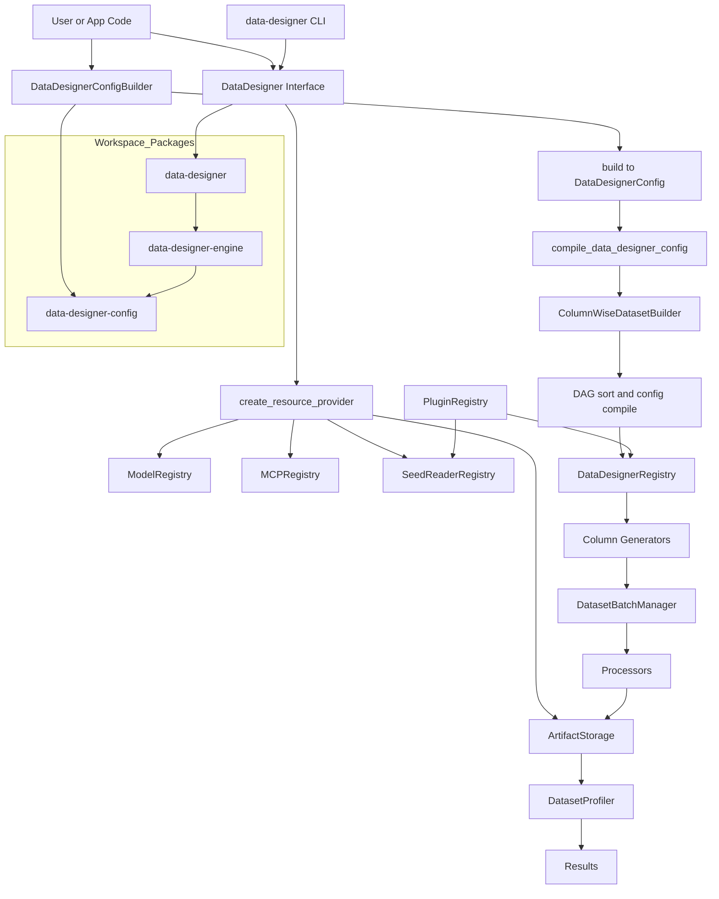

# AGENTS.md

This file is the operating guide for agents working in this repository.

## Mission

Help users build, debug, and extend **DataDesigner** quickly and safely.

Optimize for:
- Correctness first (schema validity, generation behavior, validation behavior)
- Fast iteration (small diffs, targeted tests, clear failure diagnosis)
- API stability (prefer compatibility-preserving changes)

## First 5 Minutes Checklist

1. Read this file and user request.
2. Identify impacted layer(s): `config`, `engine`, `interface`, plugin package(s).
3. Locate the execution path from public API to concrete implementation.
4. Make minimal code changes with explicit type annotations.
5. Run focused lint/tests for changed scope, then broaden only if needed.

## Architecture At A Glance

DataDesigner is split into three packages:
- `data-designer-config`: user-facing config models/builders
- `data-designer-engine`: compilation + generation/validation runtime
- `data-designer`: interface entrypoint and result types



## High-Value File Map

- `packages/data-designer/src/data_designer/interface/data_designer.py`: primary public entrypoint
- `packages/data-designer-config/src/data_designer/config/config_builder.py`: config assembly API
- `packages/data-designer-config/src/data_designer/config/column_configs.py`: column config schemas
- `packages/data-designer-engine/src/data_designer/engine/dataset_builders/column_wise_builder.py`: orchestration core
- `packages/data-designer-engine/src/data_designer/engine/column_generators/`: generation implementations
- `packages/data-designer-engine/src/data_designer/engine/validators/`: validator implementations
- `packages/data-designer-engine/src/data_designer/engine/models/`: model adapters/registry

## Core Patterns To Preserve

- Builder pattern for config creation (`DataDesignerConfigBuilder`)
- Registry pattern for generators/validators/profilers/models
- Strategy pattern for sampled/LLM/expression/seed-driven generation
- DAG-based dependency handling across column generation

## Non-Negotiable Coding Rules

- Add type annotations to all functions/methods/class attributes (including tests).
- Use absolute imports only.
- Keep imports at module scope (unless unavoidable).
- Use double quotes for strings.
- Keep lines `<= 120` chars.
- Avoid vacuous comments; comment only non-obvious logic.
- Prefer `make` targets over raw tool commands when a matching `Makefile` target exists.
- Preserve or add NVIDIA SPDX headers in Python files:

```python
# SPDX-FileCopyrightText: Copyright (c) 2025 NVIDIA CORPORATION & AFFILIATES. All rights reserved.
# SPDX-License-Identifier: Apache-2.0
```

- For newly created Python files, create the file first, then run:

```bash
make update-license-headers
```

## Imports, Lazy Loading, TYPE_CHECKING

For heavy third-party modules, use lazy imports via:
- `packages/data-designer-config/src/data_designer/lazy_heavy_imports.py`

Pattern:

```python
from typing import TYPE_CHECKING
from data_designer.lazy_heavy_imports import pd

if TYPE_CHECKING:
    import pandas as pd
```

Rules:
- Put `data_designer` type-only imports in `TYPE_CHECKING` blocks.
- Do **not** move runtime-required imports (e.g., Pydantic model field types) into `TYPE_CHECKING`.

## Testing and Validation Workflow

Preferred local flow:

```bash
# install workspace and dev tooling
make install-dev

# lint + format
make check-all

# targeted test during iteration
uv run pytest path/to/test_file.py -v

# full test pass before large merge-ready change
make test
```

Other useful commands:

```bash
make install
make install-dev-notebooks
make install-dev-recipes
make check-all-fix
make coverage
make update-license-headers
```

Command preference:
- Use `make` targets whenever applicable (lint, format, checks, tests, coverage, headers) to keep behavior consistent with project workflows.

## Change Strategy

When implementing a request:
1. Trace from user-facing API to runtime implementation path.
2. Make the smallest coherent patch.
3. Add/adjust tests in same scope as behavior change.
4. Verify lint + tests.
5. Summarize behavior change and residual risks.

## Common Pitfalls

- Circular/plugin import order issues.
  - If plugin config imports trigger plugin discovery too early, check:
    - `packages/data-designer-config/src/data_designer/plugins/plugin.py`
    - `packages/data-designer-config/src/data_designer/plugins/registry.py`
    - `packages/data-designer-config/src/data_designer/config/column_types.py`
- Registry state leakage across subclasses.
  - Validate class-level mutable registry storage in shared base classes.
- Type hints diverging from runtime behavior.
  - Keep signatures/docs synchronized with concrete return values.

## Column Config Types (Quick Reference)

- `SamplerColumnConfig`
- `LLMTextColumnConfig`
- `LLMCodeColumnConfig`
- `LLMStructuredColumnConfig`
- `LLMJudgeColumnConfig`
- `ExpressionColumnConfig`
- `ValidationColumnConfig`
- `SeedDatasetColumnConfig`

See:
- `packages/data-designer-config/src/data_designer/config/column_configs.py`

## Model Config (Quick Reference)

`ModelConfig` includes:
- `alias`
- `model`
- `inference_parameters`
- `system_prompt`
- `image_modality`

See:
- `packages/data-designer-config/src/data_designer/config/models.py`

## Recommended Public API Usage

```python
import data_designer.config as dd
from data_designer.interface import DataDesigner

data_designer = DataDesigner()
config_builder = dd.DataDesignerConfigBuilder()
config_builder.add_column(
    dd.SamplerColumnConfig(
        name="category",
        sampler_type=dd.SamplerType.CATEGORY,
        params=dd.CategorySamplerParams(values=["A", "B"]),
    )
)
```

## Quality Gate Before Hand-Off

- Changed behavior covered by tests or justified if not testable.
- Ruff checks pass for modified files/scope.
- No regressions in import style/type annotation rules.
- User-facing behavior and tradeoffs explained clearly.
