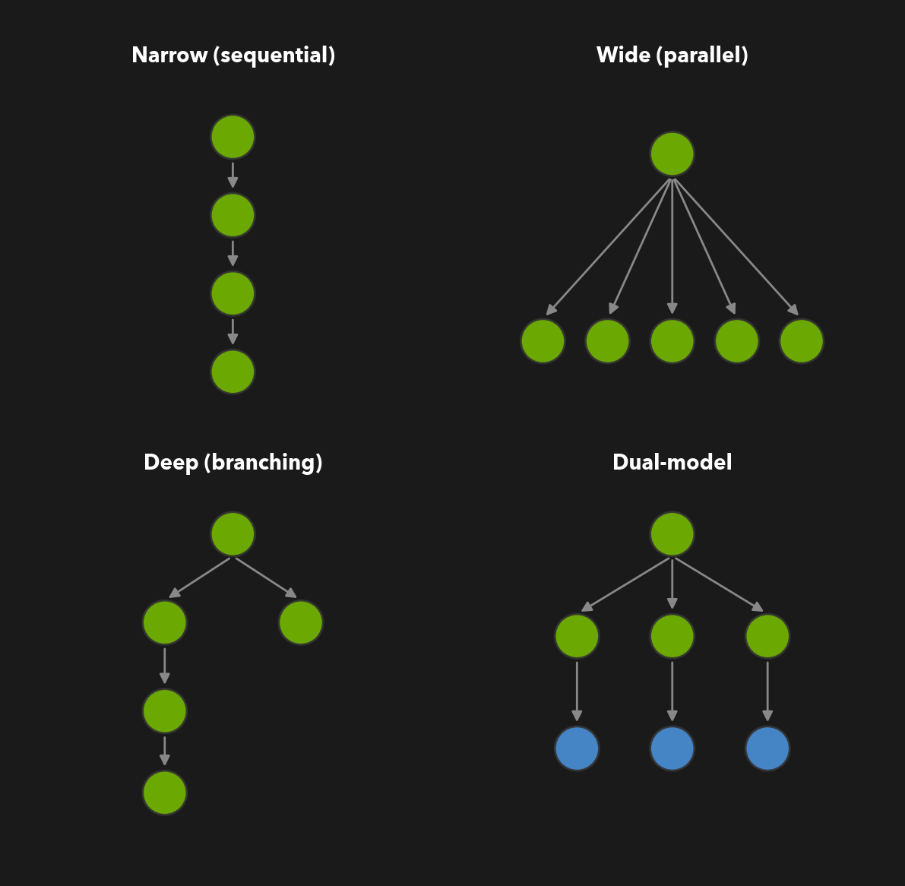
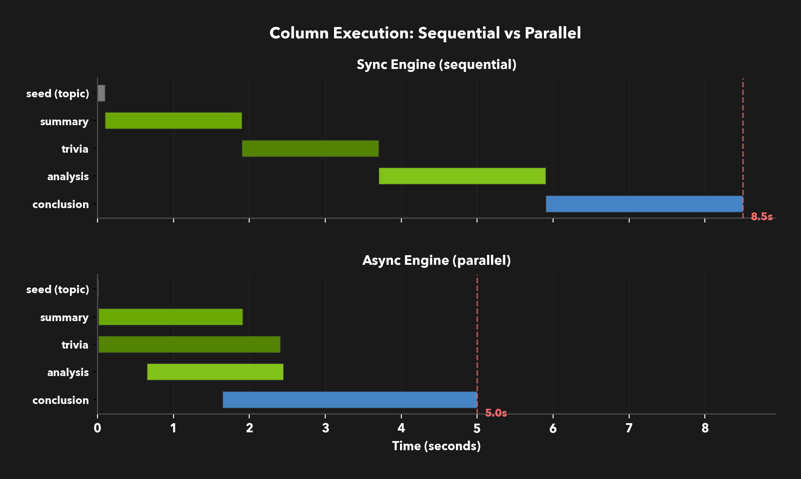
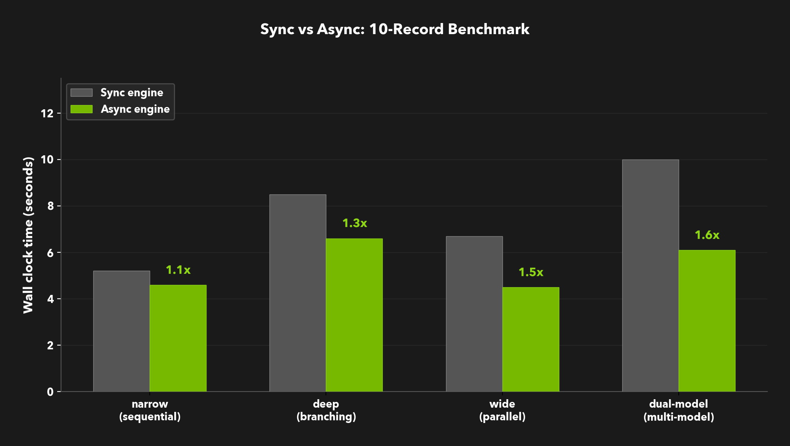
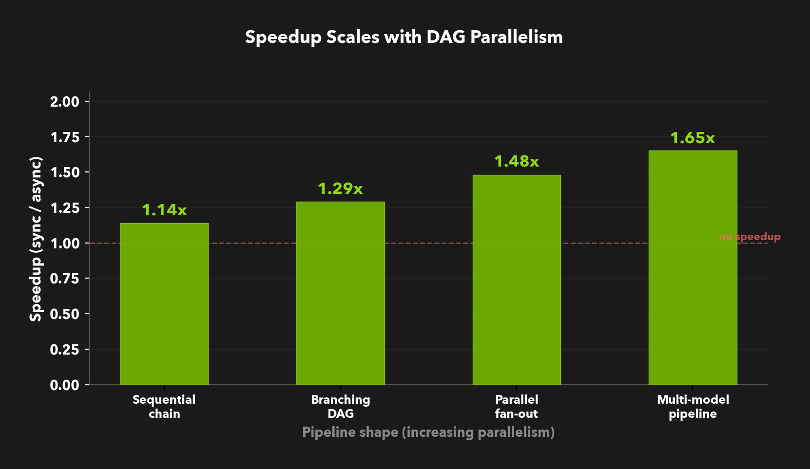

# **Async All the Way Down**

Generating a synthetic dataset at scale means making thousands of LLM calls. Most of those calls are independent of each other, but until now Data Designer ran them one column at a time. We rebuilt the execution layer from the ground up, and pipelines with parallelism in their dependency graph now run significantly faster with no changes to your config.

<!-- more -->

<div style="text-align: center;" markdown>


</div>

When you build a Data Designer pipeline, every column's prompt declares what it needs. A `summary` column references `{{ topic }}`, so it runs after `topic`. A `trivia` column also references `{{ topic }}`, so it *could* run at the same time as `summary`. An `analysis` column references `{{ summary }}`, so it has to wait.

These references form a dependency graph. The information about what can safely run in parallel has always been there, encoded in the config itself. The previous engine just didn't use it. It processed columns top to bottom, one at a time, blocking on every LLM call before starting the next.

The async engine changes that. It reads the same dependency graph, dispatches tasks as soon as their inputs are satisfied, and manages concurrency across multiple models and providers simultaneously. The result is better utilization of the LLM endpoints you're already paying for, without any changes to how you define your pipeline.

## **The Bottleneck Was Structural**

Consider a pipeline that generates content about a topic. You have a `topic` sampler, two columns that branch off it independently (`summary` and `trivia`), then an `analysis` that depends on `summary`, and a `conclusion` that depends on `analysis`:

<div style="text-align: center;" markdown>

{ style="max-width:65%; height:auto" }

</div>

In the sync engine, this pipeline takes about 8.5 seconds for 10 records. Each column waits for the previous to finish, even when there's no dependency between them. `trivia` waits for `summary` to complete despite not needing its output. Most of the wall-clock time is spent waiting on LLM responses that could have been in flight simultaneously.

The fix isn't "make the LLM faster." It's "stop waiting when you don't have to."

<div style="text-align: center;" markdown>

{ style="max-width:100%; height:auto" }

</div>

The async engine dispatches `summary` and `trivia` in parallel as soon as `topic` finishes. `analysis` starts as soon as the first `summary` rows complete, overlapping with `trivia` which is still running independently. `conclusion` fires once `analysis` rows are ready. Same pipeline, same config, about 22% less wall-clock time.

## **Three Layers of Concurrency**

Getting this right required solving three problems at different levels of the stack. We built a layered system where each layer manages one concern.

<div style="text-align: center;" markdown>

{ style="max-width:85%; height:auto" }

</div>

At the top sits the `AsyncTaskScheduler`, the dependency-aware dispatcher. It builds an `ExecutionGraph` from your column configs using Kahn's algorithm for topological ordering, then tracks per-cell completion via a `CompletionTracker`. When a cell completes, the tracker determines which downstream cells are now ready and pushes them onto the dispatch queue. Multi-column generators (where one generator produces several output columns) are deduplicated so they run once. Stateful generators like seed dataset readers get per-instance locks to preserve ordering.

Below the scheduler, rows are partitioned into groups that checkpoint to parquet independently. A semaphore limits how many row groups are in flight at once, preventing memory from growing unboundedly on large runs. A second semaphore caps total in-flight tasks across all row groups. When a row group completes, its buffer is flushed to disk and released. You see partial results on disk during generation, and if something fails, you keep everything that already checkpointed.

At the bottom, each (provider, model) pair gets an independent concurrency pool with additive-increase, multiplicative-decrease (AIMD) rate adaptation. When the provider returns a 429, the pool halves its concurrency. On streaks of successful requests, it gradually increases. Because this happens per-model, a judge model running on one provider can saturate its endpoint while a generator on another provider is backing off. The [Owning the Model Stack](owning-the-model-stack.md) dev note covers this layer in detail.

The layers compose cleanly. The scheduler decides *what* to run next. The row-group layer decides *how much* can be in flight. The throttle layer discovers *how fast* each provider will accept requests. No layer needs to know about the others.

## **Benchmark Results**

We tested four DAG shapes that represent common pipeline patterns. All benchmarks used 10 records with `max_parallel_requests=16`, running 4 measured trials (interleaved sync/async to reduce temporal bias) after a warmup.

<div style="text-align: center;" markdown>

{ style="max-width:100%; height:auto" }

</div>

The pattern is clear: speedup scales with the amount of parallelism available in the DAG.

| Workload | DAG shape | Sync | Async | Speedup |
| :--- | :--- | :--- | :--- | :--- |
| **Narrow** | 4-column sequential chain | 5.2s | 4.6s | 1.1x |
| **Deep** | Chain + independent branch | 8.5s | 6.6s | 1.3x |
| **Wide** | 5 independent columns | 6.7s | 4.5s | 1.5x |
| **Dual-model** | 3 generators + 3 judges | 10.0s | 6.1s | 1.6x |

<div style="text-align: center;" markdown>

{ style="max-width:85%; height:auto" }

</div>

The **narrow** workload is a sequential chain with no cross-column parallelism. The async engine still ekes out a small gain from overlapping row-level dispatch, but there's no structural parallelism to exploit. This is expected: async can't speed up a fundamentally serial pipeline.

The **dual-model** workload is the most interesting case. Three generation columns use one model, and three judge columns use another. Each model gets its own ThrottleManager pool. The judge model starts processing rows as soon as the first generator finishes, running at full concurrency while the generator is still producing. In the sync engine, all generation has to finish before any judging starts.

### **At higher record counts**

These small-batch numbers isolate the scheduling benefit from rate-limit effects. At higher record counts, the picture gets more nuanced. The async engine dispatches requests more aggressively, which can trigger provider rate limits that the sync engine's slower sequential pace would avoid. When a 429 hits, the AIMD controller backs off, but the backoff can cascade through downstream columns. Single-model pipelines are most susceptible because all columns compete for the same throttle pool.

Multi-model pipelines hold up well at scale because each model gets an independent throttle pool. In our larger runs, dual-model and multi-provider workloads consistently showed the largest async gains. Tuning `max_parallel_requests` per model to match your provider's actual capacity is the primary lever for getting the most out of the async engine at scale.

## **Beyond Speed**

The performance numbers are satisfying, but raw throughput is only part of the picture.

The more interesting change is what happens to the *experience* of running large pipelines. Because rows complete out of order and row groups checkpoint independently, results start appearing on disk within seconds. The new progress bars update on every task completion rather than waiting for a full column to finish. A 10-minute generation run no longer means staring at nothing until the end.

Fault tolerance also improves. If a model endpoint goes down or a prompt starts producing unparseable output, the scheduler detects the error rate and can shut down early. Completed row groups are already on disk. Retryable failures get deferred to salvage rounds at the end of a batch. You keep everything that succeeded.

Multi-model pipelines are where the architecture pays for itself. With independent throttle pools per model, there's no reason not to use the right model for each job: a reasoning model for generation, a smaller model for judging, an embedding model for deduplication, each running at its own optimal concurrency. The previous engine supported multi-model configs, but running them concurrently is what makes them practical at scale.

Adoption is opt-in. Set `DATA_DESIGNER_ASYNC_ENGINE=1` in your environment. Your existing pipeline definitions, dependency graph, column configs, model aliases all stay the same. We're keeping it behind an environment variable while we harden edge cases, but the goal is to make async the default.

## **The Build**

This was a ground-up rebuild of the execution layer, delivered across five PRs over four weeks.

It started with the data structures: `ExecutionGraph`, `CompletionTracker`, and task models ([#356](https://github.com/NVIDIA-NeMo/DataDesigner/pull/356)). Next came the generator migration ([#378](https://github.com/NVIDIA-NeMo/DataDesigner/pull/378)), where we added symmetric `generate()`/`agenerate()` bridging so every generator works in both modes without rewriting. The core scheduler and buffer manager followed in [#404](https://github.com/NVIDIA-NeMo/DataDesigner/pull/404), then integration into `DatasetBuilder` with callbacks and trace export ([#429](https://github.com/NVIDIA-NeMo/DataDesigner/pull/429)). A final polish pass ([#456](https://github.com/NVIDIA-NeMo/DataDesigner/pull/456)) added async preview, unified lifecycle callbacks, and sticky ANSI progress bars.

The symmetric bridging was critical for adoption. Generator authors implement whichever method is natural for their use case, and the base class handles calling the other. No generator needed to be rewritten. Plugin authors get async support for free.

## **Try It**

Enable the async engine on any existing pipeline by setting an environment variable:

```bash
DATA_DESIGNER_ASYNC_ENGINE=1 python my_pipeline.py
```

Pair it with the new progress bars for real-time feedback:

```py
from data_designer.config.run_config import RunConfig
from data_designer.interface import DataDesigner

dd = DataDesigner()
dd.set_run_config(RunConfig(
    progress_bar=True,
))
result = dd.create(
    config_builder=config,
    num_records=1000,
)
```

Pipelines with independent columns or multi-model setups will see the largest gains. Sequential chains will run at roughly the same speed. No config changes required.

Key Resources:

1. [NeMo Data Designer on GitHub](https://github.com/NVIDIA-NeMo/DataDesigner)
2. [Data Designer Documentation](https://nvidia-nemo.github.io/DataDesigner/)
3. [Owning the Model Stack: Adaptive Concurrency](owning-the-model-stack.md) - companion dev note on the native client layer and AIMD throttling
4. [Async Engine Plan (#346)](https://github.com/NVIDIA-NeMo/DataDesigner/issues/346) - original issue and architecture plan

*Want to learn more about NeMo Data Designer? Check out our [documentation](https://nvidia-nemo.github.io/DataDesigner/) and start building your own synthetic data pipelines today.*
