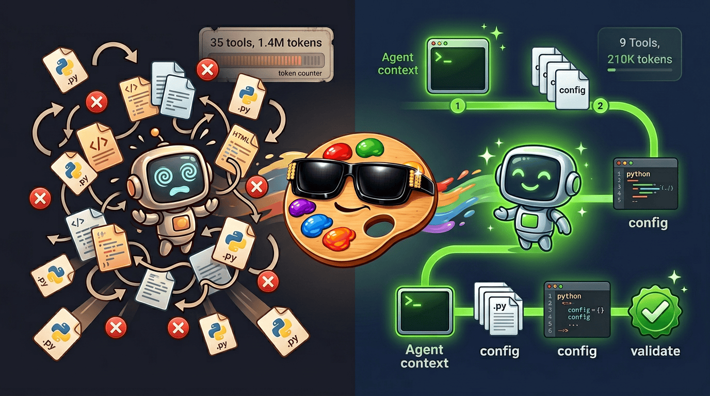
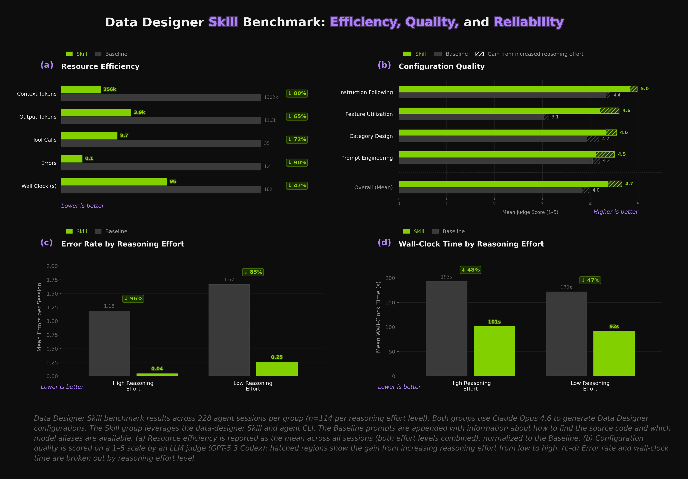

# **Data Designer Got Skills**

*Lessons from building an agent-first CLI and skill for Data Designer*

We just published the `data-designer` skill, which leverages agent-focused CLI commands in [Data Designer](https://github.com/NVIDIA-NeMo/DataDesigner) to efficiently generate datasets. Just describe the dataset you want and your agent will craft the Data Designer configuration for you — schema design, validation, preview, generation — interactively or on full autopilot (just tell the agent to "be opinionated" or "surprise me").

<!-- more -->

{ width=100% }

Instead of asking agents to explore the source code, a single CLI command (`data-designer agent context`) delivers curated, code-derived context in one read, and three more commands (`validate`, `preview`, `create`) handle the rest. The agent's only job is writing the configuration. Combined with the new skill, this reduces token usage by **~80%**, errors by **~90%**, and wall-clock time by **~47%** — all while improving output quality (mean judge score **4.0 → 4.7**). We benchmarked our approach across 228 sessions each for the skill and a baseline.

In today's Dev Note, we'll walk through the challenges agents face when using new libraries, how we designed a CLI and skill to help them, and the benchmark results in detail.

---

## **Agents as First-Class Users**

Agents have become first-class users of basically all software. Somewhere in the last few months, we crossed a threshold. Models like [Opus 4.5](https://www.anthropic.com/news/claude-opus-4-5) and [Codex 5.1](https://openai.com/index/gpt-5-1-for-developers/), paired with maturing harnesses like [Claude Code](https://code.claude.com/docs/en/overview), [Codex](https://chatgpt.com/codex), and [OpenCode](https://opencode.ai/), have become _really_ good. They're real users of your library, and their experience with your API matters.

We use agents to both build Data Designer and use it to generate datasets. When we started watching how they actually interact with the tool, a pattern emerged. They spend most of their tokens in the wrong place. Crawling engine internals, reading DAG resolution logic, reconstructing the API after reading most of the source code. They get there eventually, which is impressive, but the path they take is wasteful.

The problem isn't the agent. Data Designer has a small config API — three or four files that contain nearly all the context you need for the typical use case. But nothing was pointing the agent at those files instead of the backend engine. If your library has a CLI, it's worth asking: does it serve your agent users as well as it serves your human ones?

---

## **The Baseline: Let the Agent Figure It Out**

To see what this looks like in practice, let's walk through a simple example. We prompted Claude Code to build a text-to-python dataset with Data Designer, providing a relatively detailed dataset description, instructions to locate the library source, and a CLI command to discover valid [model aliases](https://nvidia-nemo.github.io/DataDesigner/latest/concepts/models/default-model-settings/) in the user's environment.

The prompt we used is shown below. Note that the hints at the bottom matter more than you might think. Providing the package path and the CLI commands up front streamlines the work the agent needs to do to understand the library and use it.

<details markdown open>
<summary><strong>The prompt</strong></summary>

```text
I need to generate a text-to-python dataset focused on data science and analytics for
supervised fine-tuning (SFT) a code LLM.

Each record should include at least:
- A natural language instruction describing a data science task in Python.
- A difficulty level sampled from beginner, intermediate, and advanced.
- A subtopic sampled from areas like data cleaning, exploratory analysis, aggregation
  and groupby operations, visualization with matplotlib/seaborn, statistical testing,
  feature engineering, and working with messy or missing data.
- A complete Python solution generated by an LLM that correctly implements the instruction.
  The code should be syntactically valid and self-contained.
- A code validation column that checks the generated solution for syntactic
  correctness and reports any issues found.
- An LLM-as-a-judge column that scores each (instruction, solution) pair on correctness,
  code quality, and instruction clarity. Use a 1-5 scale and return structured results.

The instructions should be realistic and diverse — vary the complexity, libraries used,
and required operations to match the difficulty level.

Use Data Designer for this task.

You can find the installed package directory by running:

    python -c "import data_designer.config as dd, os; print(os.path.dirname(dd.__file__))"

Check the available model aliases (those with API keys) by running:

    data-designer config list

Write a Python file with a function called `load_config_builder` that returns the config builder.

Validate that it is configured correctly using:

    data-designer validate <path-to-python-file>
```

</details>

While the agent didn't exactly start from zero, we didn't give it much and it still figured it out – impressive! It found the package, explored the source, pieced together the API, and produced a valid configuration. But look at the path it took:

- The main agent located the package and ran `config list`, then spawned a **subagent** to "Explore the Data Designer package thoroughly."
- The subagent read **14 source files** (some two or three times), hit an error on `__init__.py`, recovered, and returned a detailed report. **25 tool calls** inside the subagent alone.
- Back in the main agent, it re-read `column_configs.py`, `validator_params.py`, and `config/__init__.py` (files the subagent already covered), grepped for `CategorySamplerParams` and `add_column`, then wrote the config and validated.
- Final tally: **35 tool calls**, **1 error**, **159 seconds**, **~1.4M tokens** between the main agent and the subagent.

Review the full session below:

--8<-- "docs/devnotes/posts/assets/data-designer-got-skills/trace-baseline.html"

While this session started from a clear context, real sessions often don't start that way. There's prior context from the user's other work, back-and-forth as they iterate with the agent on the design, maybe a second or third run. Every token spent on exploration is context budget that can't go toward the actual task. Lean context is essential for multi-turn sessions.

---

## **Shortening the Path: Data Designer's Agent CLI and Skill**

Data Designer's CLI was previously only used for model configuration and downloading assets. But agents are first-class users now, and they already know how to run commands and read stdout. We saw an opportunity to extend the CLI with commands designed specifically for agent consumption. The `data-designer` skill leverages these new commands with workflows for interactive and autopilot dataset generation.

```bash
# Bootstrap all code-derived agent context
data-designer agent context

# Validate a config script
data-designer validate <file-path>

# Generate a small sample to inspect and iterate on
data-designer preview <file-path>

# Generate the full dataset
data-designer create <file-path> --num-records <N> --dataset-name <name>
```

`agent context` dynamically generates a structured reference from the library's source code. Column types, sampler parameters, validator configs, constraints, processors, available model aliases with their providers, installed persona datasets, and the exact files to read for needed context — everything the subagent spent 25 tool calls piecing together, delivered in one read. Because the output is derived from the code at runtime, it stays in sync as the API evolves.

The other three commands standardize config validation and dataset generation. `validate` catches config errors before any generation tokens are spent. `preview` generates a small sample to inspect and iterate on (the agent can enter this self-improvement loop on its own). `create` runs the full generation. Everything downstream of the configuration is Data Designer's domain. DAG construction, batching, execution. The agent never touches it.

### Coding best practices still matter

Data Designer's modular design and clear boundary between configuration and execution predates any agent work. This design, which we chose for testability and maintainability, turns out to be exactly what agents need. A small, predictable set of files that fully describes the API surface. `agent context` exploits this boundary. It dumps the config layer and nothing else. If your library has a similar separation, you're already most of the way there. You just need to surface it.

### The Skill in action

Let's see the [skill](https://github.com/NVIDIA-NeMo/DataDesigner/tree/main/skills/data-designer) in action. Same dataset task as before, but this time the prompt is just the dataset description. No package path, no `config list`, no validate command. The skill provides all of that.

<details markdown open>
<summary><strong>The prompt</strong></summary>

```text
I need to generate a text-to-python dataset focused on data science and analytics for
supervised fine-tuning (SFT) a code LLM.

Each record should include at least:
- A natural language instruction describing a data science task in Python.
- A difficulty level sampled from beginner, intermediate, and advanced.
- A subtopic sampled from areas like data cleaning, exploratory analysis, aggregation
  and groupby operations, visualization with matplotlib/seaborn, statistical testing,
  feature engineering, and working with messy or missing data.
- A complete Python solution generated by an LLM that correctly implements the instruction.
  The code should be syntactically valid and self-contained.
- A code validation column that checks the generated solution for syntactic
  correctness and reports any issues found.
- An LLM-as-a-judge column that scores each (instruction, solution) pair on correctness,
  code quality, and instruction clarity. Use a 1-5 scale and return structured results.

The instructions should be realistic and diverse — vary the complexity, libraries used,
and required operations to match the difficulty level.
```

</details>

--8<-- "docs/devnotes/posts/assets/data-designer-got-skills/trace-skill.html"

The skill session followed a direct, linear path: `agent context` → read 6 config files → write config → validate. **9 tools, 0 errors, 92 seconds, ~210k tokens.** Compare that to the baseline: **35 tools, 1 error, 159 seconds, ~1.4M tokens.**

Of course, these are individual sessions, and there's variance in both directions. Sometimes the baseline finds a lucky path and performs closer to the skill. Sometimes the skill takes a wrong turn. That said, the examples above are representative of the typical (median) outcomes we observed. To see whether the pattern holds, we ran **228 sessions each** for the skill and baseline, as described in the next section.

---

## **Measuring the Difference**

{ width=100% }

Evaluating agent skills is harder than it might seem. Behavior is non-deterministic, sensitive to context, and varies with prompt wording. Environment isolation is critical — coding agents explore their surroundings before they start working, so if a baseline session can discover the skill files on disk, it will use them. We observed this failure mode early on and had to ensure each session got a fully isolated environment. [LangChain's writeup](https://blog.langchain.com/evaluating-skills/) on evaluating skills is an excellent read that covers many of the same challenges.

In our experiment setup, each session started from a clean slate (new directory, fresh git history, clean venv with no skill files present for baseline runs). We used the text-to-python use case across three prompt detail levels (low, medium, high), half at high reasoning effort and half at low. Claude Code was run in headless mode (i.e., `claude -p <prompt>`). Each session ends when the agent produces a validated configuration — we stop at `data-designer validate` rather than running full generation, both for easier automation and because once the config is valid, generation is just a simple `data-designer create` away. The main results are shown in the figure above and are summarized below.

- ⚡ **Our skill and agent CLI use ~80% fewer tokens (panel a).** The skill replaces source-code exploration with directed context. Output tokens fall **65%**, tool calls **72%**, errors **90%**, wall clock time **47%**. Every downstream metric improves.

- 📈 **Beyond the efficiency gains, the skill also produces higher-quality results (panel b).** We used an LLM judge (GPT-5.3 Codex) on a 1–5 scale. Mean quality score went from **4.0 → 4.7**. The standout is feature utilization — how well the agent uses the library's capabilities — which jumped **3.1 → 4.6**. The skill surfaces capabilities like diversity axes, sampler types, and validators directly in the context.

- 🛡️ **Errors are nearly eliminated at high reasoning effort (panel c).** Mean errors per session drop from **1.18 → 0.04** when reasoning effort is high, and **1.67 → 0.25** when it's low. Fewer errors mean fewer recovery loops, fewer tokens burned on retries, less chance of the agent going down a dead end. The table below breaks down where the errors come from. The skill nearly wipes out file/path and import errors, and cuts config validation failures by more than two-thirds.

    <figure markdown="span">

    **Error Breakdown by Category**

    | Group | Total | % | Baseline | Skill |
    |---|---|---|---|---|
    | **File/Path Not Found** | 228 | 63.5% | 216 | 12 |
    | **Config Validation Failures** | 92 | 25.6% | 70 | 22 |
    | **Import Errors** | 32 | 8.9% | 32 | 0 |
    | **Tool/Environment Issues** | 7 | 1.9% | 7 | 0 |

    </figure>

- ⏱️ **Wall-clock time is cut roughly in half (panel d).** **193s → 101s** with high reasoning, **172s → 92s** with low. Less exploration, fewer errors, fewer retries. The time savings follow naturally.

---

## **Getting Started**

First, you will need to install Data Designer and set up your model providers. The [quickstart guide](https://github.com/NVIDIA-NeMo/DataDesigner#quick-start) in our README walks through this. We recommend using a virtual environment to manage dependencies.

Next, install the skill. Note that while the skill should work with other coding agents that support skills, our development and testing has focused on Claude Code at this stage. There are two ways to install:

**Via the Claude Code marketplace:**

```
/plugin marketplace add NVIDIA-NeMo/DataDesigner
/plugin install data-designer@nemo-data-designer
/reload-plugins
```

**Via [skills.sh](https://skills.sh):**

```bash
npx skills add NVIDIA-NeMo/DataDesigner
```

!!! tip
    When prompted, make sure to select **Claude Code** as an additional agent.

After installation, open Claude Code and type `/data-designer`, or just tell it you want to generate a dataset along with a description of what you want and the skill will kick in.

The skill has two modes. In interactive mode, the agent asks clarifying questions and has you make key design decisions (diversity axes, sampling strategies, model selection). You review sample records, give feedback, and iterate until it's right.

Autopilot mode is the opposite. The agent reads your description, makes its own design decisions (and tells you what they are), then validates and generates without waiting. Good when you know what you want and just need it built.

Both produce the same artifact. A standalone Python script calling Data Designer's public API. Re-runnable, modifiable, version-controllable.

---

## **What's Next**

Everything described in this post is live, and we're paying close attention to how people use it. Feedback from early adopters is very welcome and will help us shape what comes next.

On the automation side, the agent already asks if you want it to review the generated dataset and suggest improvements. We're working on closing that loop (generate config, preview, review, improve, repeat) so the agent runs a few iterations on its own before handing you the result.

We also plan to add domain-specific SDG references that the agent can draw on for specialized use cases (healthcare, finance, legal, etc.). The goal is for the agent to bring domain expertise to dataset design alongside library knowledge.

Stay tuned.

👋 Thanks for reading and happy dataset building!

---
