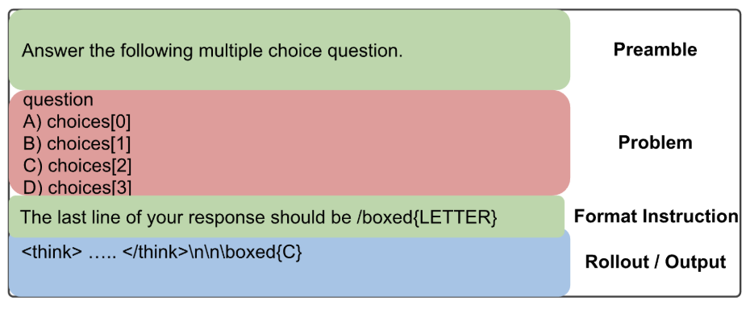

# **Mitigating Prompt Sensitivity: Manufacturing Robustness Through Diverse Preambles**

Models behave differently based on how a question is phrased --- a "cynical senior dev" and a "curious student" get different answers to the same problem. Using NeMo Data Designer, we built a pipeline that generates hundreds of diverse prompt preambles with controlled variation across tone, strictness, verbosity, and answer format, then validates each one for compliance. These preambles feed into a YAML-driven training mixture pipeline that prepends diverse instructions to existing SFT data at scale. This work directly improved Nemotron model robustness on evaluation benchmarks where prompt format varies.

<!-- more -->

---

## **Goal**

- **Reduce LLM sensitivity to prompt phrasing** by generating diverse, high-quality prompts for both SFT and RL training data using Data Designer.
- **Improve model robustness and generalization** across different instruction styles, tones, and structures.
- **Specifically target variations in preambles and format instructions** while keeping the core problem unchanged.

---

## **What Is Prompt Sensitivity?**

A prompt to an LLM typically has three distinct components: the **preamble** (high-level instructions), the **problem** (the actual question or task), and the **format instruction** (how to structure the answer). Prompt sensitivity is the phenomenon where a model's accuracy changes significantly based on how the preamble and format instruction are phrased, even when the underlying problem is identical.



```
                ANATOMY OF A PROMPT + RESPONSE
                ================================

 ┌──────────────────────────────────────────────────────────────┐
 │  PREAMBLE  (variable — what we diversify)            [GREEN] │
 │                                                              │
 │  "Answer the following multiple choice question"             │
 ├──────────────────────────────────────────────────────────────┤
 │  PROBLEM  (fixed — from the source dataset)            [RED] │
 │                                                              │
 │  What is the capital of France?                              │
 │  A) London                                                   │
 │  B) Berlin                                                   │
 │  C) Paris                                                    │
 │  D) Madrid                                                   │
 ├──────────────────────────────────────────────────────────────┤
 │  FORMAT INSTRUCTION  (variable — what we diversify)  [GREEN] │
 │                                                              │
 │  "The last line of your response should be \boxed{LETTER}"   │
 └──────────────────────────────────────────────┬───────────────┘
                                                │
                                                ▼
 ┌──────────────────────────────────────────────────────────────┐
 │  ROLLOUT / OUTPUT  (model's response)                        │
 │                                                              │
 │  <think> ... reasoning ... </think>                          │
 │                                                              │
 │  \boxed{C}                                                   │
 └──────────────────────────────────────────────────────────────┘
```

The preamble and format instruction (green) are the parts we can vary freely without changing the problem. The problem itself (red) comes from the source dataset and stays fixed. When models are trained on data with only one preamble style and one format instruction, they become brittle --- they can solve the problem, but small wording changes cause them to misformat their response, triggering scoring failures.

When we evaluated early Nemotron checkpoints on internal STEM benchmarks with varied prompt phrasings, we observed accuracy swings of **up to 15 percentage points** depending solely on how the question was phrased:

```
"Select the best answer"           → 82% accuracy
"Choose the correct option"        → 78% accuracy
"Which of the following is true?"  → 74% accuracy
```

Same questions. Same model. Same knowledge. Different scores. This is a well-documented phenomenon across the industry --- models overfit to the prompt format seen during training.

The root cause is straightforward: **the training data lacks prompt diversity**. If every STEM MCQ in your SFT dataset starts with "Answer the following question and place your answer in \boxed{}", the model learns that specific format perfectly but becomes brittle to anything else.

The fix is equally simple in principle --- expose the model to the same problems with many different phrasings --- but doing this manually at the scale of thousands of training examples is impractical. We need preambles that span a wide diversity space:

- **Sentence types:** imperative ("Select the answer"), interrogative ("Which option is correct?"), declarative ("The correct answer is to be placed in...")
- **Tones:** formal, neutral, concise, encouraging, strict
- **Strictness levels:** from "here's a question" to "you MUST follow this exact format"
- **Verbosity:** one-liners vs. detailed multi-sentence instructions
- **Answer formats:** `\boxed{}`, `\boxed{LETTER}`, `Answer: A/B/C/D`, `((X))`, `<final_answer>X</final_answer>`, and dozens more

Covering the full combinatorial space of these dimensions manually is intractable --- and this is exactly the kind of structured diversity problem that synthetic data generation is designed to solve. Data Designer's sampler-driven approach lets us define the diversity *dimensions* declaratively, and the framework handles the *combinatorics* at scale, generating thousands of validated preamble variations that no human annotator could match.

---

## **Pipeline Architecture: QA Preamble Generation**

The pipeline below shows one specific instantiation for generating diverse preambles for **QA/MCQ datasets**, designed to improve the prompt sensitivity of the question prompt. The same architecture can be adapted for Math, Code, or any domain where prompt diversity is needed.

```
                              PROMPT SENSITIVITY PIPELINE
                              ==========================
                              (QA Preamble Generation)

             ┌─────────────────────────────────────────────────────────────────────────────────────┐
             │                             STAGE 1: SEED EXAMPLES                                  │
             │                                                                                     │
             │   5 curated MCQ preambles as style anchors (not templates to copy)                  │
             │   Loaded via DataFrameSeedSource with SamplingStrategy.SHUFFLE                      │
             └─────────────────────────────────────────┬───────────────────────────────────────────┘
                                                       │
                                                       ▼
             ┌─────────────────────────────────────────────────────────────────────────────────────┐
             │                          STAGE 2: DIVERSITY SAMPLERS                                │
             │                                                                                     │
             │   sentence_type (3)    tone (5)         strictness_level (3)                        │
             │   imperative           formal            low                                        │
             │   interrogative        neutral           medium                                     │
             │   declarative          concise           high                                       │
             │                        encouraging                                                  │
             │                        strict            verbosity_level (3)                        │
             │                                          concise / standard / detailed              │
             │   domain_context (3)   answer_format (3)                                            │
             │   general              \boxed{}                                                     │
             │   STEM                 \boxed{LETTER}    Combinatorial space:                       │
             │   humanities           \boxed{<letter>}  3 × 5 × 3 × 3 × 3 × 3 = 1,215              │
             └─────────────────────────────────────────┬───────────────────────────────────────────┘
                                                       │
                                                       ▼
             ┌─────────────────────────────────────────────────────────────────────────────────────┐
             │                         STAGE 3: LLM PREAMBLE GENERATION                            │
             │                                                                                     │
             │   Single LLMTextColumnConfig conditioned on all 6 samplers + seed example           │
             │   "Generate a preamble instruction for a multiple-choice question..."               │
             │   1,000+ unique preambles generated per domain (STEM, Math, Code)                   │
             └─────────────────────────────────────────┬───────────────────────────────────────────┘
                                                       │
                                                       ▼
             ┌─────────────────────────────────────────────────────────────────────────────────────┐
             │                          STAGE 4: DUAL QUALITY JUDGES                               │
             │                                                                                     │
             │   format_compliance (binary 0/1):                                                   │
             │     Does the preamble mention the correct answer format?                            │
             │     ~15-20% of preambles fail this without the judge gate                           │
             │                                                                                     │
             │   preamble_quality (rubric 0-3):                                                    │
             │     Does the preamble match requested tone, verbosity, clarity?                     │
             │     Filter to score ≥ 2 (Good or Excellent)                                         │
             └─────────────────────────────────────────┬───────────────────────────────────────────┘
                                                       │
                                                       ▼
             ┌─────────────────────────────────────────────────────────────────────────────────────┐
             │                    STAGE 5: INTEGRATION INTO TRAINING MIXTURES                      │
             │                                                                                     │
             │   YAML-driven pipeline: add_prompt_variations.py                                    │
             │   ├─ Load base SFT dataset (STEM MCQ, Math, Code)                                   │
             │   ├─ Sample preambles from generated pool                                           │
             │   ├─ Prepend preamble to each problem's user prompt                                 │
             │   ├─ majority_percentage: 25% (original format) / 75% (diverse variations)          │
             │   └─ Pack sequences to 128k tokens for training                                     │
             └─────────────────────────────────────────────────────────────────────────────────────┘
```

The 6 samplers create a combinatorial diversity space of **1,215 unique combinations**. Even generating 1,000 records covers a substantial fraction of this space, ensuring the training data doesn't cluster around a few dominant styles.

---

## **Step 1: Curated Seed Examples**

We provide 5 hand-written preambles as reference examples. These aren't used as templates to copy --- they're provided as *style anchors* so the LLM understands what a preamble looks like:

```python
import pandas as pd
import data_designer.config as dd
from data_designer.interface import DataDesigner

seed_data = pd.DataFrame([
    {"example_preamble": "Choose the correct answer. Place your final answer in \\boxed{}."},
    {"example_preamble": "Read carefully and select the best option. Write your answer as \\boxed{LETTER}."},
    {"example_preamble": "Answer the following MCQ. Put your final answer in \\boxed{}."},
    {"example_preamble": "Consider each option and pick the correct one. Format: \\boxed{your answer}."},
    {"example_preamble": "Solve the problem and select the right choice. Enclose your answer in \\boxed{}."},
])

config = dd.DataDesignerConfigBuilder(model_configs=[
    dd.ModelConfig(alias="preamble-gen", model="qwen/qwen3-235b-a22b", provider="nvidia"),
])

config.with_seed_dataset(
    dd.DataFrameSeedSource(df=seed_data),
    sampling_strategy=dd.SamplingStrategy.SHUFFLE,
)
```

With `SamplingStrategy.SHUFFLE`, each generated record sees a random seed example alongside its sampled style parameters.

---

## **Step 2: Six Dimensions of Diversity**

Each sampler controls one axis of variation:

```python
config.add_column(dd.SamplerColumnConfig(
    name="sentence_type",
    sampler_type=dd.SamplerType.CATEGORY,
    params=dd.CategorySamplerParams(values=["imperative", "interrogative", "declarative"]),
))

config.add_column(dd.SamplerColumnConfig(
    name="tone",
    sampler_type=dd.SamplerType.CATEGORY,
    params=dd.CategorySamplerParams(values=["formal", "neutral", "concise", "encouraging", "strict"]),
))

config.add_column(dd.SamplerColumnConfig(
    name="strictness_level",
    sampler_type=dd.SamplerType.CATEGORY,
    params=dd.CategorySamplerParams(values=["low", "medium", "high"]),
))

config.add_column(dd.SamplerColumnConfig(
    name="verbosity_level",
    sampler_type=dd.SamplerType.CATEGORY,
    params=dd.CategorySamplerParams(values=["concise", "standard", "detailed"]),
))

config.add_column(dd.SamplerColumnConfig(
    name="domain_context",
    sampler_type=dd.SamplerType.CATEGORY,
    params=dd.CategorySamplerParams(values=["general", "STEM", "humanities"]),
))

config.add_column(dd.SamplerColumnConfig(
    name="answer_format",
    sampler_type=dd.SamplerType.CATEGORY,
    params=dd.CategorySamplerParams(values=["\\boxed{}", "\\boxed{LETTER}", "\\boxed{<letter>}"]),
))
```

The generation prompt references all six via Jinja2 templates:

```python
config.add_column(dd.LLMTextColumnConfig(
    name="preamble",
    model_alias="preamble-gen",
    prompt=(
        "Generate a preamble instruction for a multiple-choice question.\n"
        "Style requirements:\n"
        "- Sentence type: {{ sentence_type }}\n"
        "- Tone: {{ tone }}\n"
        "- Strictness: {{ strictness_level }}\n"
        "- Verbosity: {{ verbosity_level }}\n"
        "- Domain: {{ domain_context }}\n"
        "- Answer format: the student MUST place their final answer in {{ answer_format }}\n\n"
        "Reference example (for style, not to copy): {{ example_preamble }}\n\n"
        "Requirements:\n"
        "1. Do NOT include the actual question or options\n"
        "2. The preamble MUST mention the exact format {{ answer_format }}\n"
        "3. Keep it to 1-3 sentences based on verbosity level\n"
        "4. Match the requested tone and sentence type\n\n"
        "Return ONLY the preamble text."
    ),
))
```

This is the power of Data Designer's sampler + template approach: you define the diversity *dimensions*, and the framework handles the *combinatorics*.

---

## **Step 3: Dual Quality Judges**

Two separate judges evaluate each generated preamble:

**Format compliance (binary):** Does the preamble actually mention the required answer format? Without this gate, roughly 15-20% of generated preambles mention the wrong format or omit it entirely.

```python
config.add_column(dd.LLMJudgeColumnConfig(
    name="format_compliance",
    model_alias="preamble-gen",
    prompt=(
        "Check if this preamble instructs the user to format their answer as "
        "{{ answer_format }}.\n\n"
        "Preamble: {{ preamble }}\n"
        "Expected format: {{ answer_format }}"
    ),
    scores=[dd.Score(
        name="format_match",
        description="Does the preamble mention the correct answer format?",
        options={1: "Yes, format is correctly specified", 0: "No, format is missing or wrong"},
    )],
))
```

**Quality (0-3 rubric):** Does the preamble match the requested tone and verbosity? Is it clear and professional?

```python
config.add_column(dd.LLMJudgeColumnConfig(
    name="preamble_quality",
    model_alias="preamble-gen",
    prompt=(
        "Evaluate the quality of this MCQ preamble.\n\n"
        "Preamble: {{ preamble }}\n"
        "Tone requested: {{ tone }}\n"
        "Verbosity requested: {{ verbosity_level }}"
    ),
    scores=[dd.Score(
        name="quality",
        description="Overall preamble quality",
        options={3: "Excellent", 2: "Good", 1: "Fair", 0: "Poor"},
    )],
))
```

---

## **Step 4: Integration into Training Mixtures**

Generated preambles don't exist in isolation. They feed into a YAML-driven training mixture pipeline (`add_prompt_variations.py`) that operates at production scale:

```yaml
mixture:
  target: 1000000
  seed: 13
  files:
    - path: /path/to/openstem.jsonl
      percent: 70.6
    - path: /path/to/openstem_15p.jsonl
      percent: 10.6
    - path: /path/to/hle.jsonl
      percent: 16.3
    - path: /path/to/hle_15p.jsonl
      percent: 2.5

preamble:
  augment: true
  majority_preamble: |-
    Answer the following multiple choice question. The last line of your
    response should be in the following format: 'Answer: \boxed{A/B/C/D}'
    (e.g. 'Answer: \boxed{A}').

    {problem}
  majority_percentage: 25.0
  variations:
    path: prompts/stem_prompts_1000.jsonl
    field: preamble_text

pack:
  enabled: true
  shuffle_before: true
  shuffle_after: true
  max_seq_length: 128000
```

The pipeline:

1. **Builds the mixture** by reservoir-sampling from multiple JSONL files according to configured percentages.
2. **Applies preamble variations**: for each record, with 25% probability it uses the `majority_preamble` (the original canonical format); with 75% probability it samples from the 1,000 DD-generated variations. This ratio ensures the model still sees the canonical format frequently but is exposed to massive diversity.
3. **Detects MCQ-like prompts** using regex heuristics (looks for `\n(A)`, `\n(B)` patterns or `\boxed{}` in the assistant response). Non-MCQ records pass through unchanged.
4. **Packs sequences** to 128k tokens for efficient training.

The result: a 1M-record training mixture where each problem appears with one of 1,000+ different instruction phrasings.

---

## **Regex-Paired Format Templates: Enabling Both SFT and RL**

The key design decision that makes this pipeline work for both SFT and RL is **pairing every format instruction with an extraction regex**. Each template defines a human-readable format instruction (which gets paraphrased by Data Designer for diversity) and a regex pattern (which stays fixed for automated answer extraction).

```yaml
- prompt: 'End your response with ''Correct Option: A/B/C/D/...''.'
  output_regex: 'Correct Option:\s*([A-Za-z])'

- prompt: 'Put the chosen letter inside double brackets: ((X)).'
  output_regex: '\(\(([A-Za-z])\)\)'

- prompt: 'Wrap your final answer letter in XML-style tags: <final_answer>X</final_answer>.'
  output_regex: '<final_answer>\s*([A-Za-z])\s*</final_answer>'

- prompt: 'Finish by enclosing the correct option letter in double asterisks (like **A**).'
  output_regex: '\*\*([A-Za-z])\*\*'

- prompt: 'Conclude by stating ''Correct Answer >> A/B/C/D/...''.'
  output_regex: 'Correct Answer >> ([A-Za-z])'
```

We curated 25+ distinct format templates spanning `\boxed{}`, brackets, parentheses, XML tags, markdown bold, arrows, and plain text. This dual-use design means:

- **For SFT:** The paraphrased format instructions add diversity to the training data. The model sees the same problem with many different answer format requirements, building robustness.
- **For RL:** The paired regex lets the reward function extract the answer from model output regardless of which format was requested. The RL environment (e.g., NeMo-Gym) uses the regex to verify correctness without brittle string matching.

The preamble (generic instruction) and format instruction (answer format) are generated as separate LLM columns, then composed into a final `user_prompt` with the `{problem}` placeholder arranged in one of 8 placement orders (P + F + {problem}, {problem} + P + F, etc.). This separation lets you vary each dimension independently and prevents positional overfitting.

---

## **Key Takeaways**

1. **Samplers make diversity systematic.** Six categorical samplers with 3-5 values each create a 1,215-combination space. No human annotator covers that surface area consistently.

2. **Seed examples are style anchors, not templates.** The LLM needs to see what a preamble *is*, but the samplers control what each preamble *says*. Without seeds, the LLM guesses at the format; without samplers, it converges to a narrow style.

3. **Format compliance is a hard gate.** A preamble that mentions `\boxed{LETTER}` when the answer should be `\boxed{}` will confuse the model during training. Binary judges catch this --- LLMs generate the wrong format ~15-20% of the time.

4. **The value is in the pipeline, not the individual records.** Any single preamble is easy to write by hand. The value is generating 1,000+ diverse, validated preambles automatically and integrating them into million-record training mixtures with controlled majority/variation ratios.

5. **Regex-paired templates unify SFT and RL.** The same format templates serve double duty: paraphrased instructions add SFT diversity, while the paired regex enables RL reward parsing. One pipeline, both training paradigms.

6. **Majority percentage controls the tradeoff.** Setting `majority_percentage: 25` means the model sees the canonical format 25% of the time and diverse variations 75% of the time. This ratio was tuned empirically --- too much diversity degrades canonical-format performance; too little doesn't build robustness.

---

## **Try For Yourself**

<details markdown>
<summary><strong>Full source: prompt sensitivity pipeline</strong></summary>

```python
import itertools
import pandas as pd
import data_designer.config as dd
from data_designer.interface import DataDesigner

# --- Format templates with paired regexes ---
MCQ_FORMAT_TEMPLATES = [
    {"format_key": "boxed_letter",
     "seed_format_instruction": "Choose exactly one letter. Place your answer in \\boxed{LETTER} format.",
     "output_regex": r"\\boxed\{([A-Za-z])\}"},
    {"format_key": "correct_option",
     "seed_format_instruction": "End your response with 'Correct Option: A/B/C/D/...'.",
     "output_regex": r"Correct Option:\s*([A-Za-z])"},
    {"format_key": "double_brackets",
     "seed_format_instruction": "Put the chosen letter inside double brackets: ((X)).",
     "output_regex": r"\(\(([A-Za-z])\)\)"},
    {"format_key": "xml_tags",
     "seed_format_instruction": "Wrap your final answer letter in XML-style tags: <final_answer>X</final_answer>.",
     "output_regex": r"<final_answer>\s*([A-Za-z])\s*</final_answer>"},
    {"format_key": "double_asterisks",
     "seed_format_instruction": "Finish by enclosing the correct option letter in double asterisks (like **A**).",
     "output_regex": r"\*\*([A-Za-z])\*\*"},
    {"format_key": "square_brackets",
     "seed_format_instruction": "Give the letter choice at the end: [Answer: X] where X is the correct letter.",
     "output_regex": r"\[Answer:\s*([A-Za-z])\]"},
    {"format_key": "angle_brackets",
     "seed_format_instruction": "Provide the correct option enclosed in angle brackets: <A>.",
     "output_regex": r"<([A-Za-z])>"},
    {"format_key": "correct_answer_arrow",
     "seed_format_instruction": "Conclude by stating 'Correct Answer >> A/B/C/D/...'.",
     "output_regex": r"Correct Answer >> ([A-Za-z])"},
    {"format_key": "curly_braces",
     "seed_format_instruction": "End your answer by writing the correct option: 'Answer Choice: {X}'.",
     "output_regex": r"Answer Choice:\s*\{([A-Za-z])\}"},
    {"format_key": "selected_option",
     "seed_format_instruction": "Provide the selected option: Selected Option -> X.",
     "output_regex": r"Selected Option\s*->\s*([A-Za-z])"},
]

SEED_PREAMBLES = [
    "Choose the correct answer from the options below.",
    "Read the question carefully and select the best option.",
    "Answer the following multiple choice question.",
    "Consider each option and pick the correct one.",
    "Solve the problem and select the right choice.",
]

# Cross-product seed data
seed_df = pd.DataFrame([
    {**fmt, "seed_preamble": preamble}
    for fmt, preamble in itertools.product(
        pd.DataFrame(MCQ_FORMAT_TEMPLATES).to_dict(orient="records"),
        SEED_PREAMBLES,
    )
])

# --- Model + config ---
config = dd.DataDesignerConfigBuilder(model_configs=[
    dd.ModelConfig(alias="gen", model="qwen/qwen3-235b-a22b", provider="nvidia"),
])
config.with_seed_dataset(
    dd.DataFrameSeedSource(df=seed_df),
    sampling_strategy=dd.SamplingStrategy.SHUFFLE,
)

# --- Samplers ---
for name, values in [
    ("sentence_type", ["imperative", "interrogative", "declarative"]),
    ("tone", ["formal", "neutral", "concise", "encouraging", "strict"]),
    ("strictness_level", ["low", "medium", "high"]),
    ("verbosity_level", ["concise", "standard", "detailed"]),
    ("domain_context", ["general", "STEM", "humanities"]),
    ("preamble_format_order", [
        "P + F + {problem}", "F + P + {problem}",
        "P + {problem} + F", "F + {problem} + P",
        "{problem} + P + F", "{problem} + F + P",
        "PF + {problem}", "{problem} + PF",
    ]),
]:
    config.add_column(dd.SamplerColumnConfig(
        name=name,
        sampler_type=dd.SamplerType.CATEGORY,
        params=dd.CategorySamplerParams(values=values),
    ))

# --- LLM columns ---
config.add_column(dd.LLMTextColumnConfig(
    name="preamble",
    model_alias="gen",
    prompt=(
        "You are writing a concise instruction line to accompany a "
        "{{ domain_context }} question.\n"
        "Keep it neutral and generic; do NOT include output formatting requirements.\n\n"
        "Constraints:\n"
        "- Sentence type: {{ sentence_type }}\n"
        "- Tone: {{ tone }}\n"
        "- Strictness: {{ strictness_level }}\n"
        "- Verbosity: {{ verbosity_level }}\n\n"
        "Seed (paraphrase; do not copy): \"{{ seed_preamble }}\"\n\n"
        "Return ONLY the instruction line text."
    ),
))

config.add_column(dd.LLMTextColumnConfig(
    name="format_instruction",
    model_alias="gen",
    prompt=(
        "You are writing a concise format instruction for a multiple-choice question.\n"
        "The format must be compatible with this output pattern:\n\n"
        "- Output regex: {{ output_regex }}\n\n"
        "Constraints:\n"
        "- Tone: {{ tone }}\n"
        "- The answer must appear at the end of the response.\n\n"
        "Seed (paraphrase; keep meaning): \"{{ seed_format_instruction }}\"\n\n"
        "Return ONLY the format instruction."
    ),
))

config.add_column(dd.LLMTextColumnConfig(
    name="user_prompt",
    model_alias="gen",
    prompt=(
        "Concatenate these components in the specified order:\n\n"
        "- P (Preamble): {{ preamble }}\n"
        "- F (Format Instruction): {{ format_instruction }}\n"
        "- {problem}: Placeholder (keep as literal text)\n\n"
        "Order: {{ preamble_format_order }}\n\n"
        "Rules: arrange per order, merge if 'PF', newline before/after {problem}, "
        "no labels like 'P:' or 'F:'.\n\n"
        "Return ONLY the assembled prompt text."
    ),
))

# --- Judges ---
config.add_column(dd.LLMJudgeColumnConfig(
    name="format_compliance",
    model_alias="gen",
    prompt="Does this instruction enforce the format?\n\nInstruction: {{ format_instruction }}\nRegex: {{ output_regex }}",
    scores=[dd.Score(name="format_match", description="Format enforced?",
                     options={1: "Yes", 0: "No"})],
))

config.add_column(dd.LLMJudgeColumnConfig(
    name="regex_alignment",
    model_alias="gen",
    prompt="Does the instruction align with this regex?\n\nRegex: {{ output_regex }}\nInstruction: {{ format_instruction }}",
    scores=[dd.Score(name="aligned", description="Regex aligned?",
                     options={1: "Aligned", 0: "Not aligned"})],
))

config.add_column(dd.LLMJudgeColumnConfig(
    name="order_coherence",
    model_alias="gen",
    prompt="Is this user prompt coherent?\n\nUser prompt: {{ user_prompt }}",
    scores=[dd.Score(name="coherent", description="Ordering coherent?",
                     options={1: "Coherent", 0: "Incoherent"})],
))

config.add_column(dd.LLMJudgeColumnConfig(
    name="preamble_quality",
    model_alias="gen",
    prompt="Evaluate this instruction line.\n\nInstruction: {{ preamble }}\nTone: {{ tone }}\nVerbosity: {{ verbosity_level }}",
    scores=[dd.Score(name="quality", description="Preamble quality",
                     options={3: "Excellent", 2: "Good", 1: "Fair", 0: "Poor"})],
))

# --- Run ---
data_designer = DataDesigner()
results = data_designer.create(
    config_builder=config,
    num_records=1000,
    dataset_name="prompt-sensitivity-mcq",
)
```

</details>

---

Key Resources:

1. [NeMo Data Designer on GitHub](https://github.com/NVIDIA-NeMo/DataDesigner)

---

*Want to learn more about NeMo Data Designer? Check out our [documentation](https://github.com/NVIDIA-NeMo/DataDesigner) and start building your own synthetic data pipelines today.*
