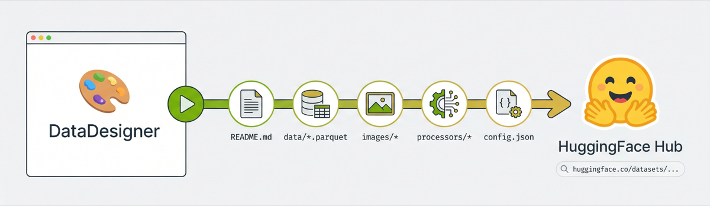
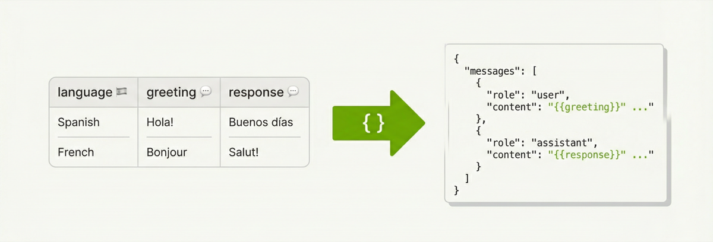

# **Push Datasets to Hugging Face Hub**


You just generated 10k multilingual greetings (or some other cool dataset). Now what — email a parquet file?
Nah. Call `.push_to_hub()` and you've got a live dataset page on Hugging Face. Done and dusted 🚢.


Here's the full flow — build a multilingual greeting dataset with a conversation
training processor, generate it, and push it to the Hub in one go:

```python
import data_designer.config as dd
from data_designer.interface import DataDesigner

data_designer = DataDesigner()
config_builder = dd.DataDesignerConfigBuilder()

config_builder.add_column(
    dd.SamplerColumnConfig(
        name="language",
        sampler_type=dd.SamplerType.CATEGORY,
        params=dd.CategorySamplerParams(
            values=["English", "Spanish", "French", "German", "Italian"],
        ),
        drop=True,
    )
)

config_builder.add_column(
    dd.LLMTextColumnConfig(
        name="greeting",
        model_alias="nvidia-text",
        prompt="Write a casual greeting in {{ language }}.",
    )
)
config_builder.add_column(
    dd.LLMTextColumnConfig(
        name="response",
        model_alias="nvidia-text",
        prompt="Write a helpful agent response to this greeting: '{{ greeting }}'.",
    )
)

# Reshape into an OpenAI-style conversation training format
config_builder.add_processor(
    dd.SchemaTransformProcessorConfig(
        name="conversations",
        template={
            "messages": [
                {"role": "user", "content": "{{ greeting }}"},
                {"role": "assistant", "content": "{{ response }}"},
            ]
        },
    )
)

results = data_designer.create(config_builder, num_records=10_000)

# Ship it:
url = results.push_to_hub(
    "my-org/multilingual-greetings",
    "10k synthetic agent/user conversations across 5 languages.",
    tags=["greetings", "multilingual", "conversation"],
)
print(url)  # https://huggingface.co/datasets/my-org/multilingual-greetings
```
<!-- more -->

---
## Two Ways In - same outcome

**From results** (the happy path) — you just ran `.create()`, you have the
results object, call `.push_to_hub()` on it.

**From a folder** (the "I closed my notebook" path) — you saved artifacts to
disk earlier and want to push them later:

```python
from data_designer.integrations.huggingface import HuggingFaceHubClient

url = HuggingFaceHubClient.push_to_hub_from_folder(
    dataset_path="./my-saved-dataset",
    repo_id="my-org/multilingual-greetings",
    description="10k synthetic agent/user conversations across 5 languages.",
)
```

<!-- more -->

---
## What Gets Uploaded



Everything. The upload pipeline runs in this order:

```
1. README.md          ← auto-generated dataset card
2. data/*.parquet     ← your main dataset (remapped from parquet-files/)
3. images/*           ← if you have image columns (skipped otherwise)
4. {processor}/*      ← processor outputs (remapped from processors-files/)
5. builder_config.json
6. metadata.json      ← paths rewritten to match HF repo layout
```

Each step is its own commit on the HF repo, so you get a clean history.

This is especially nice for large datasets. Data Designer writes output in
batched parquet partitions — generate 100k records and you'll have dozens of
parquet files across `parquet-files/`, `processors-files/`, and maybe `images/`.
Manually uploading all of that, organizing it into the right HF repo structure,
writing the dataset card YAML configs, and rewriting metadata paths would be
tedious and error-prone. `push_to_hub` handles the whole thing in one call —
folder uploads, path remapping, config registration, dataset card generation,
all of it.

Re-pushing to the same `repo_id` updates the existing repo — no need to delete
and recreate.
<!-- more -->

---
## Processors Get First-Class Treatment



Notice the `SchemaTransformProcessorConfig` in the example above. That's doing
the heavy lifting — it takes the raw `greeting` and `response` columns and
reshapes each row into an OpenAI-style `messages` array:

```python
config_builder.add_processor(
    dd.SchemaTransformProcessorConfig(
        name="conversations",
        template={
            "messages": [
                {"role": "user", "content": "{{ greeting }}"},
                {"role": "assistant", "content": "{{ response }}"},
            ]
        },
    )
)
```

The template is Jinja2 all the way down. Keys become columns in the output,
values get rendered per-row with the actual column data. The template dict must
be JSON-serializable — strings, lists, nested objects, all fair game. So you can
build arbitrarily complex conversation schemas (multi-turn, system prompts,
tool calls) just by adding more entries to the `messages` list.

The processor runs after each batch and writes its output to a separate parquet
file alongside the main dataset. The main dataset (`data/`) still has the raw
columns — the processor output is an *additional* view, not a replacement.

**When you push to hub, each processor gets its own top-level directory and its
own HF dataset config.** So the `conversations` processor from our example ends
up like this on HF:

```
my-org/multilingual-greetings/
├── README.md
├── data/
│   ├── batch_00000.parquet      ← raw columns (greeting, response)
│   └── batch_00001.parquet
├── conversations/
│   ├── batch_00000.parquet      ← transformed (messages array)
│   └── batch_00001.parquet
├── builder_config.json
└── metadata.json
```

The dataset card YAML frontmatter registers each processor as its own named
config:

```yaml
configs:
- config_name: data
  data_files: "data/*.parquet"
  default: true
- config_name: conversations
  data_files: "conversations/*.parquet"
```

So consumers grab exactly the format they need:

```python
from datasets import load_dataset

# Raw columns — good for analysis
df = load_dataset("my-org/multilingual-greetings", "data", split="train")

# Conversation format — ready for fine-tuning
df_conv = load_dataset("my-org/multilingual-greetings", "conversations", split="train")
print(df_conv[0])
# {'messages': [{'role': 'user', 'content': 'Hey! Como estás?'},
#               {'role': 'assistant', 'content': 'Hola! Estoy bien, gracias...'}]}
```

The Quick Start section in the generated README includes these snippets
automatically — one `load_dataset` call per processor.

**Metadata paths are rewritten too.** Local paths like
`processors-files/conversations/batch_00000.parquet` become
`conversations/batch_00000.parquet` so file references in the metadata match
the actual HF repo structure.

If there are no processors, all of this is silently skipped — no empty
directories, no phantom configs.
<!-- more -->

---
## The Auto-Generated Dataset Card

This is the fun part. The upload generates a full HuggingFace dataset card from
your run metadata. It pulls from `metadata.json` and `builder_config.json` to
build:

- A **Quick Start** section with `load_dataset` code (including processor subsets)
- A **Dataset Summary** with record count, column count, completion %
- A **Schema & Statistics** table — per-column type, uniqueness, null rate, token stats
- **Generation Details** — how many columns of each config type
- A **Citation** block so people can cite your dataset

Tags default to `["synthetic", "datadesigner"]` plus whatever you pass in.
Size category (`n<1K`, `1K<n<10K`, etc.) is auto-computed.

The template lives at `integrations/huggingface/dataset_card_template.md` if you
want to see the Jinja2 source.
<!-- more -->

---
## Auth

Token resolution follows the standard `huggingface_hub` chain:

1. Explicit `token=` parameter
2. `HF_TOKEN` env var
3. Cached creds from `hf auth login`

If none of those work, you get a clear error telling you what to do.
<!-- more -->

---
## Reproducible Pipelines — The Round-Trip

{ width="800" }

Here's the payoff: every dataset you push includes `builder_config.json` — the
full SDG pipeline definition. Anyone (including future-you) can recreate the
exact same pipeline from the HuggingFace URL:

```python
import data_designer.config as dd

config_builder = dd.DataDesignerConfigBuilder.from_config(
    "https://huggingface.co/datasets/my-org/multilingual-greetings/blob/main/builder_config.json"
)
```

That's it. One line. `from_config` accepts a raw URL, a local file path, a dict,
or a YAML string. When you hand it a HuggingFace Hub URL, it auto-rewrites the
blob URL to a raw URL behind the scenes so the fetch just works (same trick for
GitHub blob URLs).

The loaded config builder comes back fully hydrated — columns, model configs,
constraints, seed config, all of it. You can inspect it, tweak it, and re-run:

```python
from data_designer.interface import DataDesigner

# Maybe bump the count or swap a model
results = DataDesigner().create(config_builder, num_records=50_000)

# And push the new version right back
results.push_to_hub(
    "my-org/multilingual-greetings-v2",
    "50k version with the same pipeline.",
)
```

So the full loop is: **design → generate → push → share URL → recreate → iterate**.
The `builder_config.json` on HuggingFace *is* the reproducibility artifact.
<!-- more -->

---
## Gotchas

- **`repo_id` must be `username/dataset-name`** — exactly one slash. The client
  validates this before hitting the network.
- **`description` is required** — it's the prose that appears right under the
  title on the dataset card. Make it good.
- **`private=True`** if you don't want the world to see your dataset yet.
- **Metadata paths get rewritten** — local paths like `parquet-files/batch_00000.parquet`
  become `data/batch_00000.parquet` in the uploaded `metadata.json` so references
  stay valid on HF.
