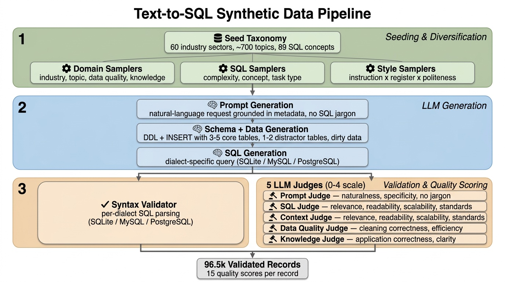
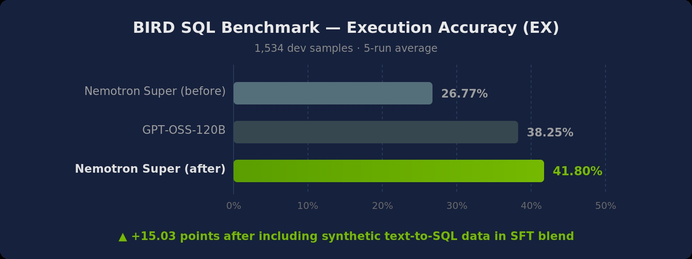

# **Engineering an Enterprise-Grade Text-to-SQL Dataset with NeMo Data Designer**



<br>

While LLMs have mastered generic coding, Text-to-SQL remains one of the most challenging frontiers in enterprise AI. In many ways this is due to (i) SQL tasks relying on both code and data and (ii) real-world data and databases being quite messy. Focusing on careful data design that accounts for real-world diversity and complexity, we built a [NeMo Data Designer](https://github.com/NVIDIA-NeMo/DataDesigner) pipeline that includes conditional sampling, three-stage LLM generation, code validators, and multi-dimensional judge scoring to generate reasoning-heavy text-to-SQL samples across PostgreSQL, MySQL, and SQLite, and automatically filter down to the highest quality 96.5k records. Each sample pairs a natural-language prompt and a fully synthetic database schema context with a target SQL query. To improve robustness and mimic the messiness of production databases, the pipeline injects distractor tables and columns into the schema context, forcing the model to learn to ignore irrelevant schema elements. The final dataset is validated and filtered through per-dialect syntax validators and five LLM-as-a-critic judges.

<!-- more -->

---

## **The "Real-World" Gap: Why Academic Data Wasn't Enough**

The gap between academic benchmarks and the messy reality of enterprise data warehouses is massive. On academic benchmarks like Spider (where schemas are clean, tables are few, and queries are straightforward), frontier models score above 85%. On [BIRD](https://bird-bench.github.io/) (which introduces dirty data, larger schemas, and external knowledge requirements), the same models drop to 60-70%. On [Spider 2.0 Lite](https://spider2-sql.github.io/) (which uses real enterprise databases with hundreds of tables, multiple dialects, and complex business logic), even the best models score below 50%.

The problem isn't model capability --- it's **training data**. Most open-source text-to-SQL datasets assume a "happy path": intuitive column names, perfect data types, and straightforward questions. Production SQL is different:

- **Dialect specificity.** Generic "SQL" doesn't compile. We needed valid, executable code for MySQL, PostgreSQL, and SQLite that respects their unique syntax --- `date('now')` in SQLite vs. `CURRENT_DATE` in Postgres, `DISTINCT ON` in PostgreSQL vs. nested subqueries in MySQL.
- **Dirty data.** Real columns contain currency symbols (`$57,500`), mixed date formats, and JSON blobs. The model needs to learn *defensive SQL*: writing queries that use `CAST`, `STR_TO_DATE`, and string manipulation functions to clean data at query time before attempting any aggregation. We explicitly prompted the generation engine to introduce anti-patterns like storing dates as text (`'01-Jan-2023'`), including currency symbols in pricing columns, or burying critical flags inside JSON blobs.
- **Distractor tables and schema linking.** In production, you rarely get just the 2 tables you need; you're more likely to get a schema with 50 tables, many of which look identical. We injected semantically similar "distractor" tables into every context --- `sales_orders` vs. `sales_orders_archive`, `customer_leads` vs. `active_customers` --- forcing the model to perform schema linking based on column constraints and relationships, not just table names.
- **Industry-specific schemas.** Healthcare EHR tables look nothing like financial trading systems. The column names, relationships, and business logic are domain-specific.
- **Complexity gradients.** Junior analysts write simple SELECTs; senior engineers write recursive CTEs with window functions. Training data needs the full spectrum.

The key insight: **domain diversity and complexity coverage matter more than dataset size**.

---

## **Pipeline Overview**

The pipeline generates text-to-SQL training data through a five-stage process. Each record flows through seeding & diversification, three LLM generation steps, and a validation + quality scoring layer. All three LLM generation stages use a reasoning model whose internal chain-of-thought improves schema design and SQL correctness. The pipeline runs independently for each SQL dialect, with dialect-specific prompts, validators, and judge prompts.

<details open markdown>
<summary><strong>ASCII version of the pipeline diagram</strong></summary>

```
                                  TEXT-TO-SQL SDG PIPELINE
                                  ========================

     ┌─────────────────────────────────────────────────────────────────────────────────────┐
     │                            STAGE 1: SEEDING & DIVERSIFICATION                       │
     │                                                                                     │
     │   Domain Controls                SQL Controls                 Prompt Controls       │
     │   ├─ industry_sector (60)        ├─ sql_complexity (3 tiers)  ├─ instruction_style  │
     │   ├─ topic (~700)                ├─ sql_concept (89 buckets)  │   (5 styles)        │
     │   ├─ data_quality_challenge      ├─ sql_task_type (12 cats)   ├─ linguistic_register│
     │   │   (5 categories)             └─ sql_task_concept (94)     │   (5 registers)     │
     │   └─ knowledge_dependency                                     └─ politeness_level   │
     │       (3 categories)                                              (4 levels)        │
     └─────────────────────────────────────────┬───────────────────────────────────────────┘
                                               │
                                               ▼
     ┌─────────────────────────────────────────────────────────────────────────────────────┐
     │               STAGE 2: PROMPT GENERATION (Reasoning LLM)                            │
     │                                                                                     │
     │   Generates a natural-language request to a data assistant.                         │
     │   Grounded in sampled metadata; no SQL jargon; realistic thresholds.                │
     │   Style adapts to instruction_style × linguistic_register × politeness_level.       │
     └─────────────────────────────────────────┬───────────────────────────────────────────┘
                                               │
                                               ▼
     ┌─────────────────────────────────────────────────────────────────────────────────────┐
     │             STAGE 3: SCHEMA + DATA GENERATION (Reasoning LLM)                       │
     │                                                                                     │
     │   Generates dialect-specific DDL (CREATE TABLE) + sample data (INSERT).             │
     │   ├─ 3–5 core tables with PKs, FKs, and realistic constraints                       │
     │   ├─ 1–2 distractor tables (plausible but unnecessary, with FK links)               │
     │   ├─ 3–5 distractor columns per table (created_at, updated_by, etc.)                │
     │   └─ Dirty data injected per data_quality_concept (mixed formats, embedded chars)   │
     └─────────────────────────────────────────┬───────────────────────────────────────────┘
                                               │
                                               ▼
     ┌─────────────────────────────────────────────────────────────────────────────────────┐
     │                  STAGE 4: SQL GENERATION (Reasoning LLM)                             │
     │                                                                                     │
     │   Generates dialect-specific SQL (SQLite / MySQL / PostgreSQL).                     │
     │   ├─ References only tables/columns from the schema context                         │
     │   ├─ Handles dirty data with cleaning logic (CAST, REPLACE, SUBSTR, regex)          │
     │   ├─ Ignores distractor tables and columns                                          │
     │   └─ Anchors relative time to max date in data (no CURRENT_DATE / NOW())            │
     └─────────────────────────────────────────┬───────────────────────────────────────────┘
                                               │
                                               ▼
     ┌─────────────────────────────────────────────────────────────────────────────────────┐
     │                    STAGE 5: VALIDATION + QUALITY SCORING                            │
     │                                                                                     │
     │   Syntax Validator          5 LLM Judges (0–4 scores)                               │
     │   ├─ SQL_SQLITE             ├─ Prompt: naturalness, specificity, no SQL jargon      │
     │   ├─ SQL_MYSQL              ├─ SQL: relevance, readability, scalability, standards  │
     │   └─ SQL_POSTGRES           ├─ Context: relevance, readability, scalability, stds   │
     │                             ├─ Data Quality: cleaning correctness, efficiency       │
     │                             └─ Knowledge: application correctness, clarity          │
     │                                                                                     │
     │   96.5k records pass validation and quality filtering                               │
     └─────────────────────────────────────────────────────────────────────────────────────┘
```

</details>

---

## **Step 1: Seeding & Diversification -- Controlling Diversity at the Source**

Rather than relying on LLM creativity alone for diversity, the pipeline samples structured metadata that deterministically controls every axis of variation. A JSON taxonomy file defines the problem space:

| Axis | Categories | Subcategories | Role |
|------|-----------|---------------|------|
| Industry sector | 60 | ~700 topics | Domain grounding (Healthcare, FinServ, Gaming, ...) |
| SQL complexity | 3 tiers | 89 concepts | Difficulty level (Beginner → Advanced) |
| SQL task type | 12 categories | 94 concepts | What the query does (analytics, transformation, ...) |
| Data quality | 5 challenges | 12 concepts | Dirty data to inject and clean |
| Knowledge dependency | 3 categories | 8 concepts | Implicit reasoning required |
| Instruction style | 5 styles | -- | imperative, declarative, interrogative, contextual, abbreviated |
| Linguistic register | 5 registers | -- | formal, conversational, technical, academic, direct |
| Politeness level | 4 levels | -- | none, minimal, polite, very polite |

Standard categorical samplers draw independently from their value lists. Data Designer's `SubcategorySamplerParams` creates hierarchical dependencies --- what we call "Semantic Blueprints" --- that ensure internally consistent records. When `industry_sector` samples "Healthcare", `topic` is drawn only from healthcare-specific subcategories. When `sql_complexity` samples "Beginner", `sql_concept` is restricted to foundational SQL operations. This is the difference between realistic training data and random noise.

!!! note "Code snippets in this post are illustrative"
    The code blocks below show the key configuration patterns for each pipeline stage. Model aliases (`prompt_gen`, `context_gen`, etc.) and companion files (`prompts.py`, `rubrics.py`) are referenced but not fully defined inline. For a complete, runnable pipeline, see the [Enterprise Text-to-SQL Recipe](../../recipes/code_generation/enterprise_text_to_sql/).

```python
import data_designer.config as dd

config = dd.DataDesignerConfigBuilder()

# Industry → Topic (two-level conditional)
config.add_column(dd.SamplerColumnConfig(
    name="industry_sector",
    sampler_type=dd.SamplerType.CATEGORY,
    params=dd.CategorySamplerParams(values=[
        "Healthcare", "Finance", "Technology", "Retail", "Manufacturing",
        "Aerospace", "Energy", "Telecommunications", "Transportation", "Education",
        # ... 60 industries total
    ]),
))

config.add_column(dd.SamplerColumnConfig(
    name="topic",
    sampler_type=dd.SamplerType.SUBCATEGORY,
    params=dd.SubcategorySamplerParams(
        category="industry_sector",
        values={
            "Healthcare":    ["Electronic Health Records", "Telemedicine Platforms",
                              "Clinical Trials", "Patient Scheduling", "Insurance Claims"],
            "Finance":       ["Fraud Detection", "Trading Systems", "Risk Assessment",
                              "Portfolio Management", "Regulatory Compliance"],
            "Technology":    ["Cloud Platforms", "ML Pipelines", "DevOps Tools",
                              "API Gateway Logs", "User Analytics"],
            "Retail":        ["Inventory Management", "Customer Segmentation",
                              "Pricing Optimization", "Supply Chain", "Returns Processing"],
            # ... 700 subcategories across all industries
        },
    ),
))

# Complexity → SQL Concept (two-level conditional)
config.add_column(dd.SamplerColumnConfig(
    name="sql_complexity",
    sampler_type=dd.SamplerType.CATEGORY,
    params=dd.CategorySamplerParams(values=["Beginner", "Intermediate", "Advanced"]),
))

config.add_column(dd.SamplerColumnConfig(
    name="sql_concept",
    sampler_type=dd.SamplerType.SUBCATEGORY,
    params=dd.SubcategorySamplerParams(
        category="sql_complexity",
        values={
            "Beginner":     ["Basic SELECT Statements", "WHERE Clauses", "Simple Aggregations", ...],
            "Intermediate": ["Window Functions", "Recursive CTEs", "Correlated Subqueries", ...],
            "Advanced":     ["Frame Clauses", "Pivot/Unpivot", "Geospatial SQL", ...],
        },
    ),
))

# Dialect control (one value per run; the pipeline runs once per dialect)
config.add_column(dd.SamplerColumnConfig(
    name="sql_dialect",
    sampler_type=dd.SamplerType.CATEGORY,
    params=dd.CategorySamplerParams(values=["SQLite"]),  # or "MySQL", "PostgreSQL"
))

# Task type restricted by complexity via conditional_params
task_types = {
    "Foundational Queries & DML": [...],
    "Data Quality & Validation": [...],
    "Advanced Analytics & Windowing": [...],
    "Schema, DDL & Performance": [...],
    # ... 12 task types total
}

task_type_conditional_params = {
    "sql_complexity == 'Beginner'": dd.CategorySamplerParams(
        values=["Foundational Queries & DML", "Data Quality & Validation", ...]
    ),
    "sql_complexity == 'Advanced'": dd.CategorySamplerParams(
        values=["Advanced Analytics & Windowing", "Schema, DDL & Performance", ...]
    ),
}

config.add_column(dd.SamplerColumnConfig(
    name="sql_task_type",
    sampler_type=dd.SamplerType.CATEGORY,
    params=dd.CategorySamplerParams(values=list(task_types.keys())),
    conditional_params=task_type_conditional_params,
))
```

Prompt diversity is controlled independently through three additional samplers (instruction style, linguistic register, politeness level). Because these are combinatorial (5 × 5 × 4 = 100 style combinations), even records with identical domain and SQL metadata will produce stylistically distinct prompts. A CFO asking "Can you pull the Q3 numbers?" and an engineer saying "Write a query that joins sales on customer_id" should both produce correct SQL.

---

## **Step 2: Generating Natural-Language Prompts**

The prompt generation step produces a single natural-language request to a data assistant. The LLM receives all sampled metadata via Jinja2 template variables and must produce a request that:

- Describes a **business problem**, not a SQL specification (no SQL jargon allowed)
- Matches the sampled instruction style, linguistic register, and politeness level
- Implicitly requires the sampled SQL concept, task type, data quality handling, and knowledge dependency
- Uses realistic thresholds appropriate for small sample data (5-10 rows per table)

```python
config.add_column(dd.LLMTextColumnConfig(
    name="sql_prompt",
    model_alias="prompt_gen",
    system_prompt=(
        "You write natural-language requests to a data assistant. "
        "You adapt your writing style based on the specified instruction style, "
        "linguistic register, and politeness level."
    ),
    prompt=(
        "Write a single-sentence, natural-language request to a data assistant.\n\n"
        "## Style Requirements\n"
        "* Instruction Style: {{ instruction_style }}\n"
        "* Linguistic Register: {{ linguistic_register }}\n"
        "* Politeness Level: {{ politeness_level }}\n\n"
        "## Grounding Requirements\n"
        "* Industry: {{ industry_sector }} / {{ topic }}\n"
        "* SQL Complexity: {{ sql_complexity }} ({{ sql_concept }})\n"
        "* Task: {{ sql_task_type }} ({{ sql_task_concept }})\n"
        "* Data Quality: {{ data_quality_challenge }} ({{ data_quality_concept }})\n"
        "* Knowledge: {{ knowledge_dependency }} ({{ knowledge_concept }})\n"
    ),
))
```

Here are example prompts generated from the same underlying SQL concept (window functions) but with different style settings:

| Style | Example Prompt |
|-------|---------------|
| imperative / formal / none | List each sales representative alongside their quarterly revenue and the running total across the team, ordered by performance. |
| interrogative / conversational / polite | Hey, could you show me how each rep's quarterly numbers stack up against the team's running total? |
| abbreviated / direct / none | Sales rep quarterly revenue, running team total, ranked by performance |
| contextual / academic / polite | For the upcoming performance review, could you provide each representative's quarterly revenue figures alongside a cumulative team total? |

---

## **Step 3: Schema and Data Generation with Distractor Injection**

This is the most distinctive stage of the pipeline. For each record, the LLM generates a complete database schema (DDL) and sample data (INSERT statements) in the target SQL dialect. The schema must include both the tables needed to answer the prompt *and* deliberate noise:

- **3–5 core tables** directly related to the industry/topic, connected via foreign keys
- **1–2 distractor tables** that are plausible for the domain but *not* needed to answer the prompt, each with FK relationships to core tables and 5-10 rows of realistic data
- **3–5 distractor columns per table** (e.g., `created_at`, `updated_by`, `description`, `is_active`) that are realistic but irrelevant to the query
- **Dirty data** injected according to the sampled `data_quality_concept` -- stored in TEXT/VARCHAR columns so the schema itself doesn't enforce type correctness

In production, you rarely get just the 2 tables you need; you're more likely to get a schema with 50 tables, many of which look identical. Injecting semantically similar "distractor" tables --- `sales_orders` vs. `sales_orders_archive`, `customer_leads` vs. `active_customers` --- forces the model to perform schema linking based on column constraints and relationships, not just table names. This is the skill gap between academic benchmarks and production.

The schema prompt requires four clearly labeled sections (`-- Core Tables`, `-- Distractor Tables`, `-- Sample Data for Core Tables`, `-- Sample Data for Distractor Tables`) and enforces determinism by forbidding real-time functions like `NOW()` or `CURRENT_DATE` in INSERT statements.

```python
config.add_column(dd.LLMCodeColumnConfig(
    name="sql_context",
    model_alias="context_gen",
    system_prompt="You are an expert SQL database architect who designs well-structured, normalized schemas.",
    prompt=(
        "Generate {{ sql_dialect }} DDL and sample data for tables relevant to the instruction.\n"
        "Instruction: {{ sql_prompt }}\n\n"
        "Requirements:\n"
        "* Include 3–5 core tables for {{ industry_sector }}/{{ topic }}\n"
        "* Include 1–2 distractor tables (plausible but NOT needed for the instruction)\n"
        "* Include 3–5 distractor columns per table\n"
        "* Introduce {{ data_quality_concept }} dirty data issues\n"
        "* Use section headers: -- Core Tables, -- Distractor Tables, etc.\n"
        "* No NOW()/CURRENT_DATE in INSERT statements\n"
    ),
    code_lang=dd.CodeLang.SQL_SQLITE,  # or SQL_MYSQL, SQL_POSTGRES
))
```

---

## **Step 4: Dialect-Specific SQL Generation**

The SQL generation step receives the natural-language prompt and the generated schema context, then produces an executable query in the target dialect. The prompt enforces several constraints that are critical for training quality:

- **Only reference defined tables/columns** -- the LLM is strictly forbidden from inventing schema elements
- **Handle dirty data** -- the query must clean data issues (CAST, REPLACE, SUBSTR, regex) before computing results
- **Ignore distractors** -- no unnecessary joins or column selections; distractor elements must be left untouched
- **Anchor relative time** -- instead of `CURRENT_DATE`, anchor to `(SELECT MAX(date_col) FROM table)` for reproducibility
- **Dialect-specific syntax** -- SQLite uses `strftime`, MySQL uses `DATE_SUB`, PostgreSQL uses `::` casting and `interval`. Each dialect also has its own explicit limitations (e.g., SQLite forbids `LATERAL` joins and `REGEXP_REPLACE`; MySQL forbids `REGEXP_REPLACE` and `CONVERT_TZ`)

```python
config.add_column(dd.LLMCodeColumnConfig(
    name="sql",
    model_alias="sql_gen",
    system_prompt="You are an expert SQL programmer. Return only the final SQL.",
    prompt=(
        "Write {{ sql_dialect }} SQL for the instruction using only the provided database context.\n"
        "Instruction: {{ sql_prompt }}\n\n"
        "Database Context:\n{{ sql_context }}\n\n"
        "* Handle {{ data_quality_concept }} issues with cleaning logic\n"
        "* Apply {{ knowledge_concept }}\n"
        "* Match {{ sql_complexity }} level using {{ sql_concept }}\n"
        "* Do NOT join distractor tables or select distractor columns\n"
    ),
    code_lang=dd.CodeLang.SQL_SQLITE,  # or SQL_MYSQL, SQL_POSTGRES
))
```

The pipeline runs independently for each dialect (SQLite, MySQL, PostgreSQL), producing ~32k records per dialect that are combined into the final 96.5k-record dataset. Separating prompt, schema, and query generation across three stages is essential --- when you ask a single prompt to generate all three, the SQL tends to reference tables that don't exist in the schema, or the schema doesn't contain the columns the SQL needs.

The chain-of-thought traces from the reasoning model teach it to *think like a Data Engineer*: decomposing complex problems, handling edge cases, and verifying logic before writing a single line of code. A typical reasoning trace looks like:

> "The user wants to filter by date, but the 'timestamp' column is stored as TEXT. I need to first normalize this column using STR_TO_DATE before I can apply the WHERE clause..."

---

## **Step 5: The Quality Waterfall**

Generating 300,000 samples is straightforward. Ensuring they are correct is the hard part. We implemented a rigorous "Quality Waterfall" that rejected over 68% of the generated data.

### Hard Validation

Data Designer's built-in code validator checks each SQL query for syntactic correctness against the target dialect:

```python
config.add_column(dd.ValidationColumnConfig(
    name="sql_validity_result",
    target_columns=["sql"],
    validator_type=dd.ValidatorType.CODE,
    validator_params=dd.CodeValidatorParams(code_lang=dd.CodeLang.SQL_SQLITE),
))
```

The validator returns `is_valid` (boolean) and `error_messages` (string). Records that fail parsing are flagged immediately. Supported dialects: `SQL_SQLITE`, `SQL_POSTGRES`, `SQL_MYSQL`, `SQL_TSQL`, `SQL_BIGQUERY`, `SQL_ANSI`.

### Five LLM Judges

Beyond syntax validity, we evaluate record *quality* across five judges, each scoring on a 0-4 scale:

| Judge | What It Evaluates | Scoring Criteria |
|-------|-------------------|-----------------|
| Prompt Judge | Natural-language prompt quality | Naturalness of wording, specificity and clarity, absence of SQL jargon |
| SQL Judge | Generated SQL quality | Relevance (penalizes unnecessary joins to distractor tables), readability, scalability, standards compliance |
| Context Judge | Schema + sample data quality | Relevance (penalizes missing distractors and bare-minimum schemas), readability, scalability, standards compliance |
| Data Quality Judge | Cleaning logic in SQL | Correctness of cleaning logic, efficiency of cleaning method |
| Knowledge Judge | Implicit knowledge application | Correctness of knowledge application, clarity of inference |

The SQL judge rubric explicitly penalizes distractor usage:

> *"The SQL should only JOIN or reference tables that are strictly necessary to answer the prompt. The database context may include distractor tables that look relevant but are not needed -- penalize queries that unnecessarily join or reference these tables."*

Each judge provides a score *and* reasoning for each dimension, making it easy to diagnose why a record scored low. After configuring the five `LLMJudgeColumnConfig` columns (see the [full recipe](../../recipes/code_generation/enterprise_text_to_sql/) for complete judge definitions), expression columns extract numeric scores into flat columns for downstream filtering:

```python
config.add_column(dd.ExpressionColumnConfig(
    name="sql_relevance_score",
    expr="{{ sql_judge_result.relevance.score if sql_judge_result.relevance.score is not none else '' }}",
))
```

---

## **Rich Metadata for Precision Training**

We didn't just generate text pairs --- we generated structured data. Unlike standard datasets that give you a black box of question → SQL, every single record is tagged with rich, granular metadata:

| Field | Description | Example Values |
|-------|-------------|----------------|
| `industry_sector` | Domain vertical | Healthcare, Finance, Aerospace |
| `topic` | Specific subdomain | Electronic Health Records, Fraud Detection |
| `sql_complexity` | Difficulty tier | Beginner, Intermediate, Advanced |
| `sql_concept` | Target SQL skill | Window Functions, Recursive CTEs |
| `sql_dialect` | Target database | PostgreSQL, MySQL, SQLite |
| `instruction_style` | Prompt style | imperative, interrogative, contextual |
| `linguistic_register` | Language register | formal, conversational, technical |
| `politeness_level` | Politeness level | none, minimal, polite, very polite |
| `data_quality_challenge` | Dirty data type | Type Mismatches, Temporal Drift |
| `knowledge_dependency` | Reasoning required | Domain Knowledge, Implicit Logic |
| 15 judge scores | Per-dimension scores | 0-4 across 5 judges |

This allows researchers and engineers to "slice and dice" the training data with surgical precision. If you want to fine-tune a model specifically for Finance analytics using Window Functions in PostgreSQL, you can filter for exactly that subset.

---

## **Results**

| Metric | Value |
|--------|-------|
| Records generated | 300,000 |
| Records after Quality Waterfall | 96,500 |
| Rejection rate | 68% |
| SQL dialects | PostgreSQL, MySQL, SQLite |
| Industry coverage | 60 distinct industries |
| Topic coverage | ~700 distinct subcategories |
| SQL concept coverage | 89 concepts across 3 complexity tiers |
| Syntax validation | 100% verified |
| LLM judges | 5 judges, 15 scoring dimensions |
| Minimum judge score | ≥ 3/4 across all dimensions |

The high rejection rate is a feature, not a bug. By generating 3x more data than we needed and filtering aggressively, we ensured every record in the final dataset is both syntactically valid and semantically meaningful.

---

## **BIRD Benchmark Results**

This dataset was shipped in the SFT stage of **Nemotron Super v3**. On the [BIRD SQL benchmark](https://bird-bench.github.io/) (1,534 dev samples, 5-run average), Nemotron Super achieves **41.80% EX** (execution accuracy) --- outperforming GPT-OSS-120B at 38.25%. Including our synthetic dataset in the SFT blend raised Nemotron Super's EX on BIRD by **15 points**, from 26.77% to 41.80%.



<br>

| Model | BIRD EX (%) |
|-------|-------------|
| Nemotron Super (before synthetic text-to-SQL SFT data) | 26.77 |
| GPT-OSS-120B | 38.25 |
| **Nemotron Super (after synthetic text-to-SQL SFT data)** | **41.80** |

**Caveat on BIRD:** BIRD measures *execution accuracy* (EX) --- whether the query returns the correct result set when run against the ground-truth database. This is stricter than exact-match or string similarity, but it can also be inflated by semantically different queries that happen to produce identical result sets on small test data. BIRD's dev set includes dirty data, external knowledge requirements, and multi-table schemas, making it more representative of production SQL than earlier benchmarks like Spider --- but it does not cover all production challenges (e.g., multi-statement transactions, DDL, stored procedures, or the hundreds-of-tables schemas common in enterprise warehouses). Results here are on the 1,534-sample dev split averaged over 5 runs.

---

## **Key Takeaways**

1. **Conditional sampling prevents incoherent records.** `SubcategorySamplerParams` ensures "Geospatial SQL" only appears with "Advanced" complexity, and "Electronic Health Records" only appears with "Healthcare". Independent samplers would produce nonsensical combinations that confuse training.

2. **Three-stage generation beats one-shot.** Separating prompt, schema, and query generation ensures the SQL actually references the tables that exist. One-shot generation frequently hallucinates tables.

3. **Dirty data must be intentional.** Explicitly prompting for anti-patterns (dates as text, currency symbols, JSON blobs) forces the model to learn defensive SQL. Clean schemas produce clean-only training data.

4. **Distractor tables teach schema linking.** Injecting semantically similar but irrelevant tables forces the model to *read* the schema instead of guessing from table names. This is the skill gap between academic benchmarks and production.

5. **Per-dialect generation avoids lowest-common-denominator SQL.** Rather than generating ANSI SQL and hoping it works everywhere, the pipeline produces dialect-specific schemas and queries with appropriate syntax (`strftime` vs `DATE_SUB` vs `interval`, `REPLACE()` vs `regexp_replace`). Each dialect gets its own tailored prompts, validators, and judge prompts.

6. **Hard validators are non-negotiable for code.** LLM judges can assess quality, but they can't reliably detect syntax errors. Syntax validators catch parsing failures that the judge misses.

7. **Multi-dimension scoring enables targeted filtering.** A query that scores 4 on Relevance but 1 on Efficiency tells you the model understood the task but wrote a bad plan. You can filter differently depending on what you're training for.

8. **Chain-of-thought teaches reasoning, not just syntax.** Including reasoning traces in the training data teaches models to decompose problems, handle edge cases, and verify logic --- acting as a Data Engineer rather than a translator.

---

## **Next Steps**

- **Code Sandbox for semantic correctness.** The current Quality Waterfall validates syntax and assesses quality (LLM judges), but it doesn't verify whether the query actually returns the right results. A natural next step would be adding Code Sandbox support to Data Designer --- executing generated SQL against a ground-truth database and comparing results to enable execution-based filtering, end-to-end verification, and hard negative mining for preference training.
- **RL on BIRD.** Run reinforcement learning experiments using the [NeMo Gym](https://github.com/NVIDIA-NeMo/Gym) RL environment for BIRD, training models to improve execution accuracy through reward signals from actual query execution.
- **Schema representation.** Improve how schemas are represented in prompts to close the gap with SOTA approaches that use richer structural encodings (e.g., foreign key graphs, column descriptions, value examples).
- **More benchmarks.** Incorporate additional SQL benchmarks --- [Spider 2.0](https://spider2-sql.github.io/), [LiveSQLBench](https://livesqlbench.github.io/) --- to evaluate generalization beyond BIRD and drive the next iteration of the pipeline.

---

## **Try It Yourself**

The snippet below builds a simplified text-to-SQL pipeline for SQLite using Data Designer. It covers the core stages -- seeding & diversification, prompt generation, schema generation with distractors, SQL generation, syntax validation, and LLM judge scoring.

<details markdown>
<summary><strong>Minimal example: text-to-SQL pipeline for SQLite</strong></summary>

```python
import data_designer.config as dd
from data_designer.interface import DataDesigner

MODEL_ALIAS = "nvidia-text"

# Build the pipeline (uses default NVIDIA provider via NVIDIA_API_KEY)
data_designer = DataDesigner()
config = dd.DataDesignerConfigBuilder()

# --- Stage 1: Seeding & diversification ---
config.add_column(dd.SamplerColumnConfig(
    name="industry_sector", sampler_type=dd.SamplerType.CATEGORY,
    params=dd.CategorySamplerParams(values=["Healthcare", "Financial Services", "Retail"]),
))
config.add_column(dd.SamplerColumnConfig(
    name="sql_complexity", sampler_type=dd.SamplerType.CATEGORY,
    params=dd.CategorySamplerParams(values=["Beginner", "Intermediate", "Advanced"]),
))
config.add_column(dd.SamplerColumnConfig(
    name="instruction_style", sampler_type=dd.SamplerType.CATEGORY,
    params=dd.CategorySamplerParams(
        values=["imperative", "declarative", "interrogative", "contextual", "abbreviated"]
    ),
))

# --- Stage 2: Natural-language prompt ---
config.add_column(dd.LLMTextColumnConfig(
    name="sql_prompt", model_alias=MODEL_ALIAS,
    prompt=(
        "Write a natural-language request to a data assistant about {{ industry_sector }}.\n"
        "Style: {{ instruction_style }}. Complexity: {{ sql_complexity }}.\n"
        "Describe the business problem without SQL jargon."
    ),
))

# --- Stage 3: Schema + data with distractors ---
config.add_column(dd.LLMCodeColumnConfig(
    name="sql_context", model_alias=MODEL_ALIAS,
    prompt=(
        "Generate SQLite DDL and sample data for: {{ sql_prompt }}\n"
        "Include 3-5 core tables, 1-2 distractor tables, distractor columns per table.\n"
        "Use section headers: -- Core Tables, -- Distractor Tables, etc."
    ),
    code_lang=dd.CodeLang.SQL_SQLITE,
))

# --- Stage 4: SQL generation ---
config.add_column(dd.LLMCodeColumnConfig(
    name="sql", model_alias=MODEL_ALIAS,
    prompt=(
        "Write SQLite SQL for: {{ sql_prompt }}\n"
        "Database Context:\n{{ sql_context }}\n"
        "Ignore distractor tables/columns. Handle dirty data."
    ),
    code_lang=dd.CodeLang.SQL_SQLITE,
))

# --- Stage 5: Validation + judge ---
config.add_column(dd.ValidationColumnConfig(
    name="sql_validity",
    target_columns=["sql"],
    validator_type=dd.ValidatorType.CODE,
    validator_params=dd.CodeValidatorParams(code_lang=dd.CodeLang.SQL_SQLITE),
))

config.add_column(dd.LLMJudgeColumnConfig(
    name="sql_judge", model_alias=MODEL_ALIAS,
    prompt=(
        "Grade the SQL quality.\n"
        "Prompt: {{ sql_prompt }}\nContext: {{ sql_context }}\nSQL: {{ sql }}\n"
        "Penalize unnecessary joins to distractor tables."
    ),
    scores=[
        dd.Score(name="relevance", description="Uses only necessary tables/columns",
                 options={"4": "Perfect", "3": "Minor extras", "2": "Unnecessary joins", "1": "Largely irrelevant", "0": "Wrong"}),
        dd.Score(name="readability", description="Code clarity and formatting",
                 options={"4": "Excellent", "3": "Good", "2": "Adequate", "1": "Poor", "0": "Unreadable"}),
    ],
))

# Generate
preview = data_designer.preview(config, num_records=10)
preview.display_sample_record()
```

</details>

<details markdown>
<summary><strong>Full recipe: <code>enterprise_text_to_sql.py</code> (self-contained, runnable)</strong></summary>

[Download Code :octicons-download-24:](../../assets/recipes/code_generation/enterprise_text_to_sql.py){ .md-button download="enterprise_text_to_sql.py" }

```python
--8<-- "assets/recipes/code_generation/enterprise_text_to_sql.py"
```

</details>

---

## **Summary**

This dataset is the result of a cross-functional effort across the NeMo Data Designer and Nemotron teams at NVIDIA, combining expertise in synthetic data generation, SQL engineering, and large-scale model training.

Because this pipeline is encapsulated in Data Designer, the configuration can be shared with any team --- allowing them to fork our baseline, swap in their own schemas or industry verticals, and generate a custom, high-fidelity dataset for their specific domain in hours, not months.

---

**Key Resources:**

- **NeMo Data Designer:** [github.com/NVIDIA-NeMo/DataDesigner](https://github.com/NVIDIA-NeMo/DataDesigner)
- **BIRD Benchmark:** [bird-bench.github.io](https://bird-bench.github.io/)
- **Spider 2.0 Benchmark:** [spider2-sql.github.io](https://spider2-sql.github.io/)
- **Structured Outputs Dev Note** (related pipeline): [Structured Outputs for Nemotron](structured-outputs-from-nemotron.md)
- **RQA Dev Note** (reasoning data with Data Designer): [Graduate-Level Science Reasoning Data](rqa.md)

---

*Want to learn more about NeMo Data Designer? Check out our [documentation](https://github.com/NVIDIA-NeMo/DataDesigner) and start building your own high-fidelity synthetic datasets today.*
