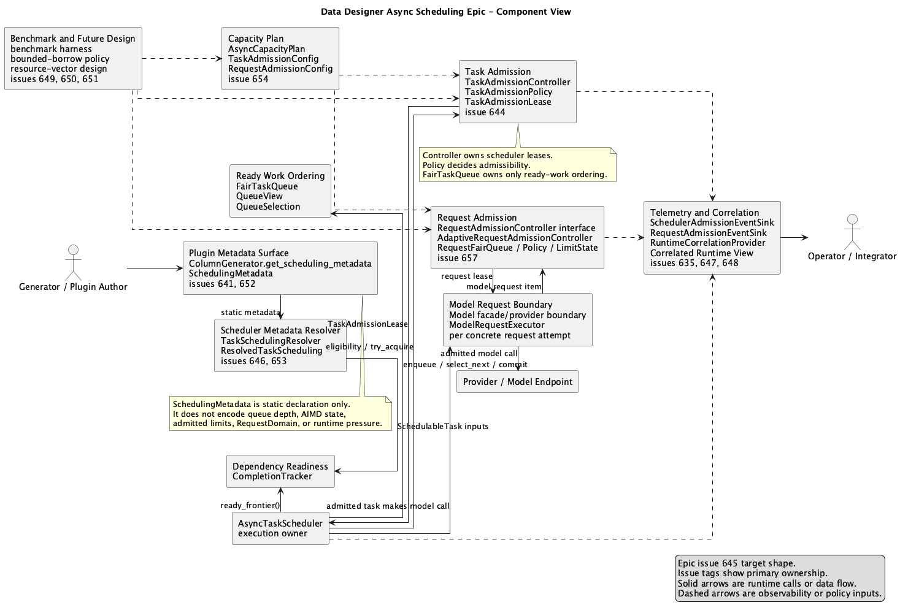
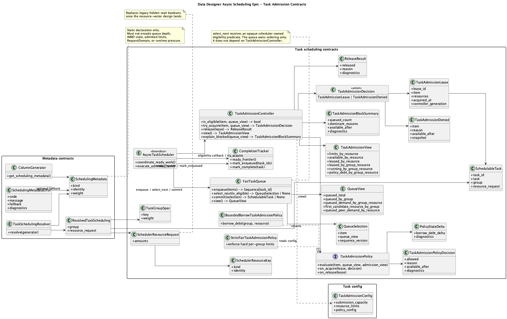
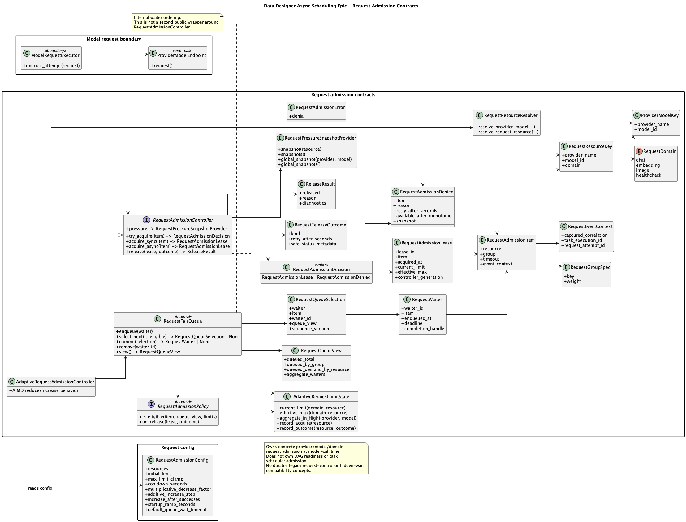
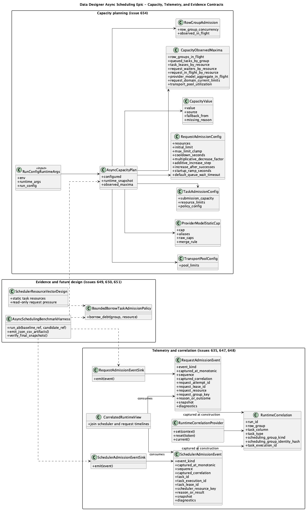
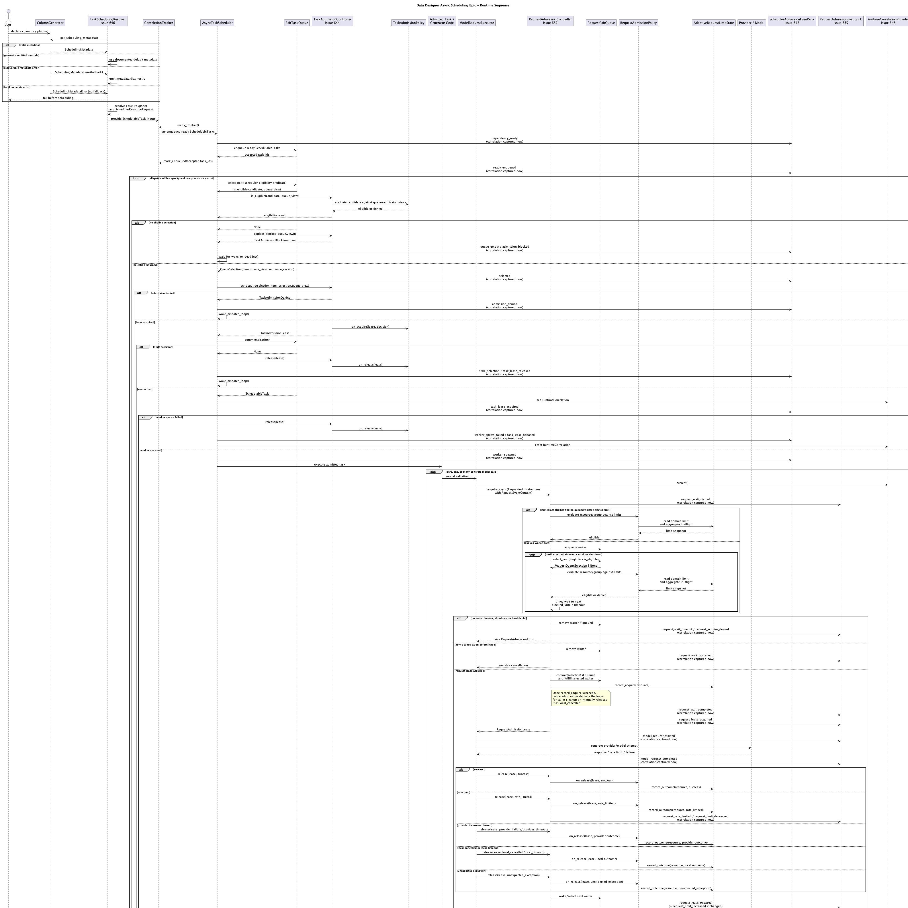
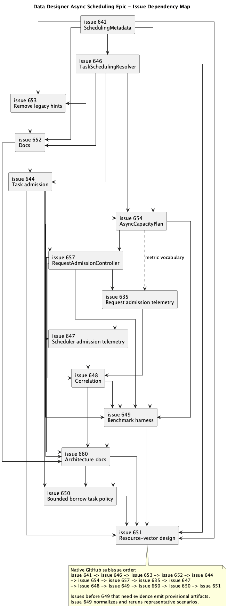

# Async Scheduling Architecture Plan

Source-of-truth architecture plan for the async scheduling epic tracked by issue 645. The UML file is the visual index; the Markdown files in this directory are the durable spec. GitHub issues should point back here and focus on implementation sequencing, quality gates, tests, and evidence.

If an issue body and this plan disagree, update this plan first, then adjust the issue to reference the corrected section.

This directory is the maintainer source of truth while the epic is active. Issue 660 promotes the stabilized V1 content into current user/operator architecture docs and marks older pre-epic scheduling descriptions as historical or removes them.

## Spec

- [Architecture](architecture.md): target system shape, ownership boundaries, invariants, and non-goals.
- [Contracts](contracts.md): durable DTO, protocol, event, and config names.
- [Module ownership](module-ownership.md): final repository/module homes, import rules, audience boundaries, tests, and benchmark ownership.
- [Capacity model](capacity-model.md): layered capacity vocabulary and ownership.
- [Task admission](task-admission.md): scheduler-owned ready selection, task leases, policy hooks, bounded borrowing, and resource-vector direction.
- [Request admission](request-admission.md): model-call admission, AIMD controller shape, dynamic request semantics, and replacement of pre-epic request-control names.
- [Observability](observability.md): scheduler events, request events, runtime correlation, snapshots, and cardinality rules.
- [Benchmark plan](benchmark-plan.md): scenarios, metrics, A/B baselines, and required artifacts.
- [Migration and cleanup](migration-and-cleanup.md): legacy-name removal, grep gates, and no-shim rules.
- [Issue map](issue-map.md): how the GitHub issues map to this source-of-truth plan.

## Read This First

Recommended reading paths:

- Implementers: [Architecture](architecture.md), [Contracts](contracts.md), [Module ownership](module-ownership.md), then the topic file for the issue being implemented.
- Plugin documentation authors: [Contracts](contracts.md#metadata-contracts), [Architecture](architecture.md#audience-and-api-boundaries), and [Migration and cleanup](migration-and-cleanup.md#documentation-cleanup).
- Operators and performance reviewers: [Capacity model](capacity-model.md), [Observability](observability.md), and [Benchmark plan](benchmark-plan.md).
- Issue owners: [Issue map](issue-map.md), then the linked source sections for the issue.

## Source

- [async-scheduling-epic.puml](async-scheduling-epic.puml): PlantUML source for every diagram on this page.

The PNG files in this directory are generated review artifacts. The PlantUML file is authoritative for diagram source. Any PR that changes the UML should regenerate the PNGs and include them in the same diff, or explicitly state why rendering was unavailable.

## Component View



## Task Admission Contracts



## Request Admission Contracts



## Capacity, Telemetry, and Evidence Contracts



## Runtime Sequence



## Issue Dependency Map



## Render

```bash
plantuml plans/645/async-scheduling-epic.puml
```

The expected runtime control owner is `AsyncTaskScheduler`:

```text
ColumnGenerator.get_scheduling_metadata()
  -> SchedulingMetadata
  -> TaskSchedulingResolver
  -> ResolvedTaskScheduling
  -> SchedulableTask inputs

AsyncTaskScheduler
  -> CompletionTracker.ready_frontier()
  -> FairTaskQueue.enqueue(...)
  -> FairTaskQueue.select_next(scheduler-owned eligibility callback)
  -> TaskAdmissionController.try_acquire(selection.item, selection.queue_view)
  -> FairTaskQueue.commit(...)
  -> execute admitted task/generator code

Admitted task/generator code
  -> model facade/provider boundary
  -> ModelRequestExecutor.execute_attempt(...) per concrete request attempt
  -> RequestAdmissionController.acquire_async(...)
  -> provider/model endpoint
  -> RequestAdmissionController.release(lease, outcome)
```

Task admission and request admission each have explicit controller, queue, policy, and lease/state boundaries where applicable. Telemetry observes scheduler admission and request admission separately, then issue 648 correlates the two timelines through the runtime correlation provider.
