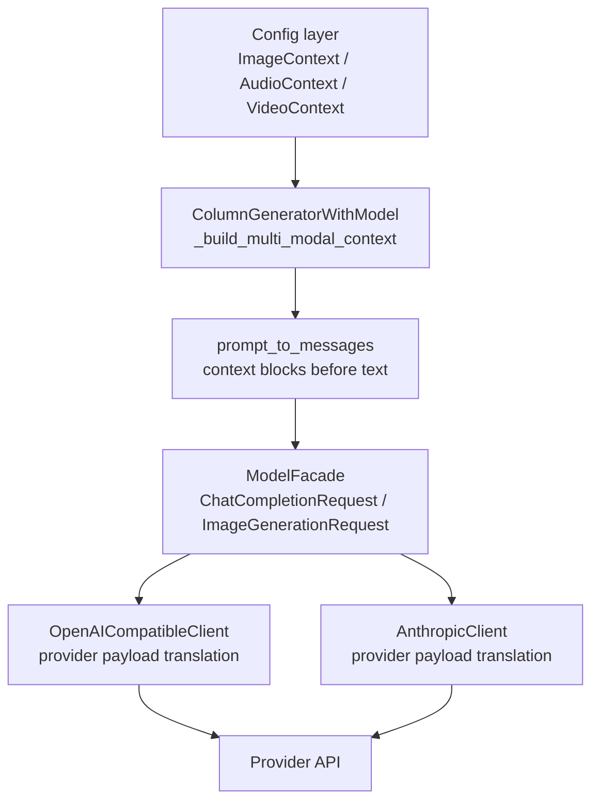

# Plan: Audio and video as multimodal context

## Problem

DataDesigner can already attach image values from upstream columns to model-generated prompts through `ImageContext`. This lets users declare that a text or image column should use a reference image without manually wiring model payloads.

The same declarative pattern is missing for audio and video. Users who want to summarize an audio clip, classify a recorded conversation, describe a video, or generate text conditioned on media currently need provider-specific workarounds outside the column config. That breaks the "declare, don't orchestrate" contract and makes media-heavy datasets harder to express.

## Current State

The existing image-context flow is narrow and useful:

1. `ImageContext` in `packages/data-designer-config/src/data_designer/config/models.py` normalizes a column value into ChatML-style `image_url` blocks. It supports strings, lists, JSON-serialized lists, and array-like values. When `data_type=None`, it auto-detects URLs, local image paths under `base_path`, and base64 image payloads.
2. `LLMTextColumnConfig` and `ImageColumnConfig` expose `multi_modal_context: list[ImageContext] | None` and include context columns in `required_columns`.
3. `ColumnGeneratorWithModel._build_multi_modal_context()` passes the artifact `base_dataset_path` into each context object so generated image paths can be resolved before an endpoint call.
4. `prompt_to_messages()` places context blocks before the text prompt in the user message.
5. The OpenAI-compatible adapter forwards `image_url` blocks unchanged. The Anthropic adapter translates `image_url` blocks into Claude `image` content blocks.

This gives audio/video a clear model to follow, but the type names and helper functions are image-specific.

## Goals

- Add first-class `AudioContext` and `VideoContext` config objects that can be used wherever `ImageContext` is accepted today.
- Preserve the current image API and behavior.
- Keep user config declarative: the user names columns and media formats; the engine and provider adapters handle payload construction.
- Support scalar, list, JSON-list, numpy-array, URL, and base64 values consistently across modalities where provider APIs permit them.
- Surface unsupported provider/model combinations as canonical DataDesigner/provider errors instead of letting raw provider 400s leak through.
- Keep the implementation inside the existing layer direction: interface -> engine -> config.

## Non-goals

- Do not add audio or video generation columns in this change. The scope is media as input context.
- Do not introduce ffmpeg, moviepy, or other heavy media dependencies in config import paths.
- Do not add automatic video frame extraction in v1. That can be a separate fallback strategy for providers without native video input.
- Do not migrate the model facade from Chat Completions to Responses in this plan. The OpenAI-compatible adapter can gain a Responses route later if needed for richer media support.
- Do not expose provider file IDs, uploads, filenames, or other provider-specific file metadata on context config models.

## Provider Notes

Provider support is uneven, so the DataDesigner API should be stable while adapters translate or reject by capability.

- OpenAI Chat Completions user content supports text, image, audio, and file content parts. Its audio content part is `input_audio` with base64 data and a `wav` or `mp3` format. DataDesigner v1 context config should still expose only URL or base64 source data; provider-specific file parts are adapter internals. See the OpenAI Chat API reference: https://developers.openai.com/api/reference/resources/chat
- OpenAI Responses exposes a more general input-item model with image/file inputs and should be evaluated later as a better adapter route for richer media support. See the OpenAI Responses create reference: https://developers.openai.com/api/reference/resources/responses/methods/create
- Anthropic Messages currently documents image input through `base64`, `url`, and provider file source types, with supported image media types only. DataDesigner v1 should map only URL/base64 image context into Anthropic and reject audio/video context. See the Claude vision and Messages docs: https://platform.claude.com/docs/en/build-with-claude/vision and https://platform.claude.com/docs/en/build-with-claude/working-with-messages

## Proposed API

Users should be able to declare mixed media context alongside existing image context:

```python
builder.add_column(
    dd.LLMTextColumnConfig(
        name="clip_summary",
        prompt="Summarize the relevant visual and spoken details.",
        model_alias="openai-audio-video-model",
        multi_modal_context=[
            dd.AudioContext(
                column_name="audio_clip",
                data_type=dd.ModalityDataType.BASE64,
                audio_format=dd.AudioFormat.MP3,
            ),
            dd.VideoContext(
                column_name="screen_recording",
                data_type=dd.ModalityDataType.BASE64,
                video_format=dd.VideoFormat.MP4,
            ),
            dd.ImageContext(column_name="thumbnail"),
        ],
    )
)
```

The field name `multi_modal_context` stays unchanged. Its type becomes a union of supported context models instead of `list[ImageContext]`.

## Design Decisions

| Decision | Choice | Rationale |
|---|---|---|
| Config surface | Add `AudioContext` and `VideoContext`; keep `ImageContext` unchanged | Users get the same declarative pattern with no image migration burden. |
| Context union | Introduce `MultiModalContextT = Annotated[ImageContext \| AudioContext \| VideoContext, Field(discriminator="modality")]` | Pydantic can deserialize exported configs reliably while preserving concrete context behavior. |
| Modality enum | Extend `Modality` with `AUDIO` and `VIDEO` | Keeps context identity explicit and future-proofs provider capability checks. |
| Data type enum | Keep `ModalityDataType.URL` and `BASE64` for v1 | Context config describes the value stored in the referenced column: either a URL or base64-encoded media. Provider file IDs and upload lifecycle are outside the config layer. |
| Local files | Do not add local-path support for new audio/video contexts in v1 | The referenced column should contain either a URL or base64-encoded media. Existing `ImageContext` local-path behavior remains for backward compatibility, but audio/video should not introduce path-to-base64 conversion. |
| Remote URLs | Pass URL values through to the endpoint when the adapter/provider supports URL sources; otherwise raise a canonical unsupported error | Avoid hidden downloads, hidden conversions, and surprising latency/cost in DataDesigner. |
| Provider-neutrality | Context classes emit canonical DataDesigner media blocks; adapters convert to provider payloads | Prevents OpenAI-specific `image_url`/`input_audio` shapes from spreading further into config. The adapters already own provider translation for Anthropic images. |
| Provider filenames | Do not expose `filename` on config context models | Filenames are provider/file-upload metadata, not declarative dataset intent. If a provider requires a filename, the adapter should derive it from the URL basename when available or synthesize one from the media type. |
| Backward compatibility | Accept legacy `image_url` blocks in adapters during the transition | Existing traces/tests and custom plugins that build `image_url` blocks keep working. |
| Video v1 | Represent video as a canonical video media block with URL or base64 source data and only enable provider paths that explicitly support video input | Native video-understanding support differs by provider. DataDesigner should fail clearly when a configured provider cannot consume the block. |

## Architecture



The important boundary is adapter translation. Config objects describe media in a canonical form; adapters own provider payload shapes and unsupported-modality errors.

## Canonical Block Shape

Add a small internal content-block schema in config or engine model utilities. Keep it plain dictionaries for compatibility with the current message plumbing. Every media block has either `source.type == "url"` or `source.type == "base64"`. URL sources are shipped to the endpoint as URLs when the provider supports URL input; base64 sources are shipped as base64.

```python
{"type": "image", "source": {"type": "base64", "media_type": "image/png", "data": "..."}}
{"type": "image", "source": {"type": "url", "url": "https://example.com/image.png"}}

{"type": "audio", "source": {"type": "base64", "media_type": "audio/mpeg", "data": "...", "format": "mp3"}}
{"type": "audio", "source": {"type": "url", "url": "https://example.com/audio.mp3", "format": "mp3"}}

{"type": "video", "source": {"type": "base64", "media_type": "video/mp4", "data": "..."}}
{"type": "video", "source": {"type": "url", "url": "https://example.com/clip.mp4"}}
```

OpenAI-compatible translation maps:

- `image` base64/url -> existing `{"type": "image_url", "image_url": {"url": ...}}`
- `audio` base64 with `mp3`/`wav` -> `{"type": "input_audio", "input_audio": {"data": ..., "format": ...}}`
- `video` base64/url -> provider-supported video content parts when supported; URL video sources stay URLs

Anthropic translation maps:

- `image` base64/url -> Claude `{"type": "image", "source": ...}`
- `audio`/`video` -> canonical unsupported-capability error in v1

## Implementation Steps

### 1. Add media context config types

Files:

- `packages/data-designer-config/src/data_designer/config/models.py`
- `packages/data-designer-config/src/data_designer/config/__init__.py`
- `packages/data-designer-config/tests/config/test_models.py`

Work:

- Extend `Modality` with `AUDIO` and `VIDEO`.
- Add `AudioFormat` and `VideoFormat` enums. Start conservatively:
  - `AudioFormat`: `MP3`, `WAV`
  - `VideoFormat`: `MP4`, `MOV`, `WEBM`
- Add `AudioContext` and `VideoContext` classes.
- Change concrete context `modality` fields to `Literal[...]` values so Pydantic discriminated unions work.
- Add `MultiModalContextT` type alias and use it from column configs.
- Preserve `ImageContext` behavior and imports.

### 2. Extract shared media normalization helpers

Files:

- `packages/data-designer-config/src/data_designer/config/utils/media_helpers.py`
- existing `image_helpers.py` only where image-specific validation is still needed
- `packages/data-designer-config/tests/config/utils/test_media_helpers.py`

Work:

- Move reusable value normalization out of `ImageContext`: scalar string, list, JSON-list string, array-like.
- Add base64 and URL helpers that work for audio and video without importing heavy libraries.
- Keep image validation and image format detection in `image_helpers.py`.
- Add MIME helpers for audio/video formats.
- Keep URL detection extension-aware and non-string-safe, matching the current image helper pattern.
- Do not add audio/video path-to-base64 helpers in this step.

### 3. Update column config typing and required columns

Files:

- `packages/data-designer-config/src/data_designer/config/column_configs.py`
- `packages/data-designer-config/tests/config/test_columns.py`

Work:

- Replace `list[ImageContext] | None` with `list[MultiModalContextT] | None` on `LLMTextColumnConfig` and `ImageColumnConfig`.
- Update field descriptions from "image contexts" to "multimodal contexts".
- Keep `required_columns` logic generic by reading `ctx.column_name`.
- Add tests for audio/video context columns being included in `required_columns`.

### 4. Keep engine prompt plumbing generic

Files:

- `packages/data-designer-engine/src/data_designer/engine/column_generators/generators/base.py`
- `packages/data-designer-engine/src/data_designer/engine/models/utils.py`
- `packages/data-designer-engine/tests/engine/models/test_model_utils.py`
- generator tests under `packages/data-designer-engine/tests/engine/column_generators/generators/`

Work:

- Keep `_build_multi_modal_context()` generic. It already calls `context.get_contexts(record, base_path=...)`; new audio/video contexts should ignore `base_path` unless a future design intentionally adds local file support.
- Update docstrings from "image" to "media".
- Add mixed image/audio/video tests to ensure `prompt_to_messages()` keeps media blocks before the text prompt.
- Verify prompt validation still suppresses the "prompt without references" warning when any multimodal context is present.

### 5. Translate or reject media blocks in adapters

Files:

- `packages/data-designer-engine/src/data_designer/engine/models/clients/adapters/openai_compatible.py`
- `packages/data-designer-engine/src/data_designer/engine/models/clients/adapters/anthropic_translation.py`
- `packages/data-designer-engine/src/data_designer/engine/models/clients/errors.py`
- provider adapter tests

Work:

- Add content-block translation helpers before requests leave each adapter.
- OpenAI-compatible:
  - Translate canonical `image` blocks to `image_url`.
  - Translate canonical base64 `audio` blocks to `input_audio`.
  - Translate supported `video` blocks to provider-specific media content parts only when the provider route supports them.
  - Derive any provider-required filename outside config from the URL basename when available, otherwise synthesize a stable default from the media type.
  - Preserve existing `image_url` and `input_audio` blocks for compatibility.
- Anthropic:
  - Translate canonical `image` blocks to Claude image blocks.
  - Continue accepting legacy `image_url` blocks.
  - Raise a canonical unsupported-capability provider error for `audio` and `video`.
- Add tests that unsupported blocks fail before making an HTTP request.

### 6. Add focused examples and docs after implementation

Files:

- API docs or examples selected during implementation
- `README.md` snippets only if the existing docs surface calls for it

Work:

- Add an example of audio-context text generation.
- Add a mixed image/audio/video example behind an OpenAI-compatible model/provider note.
- Document provider limitations explicitly, especially Anthropic image-only support in v1 and OpenAI audio format limits.

## Test Plan

- Config tests:
  - `AudioContext` and `VideoContext` support scalar, list, JSON list, numpy array, empty list, base64, and URL values.
  - Required format validation mirrors `ImageContext`: explicit base64 requires an explicit format.
  - Export/import round trips preserve concrete context types through the discriminated union.
- Column tests:
  - `required_columns` includes audio/video context columns for LLM and image columns.
  - Prompt validation treats audio/video context like image context.
- Engine tests:
  - `_build_multi_modal_context()` forwards URL and base64 media blocks without attempting audio/video local-path resolution.
  - `prompt_to_messages()` preserves context ordering before text.
- Adapter tests:
  - OpenAI-compatible payloads contain correct provider content blocks for image, audio, and supported video inputs.
  - Anthropic image translation remains unchanged.
  - Anthropic audio/video context raises a canonical unsupported error before transport.
- Regression tests:
  - Existing image-context tests remain green.
  - Existing image-generation path still uses diffusion vs chat routing correctly.

## Rollout Plan

1. PR 1: Config/API foundation. Add `AudioContext`, `VideoContext`, shared helpers, exports, and config/column tests.
2. PR 2: Engine/provider translation. Add adapter translation, unsupported-modality errors, and model/generator tests.
3. PR 3: Docs/examples. Add user-facing examples and provider-limit notes.

## Risks and Open Questions

- Video as context is the least stable provider surface. The implementation should avoid promising native video understanding unless the selected provider adapter can actually send it.
- URL support differs by modality and provider. V1 should not silently download remote media unless that behavior is explicit.
- Inline base64 video can produce very large request bodies. Add a size warning or validation guard once provider limits are confirmed.
- Relative media paths in seed datasets are out of scope for audio/video v1. If users need local media support later, DataDesigner should design that explicitly instead of silently converting paths during context building.
- Provider upload and reusable file-reference flows may make large video/audio context more practical later, but they need lifecycle management and should be planned as a separate adapter capability rather than config-layer state.
