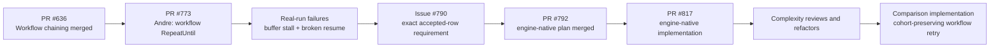
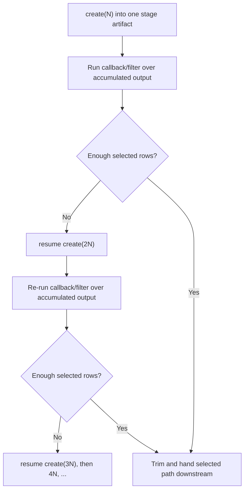
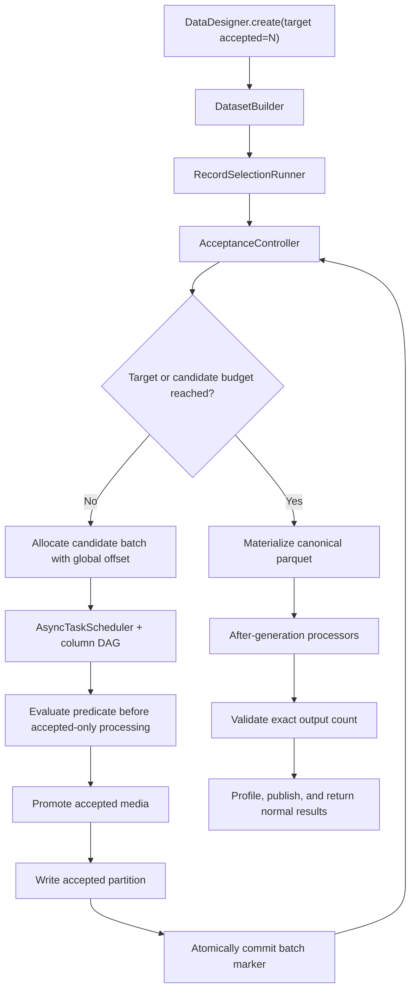
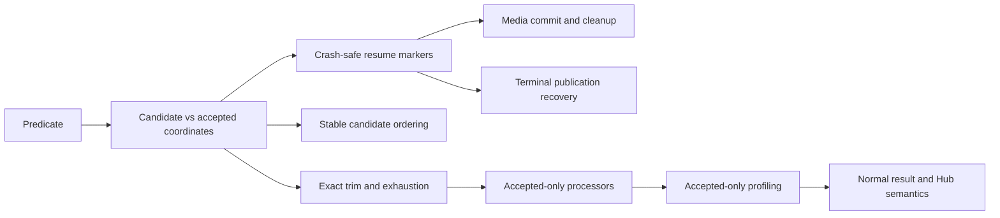
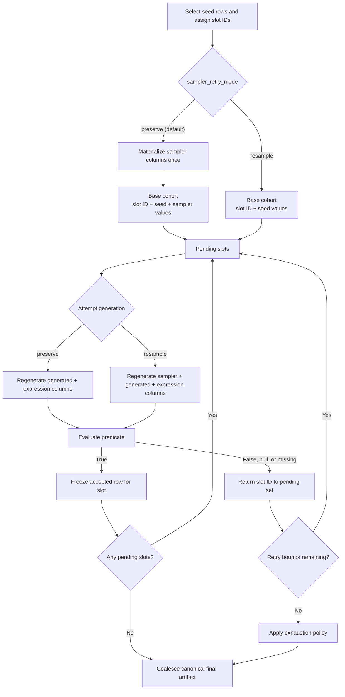
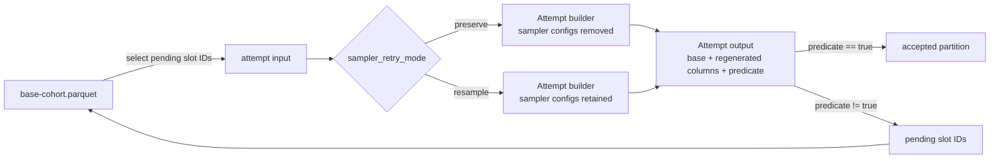
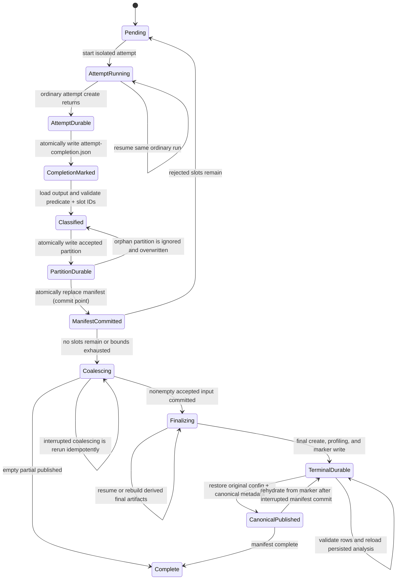

# Cohort-Based Record Retry Plan

Status: implemented on the `codex/790-cohort-retry-workflow` comparison branch; validation and PR preparation are in progress

## Background and design history

This design is the third architecture considered for exact accepted-row generation. It follows [Andre Manoel's](https://github.com/andreatgretel) workflow-level experiment and [Nabin Mulepati's](https://github.com/nabinchha) engine-native design and implementation. It is easier to evaluate when read alongside those two earlier designs and the complexity they uncovered.

### Executive takeaway

- Andre's PR showed that a small workflow policy is attractive, but repeatedly extending one dataset artifact does not provide correct multi-attempt or resume semantics.
- Nabin's engine-native implementation provides the strongest normal-`create()` contract, but doing so requires selection-specific coordination across the scheduler, builder, storage, media, processors, profiling, results, and publication.
- The implemented comparison changes the problem: freeze the original seed cohort, retry only its rejected slots in immutable attempts, and coalesce one passing version per slot.
- Sampler values are frozen by default to preserve the realized sampler distribution. Users may instead choose to resample them on retries when completion is more important than distribution preservation.
- Stable slots and immutable attempts remove global seed-stream offsets, cumulative extension, and final overshoot. The design retains bounded retry, manifests, media packaging, usage aggregation, and final accepted-only processing.

### Linked issues, plans, and pull requests

| Item | Status | Role in the design history |
|---|---|---|
| [PR #636: workflow chaining](https://github.com/NVIDIA-NeMo/DataDesigner/pull/636) | Merged May 18, 2026 | Established the `CompositeWorkflow` stage model later used by Andre's experiment. |
| [PR #773: repeat-until workflow stages](https://github.com/NVIDIA-NeMo/DataDesigner/pull/773) | Closed unmerged July 1, 2026 | Andre's bounded workflow-level repetition experiment. |
| [Critical real-run review on PR #773](https://github.com/NVIDIA-NeMo/DataDesigner/pull/773#issuecomment-4846928125) | Historical review | Reproduced the buffer-boundary stall, broken append resume, and discard-partial problem. |
| [Issue #790: exact rows matching a criterion](https://github.com/NVIDIA-NeMo/DataDesigner/issues/790) | Open since July 1, 2026 | Tracks the product requirement and documents the pivot away from PR #773. |
| [PR #792: engine-native record-selection plan](https://github.com/NVIDIA-NeMo/DataDesigner/pull/792) | Merged July 13, 2026 | Added the original source-of-truth engine-native plan. |
| [Merged engine-native plan](https://github.com/NVIDIA-NeMo/DataDesigner/blob/main/plans/790/engine-native-record-selection.md) | Current on `main` | Defines candidate batches, accepted partitions, markers, resume, media, and publication semantics. |
| [Andre's review of the engine-native plan](https://github.com/NVIDIA-NeMo/DataDesigner/pull/792#pullrequestreview-4618890276) | Historical review | Endorsed engine-native ownership based on the known alternatives, while highlighting offsets, checkpoint validity, and empty-partial behavior. |
| [PR #817: engine-native record-selection implementation](https://github.com/NVIDIA-NeMo/DataDesigner/pull/817) | Open since July 14, 2026 | Implements the plan across config, engine, interface, storage, workflow, profiling, and publication layers. |
| [Plan as implemented on PR #817](https://github.com/NVIDIA-NeMo/DataDesigner/blob/codex/790-engine-native-record-selection/plans/790/engine-native-record-selection.md) | Open PR branch | Tracks the implementation's current behavior rather than only the original proposal. |
| [Andre's scope and complexity review on PR #817](https://github.com/NVIDIA-NeMo/DataDesigner/pull/817#issuecomment-4971402911) | Open PR discussion | Recommended separating generic publication, deleting migration code, and potentially deferring media to reduce the review surface. |

### Timeline



### Design attempt 1: Andre's workflow-level `RepeatUntil`

[PR #773](https://github.com/NVIDIA-NeMo/DataDesigner/pull/773) added a bounded policy directly to `CompositeWorkflow.add_stage()`:

- `output_records`
- `max_iterations`
- `max_generated_records`
- `mode="append" | "discard"`
- `on_exhausted="raise" | "return_partial"`
- optional exact-count trimming

Relevant snapshots: [final repeat implementation](https://github.com/NVIDIA-NeMo/DataDesigner/blob/022cac6a616fa70ffe0ea94ffd6c82908ca0d5a1/packages/data-designer/src/data_designer/interface/composite_workflow.py#L653-L750) and [the append test that stopped after iteration two](https://github.com/NVIDIA-NeMo/DataDesigner/blob/022cac6a616fa70ffe0ea94ffd6c82908ca0d5a1/packages/data-designer/tests/interface/test_composite_workflow.py#L1033-L1084).

The selection operation was an arbitrary `on_success` callback or selected processor output. In append mode, the workflow repeatedly extended one normal DataDesigner artifact:



Discard mode instead deleted the prior stage artifact and generated another fixed-size attempt. It did not retain or accumulate accepted rows across attempts.

#### Complexity introduced

PR #773 changed four files with **725 additions and 38 deletions**. Its production Python change was approximately **+367 net lines**, tests were **+291 net lines**, and documentation was **+29 lines**. `composite_workflow.py` grew from roughly 933 to 1,294 lines.

The implementation had to add:

- A public repeat policy and enums.
- Two different attempt modes with different resume semantics.
- Stage fingerprint and metadata changes.
- Selected-output path tracking separate from the ordinary stage result.
- Exact-count trimming and partial-exhaustion handling.
- Empty partial propagation to downstream stages.
- Repeated execution of callbacks and output processors over changing artifacts.

This was smaller than the later engine-native implementation, but it created a semantic split: `DatasetCreationResults` still described the candidate artifact while the workflow passed a different selected parquet path downstream. Profiling and normal publication therefore did not naturally describe the same dataset users consumed.

#### Why it failed

The [critical review](https://github.com/NVIDIA-NeMo/DataDesigner/pull/773#issuecomment-4846928125) reproduced two blocking append-mode failures:

1. With `num_records` smaller than `buffer_size`, generation extended successfully once but later cumulative targets reused a row-group identity already considered complete. Requests for 15 and 20 rows left a 10-row artifact unchanged.
2. If a later callback failed after a larger target had already been persisted, workflow resume restarted at iteration one and requested fewer records than the artifact contained. The normal engine correctly rejected the apparent shrink.

The append test reached its target on iteration two, so it never exercised the third-extension failure. Discard mode also returned the latest partial rather than the documented best partial.

Andre closed PR #773 himself without an explicit closure comment. The correctness failures were posted about nineteen hours before closure and no subsequent fix commit was added, so attributing closure to those failures is a strong chronological inference rather than a quoted closure reason. Issue [#790](https://github.com/NVIDIA-NeMo/DataDesigner/issues/790) later named those exact failures as the motivation for engine-owned candidate progress.

### Design attempt 2: Nabin's engine-native record selection

The engine-native direction was designed in [PR #792](https://github.com/NVIDIA-NeMo/DataDesigner/pull/792) and implemented in open [PR #817](https://github.com/NVIDIA-NeMo/DataDesigner/pull/817).

Its central contract is:

```python
builder.with_record_selection(
    RecordSelectionConfig(
        predicate_column="meets_criteria",
        max_candidate_records=20_000,
        on_exhausted="raise",
    )
)

results = data_designer.create(builder, num_records=5_000)
```

`num_records` becomes the accepted-row target. The engine generates immutable candidate batches until it reaches that target or exhausts the candidate budget.



#### Why engine-native ownership was chosen

The plan tried to preserve the full normal `create()` contract:

- Stop generating as soon as the accepted target is reached.
- Maintain distinct candidate and accepted coordinates.
- Preserve ordered-seed offsets across batches and resume.
- Commit zero-acceptance batches durably.
- Run post-batch and after-generation processors on accepted rows only.
- Promote accepted media and clean rejected media.
- Aggregate model/tool usage for accepted and rejected work.
- Profile and publish the accepted canonical dataset.
- Recover separately from candidate generation, terminal materialization, processor, and publication interruption.

Andre's [review on PR #792](https://github.com/NVIDIA-NeMo/DataDesigner/pull/792#pullrequestreview-4618890276) agreed with this ownership based on the then-known alternatives. The review emphasized three unresolved lifecycle problems: preserving candidate offsets, keeping checkpoint artifacts valid after after-generation processing, and defining successful zero-row partial results.

#### Complexity introduced by the implementation

As of the latest pushed head of [PR #817](https://github.com/NVIDIA-NeMo/DataDesigner/pull/817), the PR reports **6,071 additions, 664 deletions, and 46 changed files**. A path-based breakdown of the pushed branch is:

| Area | Added | Removed | Net |
|---|---:|---:|---:|
| Production Python | 2,045 | 140 | +1,905 |
| Python tests | 3,187 | 120 | +3,067 |
| Plan and documentation paths | 790 | 381 | +409 |
| Other templates/YAML and rounding difference | Included in PR total | Included in PR total | Remainder |

The largest production-code concentrations are:

| Component | Current size or net change | Complexity owned |
|---|---:|---|
| [`record_selection_runner.py`](https://github.com/NVIDIA-NeMo/DataDesigner/blob/codex/790-engine-native-record-selection/packages/data-designer-engine/src/data_designer/engine/dataset_builders/record_selection_runner.py) | 834 lines | Candidate loop, resume, attempt execution, commit ordering, media, accepted partitions, materialization, terminal processing. |
| [`acceptance.py`](https://github.com/NVIDIA-NeMo/DataDesigner/blob/codex/790-engine-native-record-selection/packages/data-designer-engine/src/data_designer/engine/dataset_builders/acceptance.py) | 343 lines | Batch allocation, strict predicate interpretation, counters, marker validation, accounting invariants, resume reconstruction. |
| [`dataset_builder.py`](https://github.com/NVIDIA-NeMo/DataDesigner/blob/codex/790-engine-native-record-selection/packages/data-designer-engine/src/data_designer/engine/dataset_builders/dataset_builder.py) | 1,248 lines, +154 versus branch base | Selection routing, generic generation integration, compatibility and run-state handoff. |
| [`artifact_storage.py`](https://github.com/NVIDIA-NeMo/DataDesigner/blob/codex/790-engine-native-record-selection/packages/data-designer-engine/src/data_designer/engine/storage/artifact_storage.py) | 601 lines, +238 versus branch base | Selection paths, marker/partition reads and writes, cleanup, media staging and promotion. |
| [`async_scheduler.py`](https://github.com/NVIDIA-NeMo/DataDesigner/blob/codex/790-engine-native-record-selection/packages/data-designer-engine/src/data_designer/engine/dataset_builders/async_scheduler.py) | 2,613 lines, +51 versus branch base | Generic hook/finalization seams needed to classify completed candidate batches correctly. |

The feature also touches config and fingerprinting, public errors and results, workflow reuse, processor row-count validation, Hugging Face upload gating, dataset cards, OpenTelemetry, and final profiling.

The complexity is not mainly the Boolean predicate. It comes from making selection indistinguishable from a normal dataset run while also preserving exact resume and accepted-only lifecycle behavior:



#### Refactors already performed in response to complexity

The branch did not leave the initial orchestration inside one giant builder method. It went through several explicit simplification passes:

- [Initial engine-native implementation](https://github.com/NVIDIA-NeMo/DataDesigner/commit/a6c1de16e7419f2ab8aa633bf55dc7e3dd2d0263) put most orchestration in `DatasetBuilder`; that file grew from 1,094 to 1,581 lines.
- [Refactor the record-selection build flow](https://github.com/NVIDIA-NeMo/DataDesigner/commit/259b5d7ea9bda781cbe879be08c1a2da061406a9) separated long execution paths but the builder snapshot reached 2,225 lines during the iterative implementation.
- [Simplify the runtime](https://github.com/NVIDIA-NeMo/DataDesigner/commit/e8e5cb1446e90f3f2529f3585b1e24dce43c5ab3) reduced the builder to 1,901 lines.
- [Extract `RecordSelectionRunner`](https://github.com/NVIDIA-NeMo/DataDesigner/commit/2ab0803049f5724426525af588f6962a89cc13ab) moved the selection collaborator out of `DatasetBuilder`; the builder fell to 1,277 lines and the runner started at 762 lines.
- [Simplify the selection lifecycle](https://github.com/NVIDIA-NeMo/DataDesigner/commit/7df4da52c6862d91bf28e8c390ebd5143a96fef1) reduced marker and lifecycle machinery.
- [Narrow the predicate contract](https://github.com/NVIDIA-NeMo/DataDesigner/commit/f30205e9d9ff34c43c88e946b27577e23fe4d524) avoided broad sampler-output changes.
- [Decouple runner state from the builder](https://github.com/NVIDIA-NeMo/DataDesigner/commit/9486fb9cf829863ba7ce7501afaafb68d9c725e7) made the collaborator boundary more explicit.

These refactors improved local readability and restored delegation in `DatasetBuilder`, but they did not remove the underlying state machine. The current builder plus runner is still over 2,000 lines because the lifecycle responsibilities still exist; they have been moved behind a cleaner boundary.

Andre's [scope comment on PR #817](https://github.com/NVIDIA-NeMo/DataDesigner/pull/817#issuecomment-4971402911) made this distinction directly: keep core candidate/accepted correctness, but split generic publication infrastructure, remove migration support for an unshipped format, and consider deferring media support. That would reduce the review surface without changing the core engine-native architecture.

A later [media/output-folder collision finding](https://github.com/NVIDIA-NeMo/DataDesigner/pull/817#discussion_r3581375783) is a concrete example of the integration cost: selection cleanup, configurable publication folders, and configurable media storage became coupled even though predicate evaluation itself was correct.

#### What the engine-native implementation achieved

The complexity bought a stronger product contract than PR #773:

- One ordinary `DataDesigner.create()` call.
- A normal `DatasetCreationResults` describing the accepted dataset.
- Deterministic global candidate ordering.
- Exact batch-level resume after zero-acceptance or partially successful work.
- Accepted-only processors, profiling, media, and publication.
- Explicit candidate accounting and terminal-state recovery.

The open PR reports 4,073 passing tests, 91.63% aggregate line coverage, and 90.3% changed-line coverage in its current description. Those quality results reduce implementation risk, but they do not reduce the permanent architectural surface area.

### Why the implemented comparison is a different third design

The cohort-preserving workflow implementation is not merely PR #773 with different method names, and it is not the engine-native runner moved wholesale into `CompositeWorkflow`.

It changes the semantics to eliminate several hard problems:

1. Materialize seed values once as a fixed cohort of `N` logical slots.
2. Retry only rejected slots.
3. Always preserve seed values; preserve sampler values by default or resample them by explicit user choice.
4. Regenerate generated and expression columns from scratch, plus sampler columns in resample mode.
5. Give every attempt its own immutable artifact.
6. Coalesce one accepted version per original slot into a final durable artifact.

| Complexity from earlier designs | Cohort-based response |
|---|---|
| Cumulative extension of one artifact | Never extend an attempt; create immutable attempt artifacts. |
| Global candidate stream and offset allocation | Stable slot IDs identify a fixed cohort; retries do not advance through the source population. |
| Final-batch overshoot and trimming | Each attempt has at most one row per pending slot, so accepted rows cannot exceed `N`. |
| Accepted/rejected partitioning inside the scheduler lifecycle | Classify a completed attempt at the workflow boundary. |
| Per-candidate-batch zero-acceptance markers | A manifested attempt and its schema-bearing accepted partition are durable even when no row passes. |
| Reconstruct retry seeds by interpreting generated output | Select rejected slot IDs from the immutable base cohort. |
| Repeatedly process/profiles cumulative candidates | Defer terminal processors and profiling until final coalescing. |
| Same-artifact resume target arithmetic | Resume only the interrupted isolated attempt; skip manifested attempts. |

Some complexity remains and must not be hidden:

- Base-cohort materialization and stable slot IDs.
- A retry manifest with per-attempt summaries and idempotent classification.
- Mode-aware builder projection that removes sampler configs in preserve mode and retains them in resample mode.
- Missing-output accounting for slots omitted by a successfully completed attempt.
- Final accepted media packaging.
- Model/tool usage aggregation.
- Final processors, profiling, publication, and partial-exhaustion reporting.

The implementation places these responsibilities at a workflow-stage boundary and reuses ordinary Data Designer artifacts for base materialization, attempts, and terminal publication. It adds no selection-specific state to `DatasetBuilder` or `AsyncTaskScheduler`.

## Implementation snapshot

### Public API

The policy is implemented in `data_designer.interface` and attached to a `CompositeWorkflow` stage:

```python
from data_designer.interface import RetryExhaustion, RetryUntil, SamplerRetryMode

workflow.add_stage(
    "quality_checked_records",
    builder,
    num_records=5_000,
    retry_until=RetryUntil(
        predicate_column="meets_criteria",
        max_attempts=5,
        max_candidate_records=20_000,
        sampler_retry_mode=SamplerRetryMode.PRESERVE,
        on_exhausted=RetryExhaustion.RETURN_PARTIAL,
    ),
)
```

`RetryUntil` is immutable. `max_attempts` and `max_candidate_records` are individually optional, but at least one must be present. Both are strict positive integers: Boolean, float, and string values are rejected rather than coerced. `max_attempts` includes the initial full-cohort generation as attempt 1; it is the total number of times a still-pending cohort may run, not the number of retries after the first run. At runtime, `max_candidate_records` must be at least the stage's `num_records`, because the implementation never starts a partial cohort attempt.

The predicate must be declared by one of the implemented rerunnable producer contracts:

- an expression column with `dtype="bool"`;
- a custom column;
- a plugin column; or
- an LLM-text column, subject to the same runtime contract. The current built-in
  LLM-text generator always materializes a string, so a direct LLM-text predicate
  cannot pass today; in practice, add a Boolean expression over that text and use
  the expression as the predicate. Exact strings such as `"true"` and `"false"`
  are not coerced.

Structured output is not itself a predicate producer in v1. A Boolean nested in LLM-structured output must feed a separate Boolean expression column, and that expression becomes `predicate_column`. Strings such as `"true"` and `"false"`, integers such as `0` and `1`, containers, and arbitrary truthy values are never coerced.

### Runtime components

| Component | Implemented responsibility |
|---|---|
| `cohort_retry.py` | Public enums and immutable, validated `RetryUntil` policy. |
| `cohort_retry_builders.py` | Deep-snapshot the original builder and project isolated base, attempt, and final builders. Hidden runs force generated columns to remain materialized and omit user processors/profilers. |
| `cohort_retry_runner.py` | Materialize the cohort, execute isolated attempts, persist attempt and terminal completion markers, classify strict predicates, preserve local seed media, package accepted images, commit accepted partitions and manifests, resume, coalesce, and finalize. |
| `composite_workflow.py` | Include the policy in stage metadata/fingerprints, delegate retry stages, publish retry summaries, and propagate successful empty partials as normal empty workflow stages. |
| `data_designer.py` | Provide the private `_create()` lifecycle seam used to disable intermediate profiling, allow a successfully completed zero-row internal run, and profile the seed-only final artifact with the original column configuration. Public `create()` behavior is unchanged. |
| `results.py` | Carry optional analysis for internal/empty runs and a serializable model-usage snapshot. |

`CohortRetryRunner` returns the ordinary stage-root `DatasetCreationResults`, not a candidate result plus a separate selected path. The canonical result therefore continues to work with normal workflow loading, export, processor-output selection, and Hub publication. The root `metadata.json` contains a `cohort_retry` summary; `workflow-metadata.json` contains the policy and the stage's `retry_summary`. `CohortRetryExhaustedError`, a `DataDesignerWorkflowError` subclass, exposes target, accepted, unresolved, candidate, attempt, and unresolved-slot fields when `on_exhausted="raise"` reaches a bound.

## 1. Goal

Produce exactly `N` acceptable records while preserving the seed distribution chosen at the beginning of the run. Preserve the realized sampler distribution by default, while allowing users to opt into sampler resampling when they prefer a better chance of completing difficult slots.

The system materializes one fixed seed cohort, generates the remaining columns, evaluates a declared Boolean predicate, and retries only the rejected logical rows. Seed values never change. In the default mode, sampler values also remain fixed; in resample mode, sampler, generated, and expression columns run again for rejected slots.

This is deliberately different from ordinary rejection sampling:

- **Ordinary rejection sampling** discards failed candidates and draws replacements from the source distribution. The accepted output is therefore conditioned on which sampled values pass.
- **Cohort retry with preserved samplers** fixes the initial seed and sampler values, then retries downstream generation for each rejected logical row. When all rows eventually pass, the output preserves the initial realized cohort distribution exactly.
- **Cohort retry with resampled samplers** fixes seed values but redraws sampler values for rejected slots. This can improve completion, but accepted sampler values become conditioned on predicate success.

## 2. User-facing contract

The user declares:

- The desired output count, `N`.
- A predicate column whose materialized value must be a strict scalar Boolean or null.
- A hard retry bound, such as `max_attempts` and/or `max_candidate_records`.
- A sampler retry mode: preserve the first sampler values or resample rejected slots.
- Exhaustion behavior: raise or return the accepted partial cohort.

Equivalent string-valued API:

```python
workflow.add_stage(
    "quality_checked_records",
    builder,
    num_records=5_000,
    retry_until=RetryUntil(
        predicate_column="meets_criteria",
        max_attempts=5,
        max_candidate_records=20_000,
        sampler_retry_mode="preserve",  # default; alternatively "resample"
        on_exhausted="return_partial",
    ),
)
```

The stage remains declarative. Users do not manage loops, intermediate paths, or resume state.

Use an enum-like `sampler_retry_mode` rather than a Boolean such as `preserve_distribution`. The field describes the mechanism accurately even when `return_partial` produces a biased subset after exhaustion:

| Mode | Stable across attempts | Regenerated for rejected slots | Primary tradeoff |
|---|---|---|---|
| `preserve` (default) | Seed and sampler columns | Generated and expression columns | Preserves the realized sampler cohort on full success; hard combinations may exhaust. |
| `resample` | Seed columns | Sampler, generated, and expression columns | Improves opportunities to pass; final sampler values are conditioned on acceptance. |

If the configuration has no sampler columns, the two modes are operationally equivalent. The selected mode is persisted in stage metadata and included in the resume fingerprint.

## 3. Core semantics

Each requested output position receives a stable internal slot ID. A slot always represents one immutable seed row. In `preserve` mode it also owns one immutable set of sampler values; in `resample` mode its sampler values belong to each attempt rather than the slot.

A slot leaves the pending set only when its predicate is strictly `True`.

- `True`: freeze that complete generated row as the accepted result for the slot.
- `False`: retry the slot.
- `null`: retry the slot and count it separately for diagnostics.
- Missing output from a successfully completed attempt: retry the slot and count it separately as missing.
- Duplicate output for one slot: fail the run because an invariant was violated.



## 4. Column lifecycle

| Column category | `preserve` mode | `resample` mode | Final output |
|---|---|---|---|
| Original seed columns | Materialize once and preserve | Materialize once and preserve | Keep |
| Sampler columns | Generate once and preserve | Regenerate for every pending slot attempt | Keep accepted version |
| Internal slot ID | Assign once and preserve | Assign once and preserve | Drop or retain only in metadata |
| Internal attempt number | Set per attempt | Set per attempt | Drop |
| LLM text and structured columns | Regenerate | Regenerate | Keep accepted version |
| Custom and plugin-generated columns | Regenerate | Regenerate | Keep accepted version |
| Expression columns | Recompute | Recompute | Keep accepted version |
| Predicate column | Recompute | Recompute | Keep or drop according to the public contract |
| Final processors and profiling | Defer | Defer | Run once after coalescing |

The retry boundary is intentionally explicit:

- Seeds are always stable.
- Samplers are stable by default.
- All generated and expression columns are recomputed.
- Opting into `resample` adds sampler columns to the recomputed side of the boundary.

## 5. Safe retry-seed construction

The implementation does not create a retry seed by taking a rejected generated row and merely dropping known generated columns. That approach is vulnerable to processors, side-effect columns, renamed columns, and future generator types.

Instead, it:

1. Persist an immutable base-cohort table containing only:
   - the stable slot ID;
   - original seed columns;
   - materialized sampler columns only when `sampler_retry_mode="preserve"`.
2. Evaluate each attempt and collect the rejected slot IDs.
3. Select those slot IDs from the immutable base cohort.
4. Use that projection as the next attempt's seed dataset.
5. In `preserve` mode, clone the original builder without sampler configs because sampler values now arrive as seed columns.
6. In `resample` mode, retain sampler configs so rejected slots receive new sampler values.
7. Retain all generated and expression configs in both modes so they execute again.

If the original builder has neither a seed dataset nor sampler columns that are materialized in `preserve` mode, the base builder creates a hidden UUID bootstrap column solely to obtain `N` stable slots. That implementation-only column is removed from the persisted base cohort and never appears in the public result.



In `preserve` mode this preserves the initial sampler distribution by value rather than attempting to recreate it from configuration. In `resample` mode only the seed cohort is preserved by value; sampler values are intentionally redrawn.

## 6. Attempt and artifact model

Each attempt has a distinct artifact and requested size. A committed attempt is immutable and is never extended or regenerated. An uncommitted attempt may be resumed in place after interruption, but it never changes into a cumulative target spanning multiple attempts.

```text
quality-checked-records/
├── base-cohort/
│   ├── cohort.parquet       # seeds + slot IDs; samplers too in preserve mode
│   ├── images/              # durable snapshot of referenced LocalFile seed media
│   └── run/                 # ordinary unprofiled base-materialization artifact
├── attempts/
│   ├── attempt-000/
│   │   ├── input.parquet
│   │   ├── attempt-completion.json  # generation-durable slot IDs, output count, and usage
│   │   └── run/             # ordinary unprofiled attempt artifact
│   │       ├── parquet-files/
│   │       ├── images/
│   │       └── metadata.json
│   ├── attempt-001/
│   └── ...
├── accepted/
│   ├── attempt-000.parquet
│   ├── attempt-001.parquet
│   ├── ...
│   ├── coalesced.parquet          # accepted rows with durable slot/attempt lineage
│   └── publication-input.parquet  # final-create seed with internal identity columns removed
├── images/                  # accepted image files, grouped by attempt
├── manifest.json
├── final-completion.json   # nonempty terminal row count and final-phase usage
├── parquet-files/          # canonical coalesced output
├── processors-files/       # original stage-processor outputs, when configured
├── builder_config.json     # restored original declarative builder
├── metadata.json
└── output-processors/      # optional normal CompositeWorkflow boundary processors
```

The wrapper artifact owns both the audit trail and the canonical dataset. Downstream workflow stages consume only the canonical `parquet-files/` view.

`attempt-completion.json` is the generation-durability marker for one attempt. It records the exact ordered input slot IDs, output row count, and model/tool usage snapshot after the ordinary internal create returns successfully. In particular, it proves that a zero-row attempt completed rather than merely having an empty or interrupted run directory.

The root manifest records the complete retry policy, stable internal column names, target count, base seed-column names, committed attempt summaries, per-phase model usage, status, and any partial-result distribution warning. Every attempt summary records whether sampler configs executed, making the final distribution semantics auditable. Unlike the completion marker, the root manifest entry commits classification and advances pending-slot and candidate accounting.

`final-completion.json` is the nonempty terminal-publication marker. It is written atomically only after the final ordinary create, original processors, profiling, and canonical row-count validation succeed. Its payload contains the accepted row count and the final phase's model/tool usage snapshot. The marker deliberately precedes restoration of the original builder configuration and canonical metadata: once it exists, resume validates the canonical parquet count and reloads persisted analysis instead of trying to resume the synthetic seed-only final builder against metadata whose fingerprint may already have been rewritten to the original declarative configuration. An all-zero partial does not use this marker because it takes the explicit direct-publication path without processors or profiling.

`accepted/coalesced.parquet` retains the internal slot and attempt columns for retry lineage and validation. Before nonempty terminal publication, the runner removes those two columns and atomically writes `accepted/publication-input.parquet`; that sanitized file is the seed for the final ordinary create. The final builder therefore does not append an internal-identity drop processor. User processors see only the intended accepted stage schema, so internal cleanup cannot collide with user drop patterns or create misleading internal-column entries in dropped-column artifacts.

Attempt artifacts, including rejected image files, are retained as the audit trail. During base materialization, the implementation recursively scans preserved seed columns for `images/...` strings nested in lists, tuples, dictionaries, and NumPy arrays. For a `LocalFileSeedSource`, it finds the nearest ancestor of the source path containing an adjacent `images/` directory and atomically copies each referenced file once into `base-cohort/images/...`. Missing files, unsafe paths, or relative seed-media references whose source root cannot be resolved fail explicitly rather than producing silently broken accepted records. Every attempt then copies its pending rows' referenced media from that durable base snapshot into the ordinary attempt run artifact at the same relative paths; later attempts and resume no longer depend on the original seed artifact. Before an accepted partition is committed, the implementation scans every accepted row value and copies relative `images/...` files that resolve inside the attempt artifact to `images/attempt-NNN/...` at the canonical stage root, rewriting those references. Other nonmatching or outside-root strings are left unchanged. Normal Hub publication therefore sees accepted root images; rejected attempt images are not published by the normal dataset uploader.

## 7. Execution algorithm

```text
materialize base cohort through an ordinary unprofiled internal create
require exactly N rows
copy referenced LocalFile seed media once into base-cohort/images/
assign stable slot IDs and persist cohort.parquet
if sampler_retry_mode == "preserve":
    materialize sampler values into the base cohort once

pending = all slot IDs
accepted = empty
candidate_records = committed attempt input rows

while pending is not empty:
    if max_attempts would be exceeded:
        stop according to exhaustion policy

    if generating len(pending) rows would exceed max_candidate_records:
        stop according to exhaustion policy

    atomically persist attempt input = base_cohort rows whose slot IDs are pending
    copy preserved LocalFile seed media from base-cohort/images/ into the attempt run artifact
    if sampler_retry_mode == "preserve":
        attempt_output = internal create(regenerated generated + expression columns)
    else:
        attempt_output = internal create(regenerated sampler + generated + expression columns)
    atomically write attempt-completion.json with input slot IDs, output count, and usage

    validate one-or-zero output rows per attempted slot
    accepted_now = rows whose predicate is strictly True
    package accepted image references into the stage root
    atomically write accepted/attempt-NNN.parquet
    atomically replace manifest.json with the new attempt summary  # commit point

    accepted += accepted_now
    pending = attempted slot IDs - accepted slot IDs
    candidate_records += attempted row count

coalesce one accepted row per slot in original slot order
if at least one slot was accepted:
    strip internal slot and attempt columns into accepted/publication-input.parquet
    mark manifest status as finalizing
    run original processors and profiling once through a normal final create seeded by publication-input.parquet
    require final processors to preserve the coalesced row count
    atomically write final-completion.json with accepted row count and final-phase usage
    on marker-based resume, validate canonical rows and rehydrate persisted analysis
else if on_exhausted == "return_partial":
    publish a schema-bearing zero-row canonical parquet directly
aggregate base, attempt, and final usage
restore the original builder configuration and fingerprint
write canonical metadata with logical target N, actual accepted rows, and persisted aggregate usage
mark the manifest complete and return normal results
```

Base, attempt, and nonempty final runs use the ordinary private `_create()` lifecycle. Base and attempt runs disable profiling; attempts additionally allow a successfully completed zero-row internal result. `allow_empty=True` does not turn generation exceptions into successful empty attempts: builder failures still fail normally. Since every attempt contains at most one candidate for each pending slot, accepted rows cannot overshoot `N`, and final trimming is unnecessary.

## 8. Durable state and resume

There are three intentional durability levels. The attempt-completion marker makes attempt generation reusable, including successful zero-output generation. The root manifest entry is the durable unit of retry progress: classification, accepted slots, and candidate accounting do not advance until it is atomically replaced. An accepted partition may exist between those two commits without advancing progress. For a nonempty result, the final-completion marker makes the terminal processors, profiling, accepted count, and final-phase usage reusable before the artifact is rewritten into its canonical original-configuration identity.



Resume rules:

- A valid attempt-completion marker prevents generation from running again even when the root manifest has no entry yet. The marker's ordered input slot IDs must match the immutable attempt input. For a positive output count, the stored run must be readable and contain exactly that many rows; for zero, the runner reconstructs a schema-bearing empty output and proceeds directly to classification. A corrupt or mismatched completion marker fails explicitly rather than being ignored or regenerated.
- Without a completion marker, an interrupted attempt resumes only within its own artifact and requested size, using ordinary `ResumeMode.ALWAYS` when its run directory is nonempty. After the ordinary create returns, the runner writes the marker before classification. Before reuse, the persisted input is checked for identical column order, slot-ID order, and recursively equal row values. This is a direct equality scan rather than a persisted cryptographic content hash.
- Manifested attempts are never regenerated. Their accepted partition must exist, match the recorded accepted-row count, contain no duplicate slot IDs, and not overlap prior accepted partitions; coalescing also validates every slot against the target range.
- If completion was marked before the root manifest entry was written, resume loads that completed output without generation, reclassifies it, atomically overwrites any orphan accepted partition, and then commits the manifest entry.
- Pending rows are reconstructed from `base slot IDs - durably accepted slot IDs`.
- Coalescing is derived and idempotent; it can be deleted and rebuilt from accepted partitions.
- The stage fingerprint and exact retry policy must match before reuse. A corrupt, missing, or incompatible manifest with durable retry artifacts fails under `ResumeMode.ALWAYS`; under `ResumeMode.IF_POSSIBLE`, the whole retry wrapper is deleted and restarted. A missing manifest with no durable attempts or accepted partitions is simply initialized.
- Changing `sampler_retry_mode` makes prior attempts incompatible because it changes both base-cohort schema and attempt execution.
- During nonempty terminal publication, the manifest moves through `finalizing` to `complete`. Before `final-completion.json` exists, the final ordinary create uses `ResumeMode.ALWAYS` when root metadata exists and `ResumeMode.IF_POSSIBLE` otherwise. If root metadata reports `post_generation_state="started"`, resume selectively removes ambiguous derived final parquet, processor, dropped-column, config, and metadata artifacts before rebuilding them from committed accepted partitions; retry artifacts remain intact.
- After `final-completion.json` exists, resume never feeds the restored original builder fingerprint back into the synthetic seed-only final create. It validates that canonical parquet contains the marker's accepted count, reloads analysis from root metadata, restores the original builder configuration again if necessary, and idempotently rewrites canonical metadata before committing the root manifest. Missing or invalid canonical rows or profiling metadata after a terminal marker are treated as corruption rather than regenerated silently.
- Canonical root metadata uses the original declarative configuration fingerprint. `target_num_records` and `original_target_num_records` remain the requested logical target `N`, while `actual_num_records` is the accepted row count. Persisted profiling analysis follows the same distinction: `target_num_records=N` and `num_records=accepted_records`, including a nonempty exhausted partial.
- The root `cohort_retry.model_usage` field stores the aggregate of base, durably completed attempts, and final-phase usage. A skipped workflow stage reconstructs `DatasetCreationResults.model_usage` from that field; when workflow output processors ran, their metadata instead stores and rehydrates `workflow_model_usage`, which combines the retry aggregate with output-processor usage.
- Base-cohort reuse validates its persisted schema, row count, and slot IDs. It does not re-read and content-hash the current external seed table. Referenced LocalFile seed media is snapshotted beside the base cohort before its manifest is committed, so attempts and resume read those bytes from the durable wrapper artifact rather than the original source.

An attempt partition and the manifest are separate atomic files, not one cross-file transaction. Their ordering is therefore part of the protocol: write the accepted partition first and replace the manifest second. A partition without an attempt entry is an orphan and safe to recompute; an entry without a valid partition is corruption and fails rather than silently regenerating committed work.

This avoids the two critical failures found in the earlier workflow experiment: repeated extension within one buffer-sized row group and resume requests smaller than already-persisted output.

## 9. Invariants

The implementation enforces:

1. The base cohort has exactly `N` unique slot IDs.
2. Seed values for a slot never change after cohort materialization.
3. In `preserve` mode, sampler values for a slot never change after cohort materialization.
4. In `resample` mode, every rejected slot executes sampler configs again on its next attempt.
5. A preserved sampler column cannot depend on a column that is regenerated.
6. Every nonempty attempted output row contains a known slot ID and a strict Boolean-or-null predicate value.
7. An attempt produces at most one output row per input slot; input slots absent from a successfully completed output are classified as missing.
8. A slot is accepted at most once and is never retried after acceptance.
9. Only a strict Boolean `True` accepts a row.
10. Missing, false, and null outcomes remain pending unless bounds are exhausted.
11. Candidate accounting includes every input row of a manifested attempt, including accepted, rejected, null-predicate, and missing output slots. Work interrupted before manifest commit is not durable candidate accounting.
12. The final canonical dataset contains one accepted row per completed slot in original slot order.
13. Final processors and profiling observe accepted rows only.
14. Internal final processors must preserve the coalesced accepted row count.
15. A nonempty final-completion marker's accepted count equals both the coalesced accepted count and the canonical parquet row count.
16. Canonical metadata identifies the original declarative configuration, records logical target `N`, and records the accepted count as actual rows.

## 10. Bounds and exhaustion

Both bounds are useful:

- `max_attempts`: limits how many times any still-pending cohort can run, including the initial attempt.
- `max_candidate_records`: limits input rows submitted to attempt-generation runs. It does not count base-cohort materialization or the terminal processor/profiling pass, so it bounds the dominant retry work rather than every operation that can incur cost.

`max_candidate_records` must be at least `N`. When the next complete pending cohort would exceed the remaining candidate budget, the runner stops before starting it; v1 does not size a partial attempt to consume the remainder.

Exhaustion behavior:

- `raise`: write an `exhausted` manifest, retain all durable attempts, and raise `CohortRetryExhaustedError` with structured target, accepted, unresolved, candidate, attempt, and unresolved-slot fields.
- `return_partial`: write an `exhausted` manifest, publish accepted slots only with accepted, unresolved, attempt, candidate, mode, and distribution-warning fields in retry metadata, and finally mark the successfully published wrapper `complete` while retaining the unresolved IDs and warning.

Some seed/sampler combinations may be intrinsically unable to pass. Bounded exhaustion is therefore a normal terminal state, not necessarily an engine failure. Resampling helps only when sampler values contribute to failure; it cannot repair a seed that makes success impossible.

`return_partial` requires an explicit distribution warning in both modes. In `preserve` mode, unresolved hard slots are absent, biasing the partial dataset toward easier seed/sampler combinations. In `resample` mode, the partial dataset has that seed-slot bias and its accepted sampler values are additionally conditioned on success.

If `return_partial` exhausts with no accepted slots, the runner publishes a schema-bearing empty `parquet-files/batch_00000.parquet` directly. It records the original builder configuration and retry metadata but stores no profiling analysis; the public `DatasetCreationResults.load_analysis()` method raises `DataDesignerProfilingError` for this unprofiled result. Without a callback override, the workflow marks the stage `completed_empty` and skips descendants. It does not run the original terminal processors, profiling, or workflow `output_processors` because there are no rows to pass through them. A configured `on_success` callback still receives the stage-root artifact and may supply a different output path, whose row count determines the workflow status. `raise` never publishes a successful empty result.

## 11. Processor, profiling, and usage behavior

Attempt execution performs only the work required to generate and evaluate the predicate.

- Row-count-changing after-generation processors are deferred until after coalescing.
- Processors that remove the predicate or stable slot ID cannot run before classification.
- Final processors run once on a nonempty coalesced accepted dataset and must preserve its row count.
- Final profiling describes the nonempty accepted canonical dataset, not individual attempt datasets. Base and attempt profiling is disabled. The profiler receives the original logical target `N` while its actual record count is the accepted row count.
- Model/tool usage snapshots from the base run, manifested attempts, and final run are aggregated into the canonical result and persisted in root retry metadata, so committed rejected work is represented as well as accepted work and the logical aggregate survives workflow-stage reuse.
- A stage's ordinary workflow `output_processors`, when configured, still run after the cohort runner returns and only for a nonempty result. They are outside the runner's exact row-count assertion.
- Every base, attempt, nonempty final, and workflow output-processor `_create()` invocation owns an ordinary OpenTelemetry create lifecycle. This preserves normal per-phase request and scheduler telemetry, but v1 does not add one enclosing create span that represents the entire logical cohort-retry stage.

The runner can aggregate only usage that reached a durable snapshot. Attempt usage becomes durable in `attempt-completion.json`; if a process stops after provider calls but before that marker, a resumed ordinary create may no-op from disk without reconstructing the previous process's in-memory usage delta. Final-phase usage becomes durable in `final-completion.json`, and the logical aggregate becomes reusable through canonical root metadata. Task traces describe the current invocation; traces from an interrupted process are not persisted by either marker.

## Implemented v1 limitations and deviations

The comparison implementation deliberately leaves several boundaries narrower than an idealized retry system:

- **No retry randomness namespace.** The hidden attempt number is persisted for lineage, but the engine, model calls, and samplers receive no explicit attempt-specific randomness namespace. Deterministic generators can therefore repeat the same failure; `resample` relies on ordinary sampler randomness rather than a retry-addressed stream.
- **Each attempt pays normal stage startup cost.** Immutable attempts deliberately reuse ordinary `DataDesigner` creation, so each one constructs its own resource provider, generator graph, and model clients. This keeps the engine feature-agnostic but costs more setup time than an engine-native loop that reuses one runtime.
- **Cohort orchestration is in-memory.** The runner loads the complete base cohort into a pandas DataFrame, filters that frame for each attempt, and reads and concatenates all accepted partitions before terminal publication. Peak memory is therefore O(`N`) with additional full-frame copies, rather than the bounded batch memory of the normal engine path. Large cohort targets can exhaust process memory even when an ordinary `create()` of the same size would remain within its configured buffer.
- **Validation and packaging scale with candidate cells.** Every nonempty attempt verifies stable seed/cohort values row-by-row and column-by-column, and accepted media packaging recursively scans every accepted cell. Attempt projection also scans the in-memory base cohort each time. These checks favor explicit invariants over throughput and can add substantial Python and filesystem overhead for wide cohorts, deeply nested values, many attempts, or media-heavy rows.
- **Pre-marker observability is incomplete.** Provider usage incurred before `attempt-completion.json` or `final-completion.json` may be unknowable after process interruption. Task traces are not persisted by either marker, and OpenTelemetry describes separate create phases rather than one enclosing logical retry lifecycle.
- **All-zero partials use a direct publication path.** The runner can publish a correct schema and configured drop projection, but it cannot infer arbitrary schema-transforming behavior from terminal processors without executing them. Analysis is absent, public `load_analysis()` raises `DataDesignerProfilingError`, and original terminal processors/profiling are skipped.
- **Terminal row count is fixed internally.** Original final processors may transform accepted values or columns, but a processor that adds or removes rows fails the retry stage. Outer workflow `output_processors` are not covered by that invariant.
- **The predicate contract is intentionally strict.** Only supported expression, custom, plugin, and LLM-text producer types may own the predicate column. Runtime values must be actual scalar Booleans or null; truthy strings, numbers, and containers fail. The built-in LLM-text path always returns strings, so its direct values fail this contract and require a separate Boolean expression in practice. LLM-structured and nested values likewise require a separate Boolean expression column.
- **Media packaging is local and image-path-specific.** Preserved relative `images/...` seed references are snapshotted during base materialization only when their root can be resolved from a `LocalFileSeedSource` with an adjacent ancestor `images/` directory, then copied from that snapshot into each attempt. Relative media from an in-memory, remote, or otherwise unresolvable seed source fails explicitly; absolute paths and generic plugin side effects are not imported. The runner then rewrites files that resolve inside an attempt artifact and copies accepted files below root `images/attempt-NNN/`. It does not define a generic media/side-effect transaction for plugins or external systems, and rejected media remains in retained attempt artifacts.
- **Seedless runs use an implementation bootstrap.** A hidden UUID creates stable base slots when no seed or preserved sampler can do so, then is removed. This supplies slot identity, not a user-visible source distribution. The current empty-builder projection also requires the original builder to contain model configurations.
- **Base reuse trusts the persisted cohort.** Resume validates shape and slot identity but does not prove that an external seed source still has byte-identical content.
- **Successful empty output is not exception recovery.** A normal attempt that completes with zero rows can be classified as all missing, but an exception raised while constructing or generating the attempt is still an error and is not converted into an empty retryable result.

## 12. Relationship to the closed workflow experiment

The earlier `RepeatUntil` workflow experiment used cumulative resume against one stage artifact:

```text
create(N) -> resume create(2N) -> resume create(3N)
```

That architecture could stall when small extensions remained inside one buffer-sized row group, and resume could restart with a target smaller than the durable artifact.

This implementation is materially different:

| Earlier experiment | Cohort-based retry |
|---|---|
| Repeatedly grows one artifact | Creates immutable per-attempt artifacts |
| Re-filters cumulative output | Classifies only the current pending cohort |
| Draws additional source rows | Retries the same seed slots; sampler values are preserved by default or explicitly resampled |
| Can overshoot and requires trimming | Cannot overshoot |
| Candidate and accepted progress share one artifact | Manifest tracks them independently |
| Resume depends on cumulative target arithmetic | Resume skips committed attempts by slot ID |

Reusable concepts from the earlier experiment include bounded attempts, policy fingerprinting, counted exhaustion metadata, empty-partial handling, and terminal retry metadata. Its cumulative append and discard implementations are not reused.

## 13. Main tradeoff

The system is not searching farther through a seed population for any `N` rows that pass. It is asking every one of the originally selected `N` seed slots to eventually produce an acceptable generated result. Accepted slots are frozen and never duplicated or retried.

Consider 100 ordered seed rows where the first 50 usually pass and the second 50 usually fail:

- After the first attempt, the passing first half is complete and removed from the pending set.
- Only rejected slots from the second half are retried.
- If their seed values make success impossible, both sampler modes eventually exhaust; resampling cannot fix a bad seed.
- If sampler values contribute to failure, `resample` may complete more slots, but accepted sampler values become biased toward draws that pass.

The user therefore chooses between two retry semantics:

| Concern | `preserve` (default) | `resample` |
|---|---|---|
| Seed distribution | Preserved | Preserved |
| Exact initial sampler realization | Preserved on full success | Not preserved |
| Sampler distribution after selection | Unchanged on full success | Conditioned on predicate success |
| Chance of escaping a bad sampler draw | None | Higher when the sampler affects success |
| Bad seed that can never pass | Retries until exhaustion | Still retries until exhaustion |
| Partial result after exhaustion | Biased toward easier completed slots | Biased toward easier slots and passing sampler draws |

Consequences common to both modes:

- Difficult slots may consume more attempts.
- Impossible slots cause bounded exhaustion even when unused source rows might have passed.
- Deterministic generated columns may repeat the same failure unless the attempt has a meaningful stochastic source or attempt-specific generation namespace.

This behavior should be named and documented as retrying or regenerating rejected cohort rows, not generic rejection sampling. `sampler_retry_mode` describes the mechanism without promising that an exhausted partial result preserves the full distribution.

## 14. Validation matrix

### Core behavior

- All rows pass on the first attempt.
- Target is reached only after three or more attempts.
- Acceptance improves, decreases, or remains zero between attempts.
- Seed values remain byte-for-byte stable in both modes.
- `preserve` keeps sampler values byte-for-byte stable across retries.
- `resample` reruns sampler configs only for rejected slots.
- Accepted slots are never sampled or generated again in either mode.
- Generated and expression values are regenerated.
- Predicate false and null remain pending.
- Missing generation output remains pending.
- Final rows are ordered by original slot ID.

### Bounds

- `max_attempts` exhaustion with `raise`.
- `max_attempts` exhaustion with `return_partial`.
- Candidate budget reached exactly.
- Next pending cohort would exceed the candidate budget.
- Zero-acceptance attempts remain durably complete.
- `max_candidate_records` below `N` is rejected before generation.
- Boolean, float, string, zero, and negative retry bounds are rejected.
- An all-zero `return_partial` publishes a schema-bearing empty result, skips profiling/processors, and causes descendants to skip.

### Resume and crash recovery

- Crash during an attempt.
- Crash after an attempt artifact completes but before its completion marker; ordinary resume/no-op records completion.
- Crash after the completion marker but before classification, including a zero-output attempt; resume classifies without regenerating.
- Crash after accepted-partition commit but before manifest commit; resume overwrites the orphan partition and commits the same attempt.
- Crash after manifest commit but before coalescing.
- Crash during final processors or profiling.
- Crash after final processors and profiling but before `final-completion.json`; resume uses the ordinary final create lifecycle.
- Crash after `final-completion.json` but before or after restoration of the original config/fingerprint; resume validates canonical rows, rehydrates analysis, and does not rerun terminal work.
- Crash after canonical metadata publication but before the manifest becomes complete.
- Resume with changed configuration, predicate, bounds, base cohort, or `sampler_retry_mode`.
- `ResumeMode.ALWAYS` fails on incompatible durable state while `ResumeMode.IF_POSSIBLE` restarts it.

### Invariants and compatibility

- Duplicate slot IDs fail clearly.
- Unknown slot IDs fail clearly.
- A sampler depending on a regenerated column is rejected.
- `preserve` rejects preserved samplers whose dependencies require regenerated values.
- `resample` retains sampler configs and respects their normal DAG dependencies.
- With no sampler columns, `preserve` and `resample` produce equivalent execution plans.
- A two-category fixture demonstrates that `resample` output becomes conditioned on acceptance while `preserve` retains the original realization on full success.
- `return_partial` reports the appropriate distribution warning for each mode.
- Ordered and partitioned seed inputs preserve the initially selected cohort.
- Generated media from accepted and rejected attempts follows the documented retention policy.
- Preserved nested `images/...` seed references from a local seed artifact are snapshotted with the base cohort, copied into attempts, and remain valid after canonical packaging even if the original media is removed before a later attempt or resume; unsafe, missing, or unresolvable relative seed media fails clearly.
- Non-Boolean truthy predicate values fail rather than being coerced; Python/NumPy Booleans and nulls classify correctly.
- Final internal processors that change the row count fail clearly.
- Nonempty canonical metadata and rehydrated analysis report logical target `N` and actual accepted rows consistently.
- Model usage reconstructed from a skipped workflow stage matches the persisted logical retry aggregate, including workflow output-processor usage when present.
- A seedless builder receives stable internal slots without exposing the UUID bootstrap column.
- Final export and Hub publication use the canonical accepted dataset.
- Coverage remains at or above the repository threshold.

## 15. Implemented boundary

The loop is implemented as the workflow-level `CohortRetryRunner`, not inside `DatasetBuilder` or `AsyncTaskScheduler`. `CompositeWorkflow` recognizes the declarative stage policy and delegates the retry stage to that collaborator.

Responsibilities:

- materialize the immutable seed cohort and, in `preserve` mode, its sampler values;
- construct attempt builders from pending cohort rows;
- remove or retain sampler configs according to `sampler_retry_mode`;
- execute ordinary bounded attempt generation;
- classify predicate results;
- write accepted partitions and then commit retry progress through the manifest;
- resume from durable attempts;
- coalesce accepted partitions and invoke one ordinary nonempty final create, durably mark its completion, restore canonical original-configuration identity, or publish the explicit all-zero result.

The only lifecycle seam added below the workflow boundary is the private `DataDesigner._create()` path used to disable hidden-run profiling, permit successful zero-row internal attempts, and carry internal result snapshots. The implementation adds no selection-specific scheduler hooks or cumulative row-group extension logic. It does not yet provide the attempt-specific randomness namespace discussed as a possible enhancement.

## 16. Decision summary

Implemented comparison direction:

1. Replace cumulative same-artifact repetition with immutable attempts.
2. Materialize seed columns once as a fixed base cohort.
3. Retry only rejected slots using the original cohort projection.
4. Default `sampler_retry_mode` to `preserve`, materializing sampler values once and reusing them across attempts.
5. Allow users to choose `resample`, which retains sampler configs and redraws sampler values only for rejected slots.
6. Regenerate generated and expression columns in both modes.
7. Persist the mode in fingerprints, manifests, result metadata, and distribution diagnostics.
8. Track progress with stable slot IDs, atomic accepted-partition writes, and an atomic manifest replacement as the commit point.
9. Coalesce one accepted version per slot into a normal durable final artifact.
10. Run final processors and profiling once for nonempty accepted output, then atomically record terminal completion before publishing original-config canonical metadata; use an explicit schema-bearing path for an all-zero partial.
11. Persist and rehydrate the aggregate model/tool usage for the logical retry stage.
12. Keep retry behavior strictly bounded and expose partial-exhaustion bias clearly.
