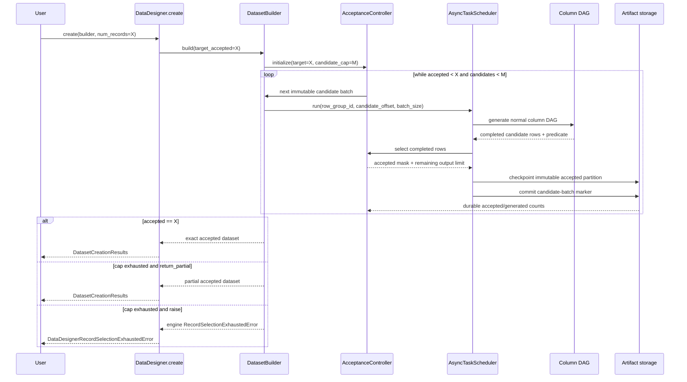
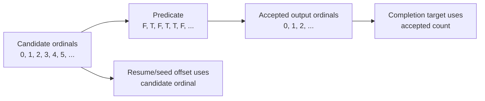
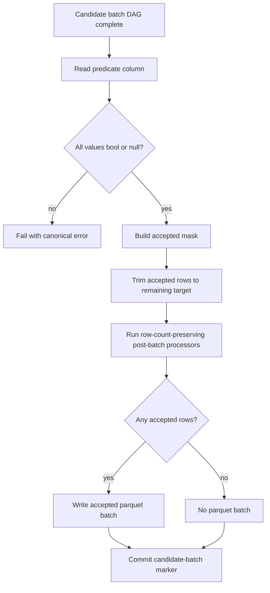
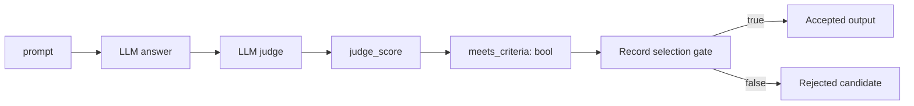
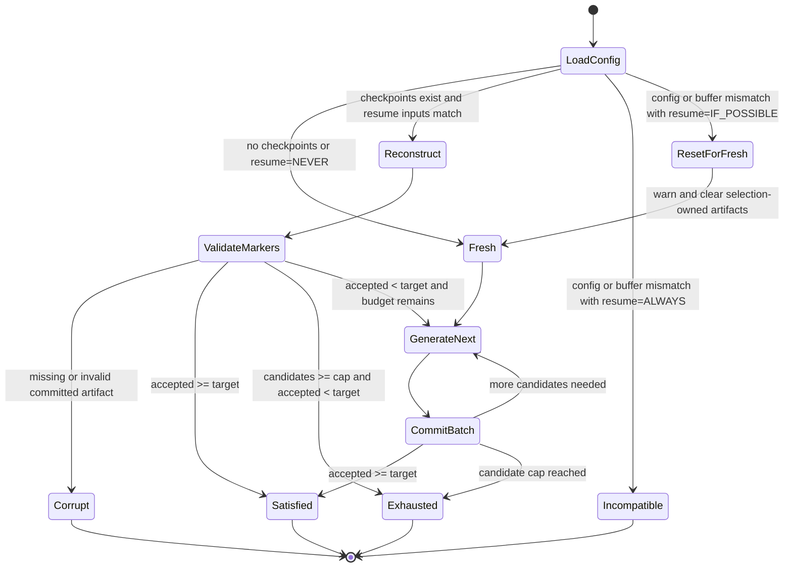

# Plan: Engine-native record selection for exact accepted-row targets

## Summary

Add a declarative record-selection policy to a normal `DataDesigner.create()` run. Users define a boolean
column that identifies acceptable records, then request the number of accepted records they want:

```python
results = data_designer.create(builder, num_records=5_000)
```

When record selection is configured, `num_records` means **5,000 accepted output records**, not 5,000 candidate
attempts. The engine generates bounded candidate batches, evaluates the configured predicate column, checkpoints
only accepted rows, and continues until it has exactly the requested count or exhausts its candidate budget.

The core user contract is:

> Produce `X` records for which this declared boolean column is true.

The user declares the desired data and acceptance criterion. The engine owns candidate generation, rejection,
refill, trimming, progress accounting, artifact layout, and resume.

## Motivation

Many synthetic-data pipelines need an exact number of rows that satisfy a quality condition:

- Generate 5,000 answers whose judge score is at least 0.8.
- Generate 10,000 conversations that pass a safety or policy validator.
- Generate examples where two judges disagree.
- Generate images whose VLM evaluation marks all required attributes present.
- Generate tool-use traces that terminate successfully and contain a required tool call.

Today users can generate candidates and filter afterward, but that produces fewer than the requested number of
rows. They can also orchestrate multiple `create()` calls or workflow stages, but then the user owns retry loops,
artifact extension, trimming, and resume. That conflicts with DataDesigner's "declare, don't orchestrate"
contract.

PR #773 explored workflow-level repetition. Real-run testing exposed two important constraints:

1. Repeatedly extending the same static row-group plan couples progress to `buffer_size`; small increments can
   stop generating after the second extension.
2. Restarting an append loop at its first requested size can ask resume to shrink below already-persisted rows.

An engine-native design should therefore treat candidate batches as immutable first-class units and persist
candidate progress separately from accepted-output progress.

## Goals

1. Let users request exactly `X` accepted output rows in one `DataDesigner.create()` call.
2. Accept any declared boolean column as the selection predicate, including an expression derived from judge or
   validation output.
3. Require a hard candidate budget so generation is always bounded.
4. Preserve normal DAG generation, model usage accounting, processors, profiling, plugins, and lazy imports.
5. Support durable resume without regenerating committed candidate batches.
6. Stream accepted candidate batches to parquet without loading the full candidate or output dataset into memory.
7. Keep dependency direction intact: interface -> engine -> config.
8. Produce deterministic output ordering and deterministic trimming from candidate order.

## Non-goals for v1

- Returning or exporting every rejected candidate.
- Running several candidate batches concurrently.
- Cancelling downstream column tasks immediately when an early predicate becomes false.
- Supporting row-count-changing after-generation processors.
- Inferring an unbounded stopping condition from an expected acceptance rate.
- Replacing workflow chaining for genuinely separate generate/judge/enrich stages.

## User-facing API

### Recommended API

Add `RecordSelectionConfig` to `data_designer.config` and a builder convenience method:

```python
import data_designer.config as dd

answer_quality = dd.Score(
    name="answer_quality",
    description="Rate whether the answer is correct, complete, and well supported.",
    options={
        1: "Incorrect or unsupported",
        2: "Major problems",
        3: "Partially correct",
        4: "Correct and sufficiently supported",
        5: "Excellent",
    },
)

builder = dd.DataDesignerConfigBuilder(model_configs=[judge_model])
builder.add_column(
    dd.LLMJudgeColumnConfig(
        name="quality",
        model_alias="judge",
        prompt="Evaluate this answer: {{ answer }}",
        scores=[answer_quality],
    )
)
builder.add_column(
    dd.ExpressionColumnConfig(
        name="meets_criteria",
        expr="{{ quality.answer_quality.score >= 4 }}",
        dtype="bool",
        drop=True,
    )
)
builder.with_record_selection(
    dd.RecordSelectionConfig(
        predicate_column="meets_criteria",
        max_candidate_records=20_000,
        on_exhausted="raise",
    )
)

results = data_designer.create(builder, num_records=5_000)
```

The predicate can derive from any columns already represented in the execution graph:

```python
dd.ExpressionColumnConfig(
    name="meets_criteria",
    expr="{{ judge_score >= 0.8 and safety.valid and answer|length >= 100 }}",
    dtype="bool",
    drop=True,
)
```

The explicit boolean column is preferable to embedding a second expression directly in the selection policy:

- It participates in normal DAG dependency discovery.
- The predicate column itself can be previewed and debugged like any other column when record selection is disabled;
  V1 rejects selection-enabled preview runs.
- It can be generated by expressions, plugins, validators, or future generator types.
- `drop=True` already controls whether it appears in the final schema.
- Selection does not need its own template renderer or duplicate expression semantics.

A V1 predicate must be **row-local**: the value for one candidate may depend on that candidate's generated columns,
but not on the composition of the current batch or on candidates accepted in earlier batches. Custom and plugin
columns are supported under the same contract. Run-global deduplication, quotas, ranking, and global top-N selection
are out of scope because they would require durable cross-batch state and could revoke rows that were already
checkpointed.

A future convenience overload may create a hidden expression column, but it should compile to the same explicit
column model rather than introduce another runtime path.

### Config model

```python
class RecordSelectionExhaustion(StrEnum):
    RAISE = "raise"
    RETURN_PARTIAL = "return_partial"


class RecordSelectionConfig(ConfigBase):
    """Select records until the requested accepted-row count is reached."""

    predicate_column: str
    max_candidate_records: int = Field(gt=0)
    on_exhausted: RecordSelectionExhaustion = RecordSelectionExhaustion.RAISE
```

Add an optional field to `DataDesignerConfig`:

```python
record_selection: RecordSelectionConfig | None = None
```

Add a builder method:

```python
def with_record_selection(
    self,
    config: RecordSelectionConfig,
) -> DataDesignerConfigBuilder:
    ...
```

`RecordSelectionConfig` belongs in the config package because it changes the meaning and identity of the output
dataset. It must be serialized and included in `DataDesignerConfig.fingerprint()`. Candidate concurrency and batch
sizing remain operational concerns owned by `RunConfig`.

### Public semantics

| Concern | v1 behavior |
|---|---|
| `num_records` | Desired number of accepted output records |
| Predicate | Existing column whose runtime values must be boolean or null |
| Predicate scope | Row-local; batch-global and run-global selectors are not supported |
| `True` | Accept the record |
| `False` | Reject the record |
| `None` / null | Reject and increment `null_predicate_records` |
| Non-boolean value | Fail with a canonical configuration/generation error |
| Bound | `max_candidate_records` is required |
| Exhausted + `raise` | Raise a canonical selection-exhausted error |
| Exhausted + `return_partial` | Complete with all accepted rows generated so far |
| Empty `return_partial` | Return a schema-bearing zero-row dataset and skip profiling |
| Overshoot | Keep the earliest accepted rows in candidate order, trimming to exactly `num_records` |
| Predicate output column | Included or removed according to its normal `drop` setting |
| Profiling | Profile only the final accepted dataset |
| Model usage | Include accepted and rejected candidate work |
| Preview | Reject record selection clearly in v1; use `create()` for accepted-row targets |
| Hugging Face Hub | Publish only terminal accepted output and aggregate selection metadata |

At the `create()` boundary, validate:

- `max_candidate_records >= num_records`.
- `predicate_column` exists.
- The predicate is not a seed-only side artifact with no materialized output.
- Known output types are boolean. Unknown plugin output types receive strict runtime validation.
- v1 has no row-count-changing after-generation processor.

## Alternatives considered

| Approach | Advantages | Problems | Decision |
|---|---|---|---|
| Generate the full candidate cap, then filter once | Smallest implementation | Always pays maximum cost; cannot stop early; large temporary output | Do not use as primary design |
| Repeat `DataDesigner.create(..., resume=ALWAYS)` with larger targets | Reuses current public API | Couples selection to resume row-group math; difficult callback resume; repeated profiling | Rejected |
| Engine-managed immutable candidate batches | Bounded, resumable, streams output, stops early | Requires new selection progress and candidate-batch manifest | **Recommended for v1** |
| Dynamically replace every rejected row inside one scheduler | Best theoretical efficiency | Invasive task-grid mutation, cancellation, refill, and ordering complexity | Future optimization |

### Is a v2 required?

No. V1 is the complete product feature, not a stepping stone that requires an immediate v2. It provides the full
user-visible contract: one declarative run produces exactly the requested number of matching rows, candidate work
is bounded, exhaustion is explicit, progress is resumable, and accepted rows and candidate attempts are accounted
for separately.

A possible v2 would preserve those semantics and improve performance only—for example, by running multiple candidate
batches concurrently, cancelling downstream work after early predicate rejection, or adapting batch size to the
observed acceptance rate. Work on v2 should begin only if production benchmarks show that v1's sequential candidate
batches materially limit throughput, provider utilization, latency, or cost. Until then, v1 is sufficient.

## Architecture

### Package ownership and control flow


Dependency direction remains legal:

```text
interface -> engine -> config
```

The config package contains only declarative models. It never imports the engine or executes generation.

### Runtime sequence



### Candidate and output coordinate spaces

Candidate position and accepted output position are different coordinates and must never be conflated:



Seed readers advance using the candidate offset. `actual_num_records` and `DatasetCreationResults.count_records()`
report accepted output rows.

## Detailed engine design

### 1. `AcceptanceController`

Introduce an engine-owned controller with no interface dependency:

```python
@dataclass(frozen=True, slots=True)
class CandidateBatch:
    candidate_batch_id: int
    row_group_id: int
    start_offset: int
    size: int


@dataclass(frozen=True, slots=True)
class SelectionDecision:
    accepted_indices: tuple[int, ...]
    rejected_count: int
    null_predicate_count: int
    failed_generation_count: int
    trimmed_accepted_count: int


class AcceptanceController:
    def has_reached_target(self) -> bool: ...
    def has_candidate_budget(self) -> bool: ...
    def next_candidate_batch(self) -> CandidateBatch: ...
    def select(self, dataframe: pd.DataFrame) -> SelectionDecision: ...
    def record_checkpoint(self, batch: CandidateBatch, decision: SelectionDecision) -> None: ...
```

Responsibilities:

- Track target accepted count.
- Track candidate attempts separately from accepted records.
- Allocate stable, monotonically increasing candidate batch IDs and offsets.
- Strictly evaluate the predicate column.
- Trim the last accepted candidate batch to the remaining output count.
- Expose progress for metadata and logs.
- Decide satisfied vs exhausted state.

The controller does not call column generators, write parquet, or own scheduler tasks.

### 2. Immutable candidate batch planning

`CandidateBatch` is the logical unit of record-selection work and progress. A row group is the scheduler's physical
task and buffering unit. They are distinct concepts even though v1 maps each candidate batch to exactly one fresh
row group. Keeping both identifiers explicit prevents selection progress from becoming coupled to row-group layout
and leaves room for later optimizations without changing the persisted selection model.

Do not extend a previously completed partial row group. Each candidate batch receives a new immutable row group:

```text
candidate batch 0 -> row group 0: candidate offset 0,    size 1000
candidate batch 1 -> row group 1: candidate offset 1000, size 1000
candidate batch 2 -> row group 2: candidate offset 2000, size 1000
...
```

Keep `CandidateBatch` as the single selection DTO and reuse the existing scheduler-facing `ExplicitRowGroupPlan`.
That plan already survives `normalize_row_group_plan()` and exposes offsets through
`row_group_start_offset()`, but its current offsets always begin at zero. Extend it with a backwards-compatible
`base_offset` so a one-row-group candidate plan preserves the candidate's absolute offset:

```python
@dataclass(frozen=True, slots=True)
class ExplicitRowGroupPlan:
    row_groups: tuple[tuple[int, int], ...]
    base_offset: int = 0

    def __post_init__(self) -> None:
        next_offset = self.base_offset
        # Build the existing size and start-offset indexes.
        ...


candidate_plan = ExplicitRowGroupPlan(
    row_groups=((candidate_batch.row_group_id, candidate_batch.size),),
    base_offset=candidate_batch.start_offset,
)
```

`scheduled_total_rows` remains the sum of scheduled sizes, not `base_offset + size`. Because the normalizer preserves
an `ExplicitRowGroupPlan` instance, the scheduler's existing `current_row_group_start_offset` context receives the
absolute candidate offset. No parallel `CandidateBatchPlan` type is introduced. This avoids both seed replay and the
repeated-extension issue where a completed partial row group cannot grow while the next target remains inside the
same `buffer_size` boundary.

### 3. Candidate batch sizing

For v1, generate one candidate batch at a time. Its row group still gets normal per-column and per-cell parallelism.

Default candidate batch size:

```python
batch_size = min(
    run_config.buffer_size,
    target_accepted_records,
    remaining_candidate_budget,
)
```

This prevents a request for ten accepted rows from immediately generating the default 1,000 candidates. Users can
tune `RunConfig.buffer_size` when larger candidate batches produce better model throughput.

One candidate batch at a time provides:

- Predictable maximum overshoot of one candidate batch.
- No cancellation of already-running LLM requests.
- Straightforward candidate offsets and resume.
- Reuse of existing scheduler concurrency inside a row group.

Concurrent candidate batches can be introduced later after measuring throughput and overshoot.

V1 persists the run's `buffer_size` as selection resume-compatibility metadata and requires the same value when
resuming. A mismatch with `ResumeMode.ALWAYS` raises an incompatibility error; `ResumeMode.IF_POSSIBLE` logs a warning,
clears selection-owned artifacts, and starts fresh. `buffer_size` remains outside the data-config fingerprint because
it is operational state, but it is still part of the selection resume contract.

### 4. Builder loop

Add a dedicated path inside `DatasetBuilder.build()` after config compilation and before profiling:

```python
def _build_with_record_selection(
    self,
    generators: list[ColumnGenerator],
    *,
    target_num_records: int,
    buffer_size: int,
    resume: ResumeMode,
) -> None:
    controller = self._load_or_create_acceptance_controller(...)

    while not controller.has_reached_target() and controller.has_candidate_budget():
        candidate_batch = controller.next_candidate_batch()
        self._run_candidate_batch(
            generators=generators,
            candidate_batch=candidate_batch,
            controller=controller,
        )

    self._handle_selection_completion(controller)
```

Initialize generator instances once and reuse them across candidate batches. In particular:

- Move `log_pre_generation()` out of `_prepare_async_run()` and call it once before entering the candidate loop.
  Ordinary build and preview paths must retain their existing once-per-logical-run behavior.
- Preserve stateful generator instances across candidate batches.
- Create new scheduler/tracker/buffer state for each immutable candidate batch.
- Accumulate model usage over the full logical run.
- Run after-generation processors and profiling once after selection completes.

### 5. Selection checkpoint hook

Selection belongs after all DAG columns for the candidate batch have completed and before post-batch processors and
final checkpointing:



Add a scheduler callback before the existing `on_before_checkpoint` processor callback, for example:

```python
on_select_before_checkpoint: Callable[[int, int], SelectionDecision] | None
```

The callback should:

1. Read the completed candidate batch from `RowGroupBufferManager`.
2. Validate and apply the predicate.
3. Mark rejected and trimmed rows as dropped in the tracker and buffer.
4. Recompute dropped/surviving diagnostics.
5. Run post-batch processors only over accepted survivors.
6. Checkpoint accepted rows.
7. Commit the batch marker even when no rows survive.

The current checkpoint path computes `dropped_rows` before processor callbacks. Refactor it so selection occurs
before that count is finalized; otherwise diagnostics and all-rows-dropped behavior will be incorrect.

### 6. Predicate placement in the DAG

For v1, selection occurs when the whole candidate row is complete. The predicate column still has normal
dependencies, so a boolean expression derived from judge results is evaluated in the correct order.



A later optimization may treat the predicate as an early row gate. When it becomes false, the scheduler can call
its existing row-drop machinery and remove downstream tasks for that row. This can avoid expensive enrichment
after a cheap criterion fails. That optimization is not required for exact-count v1 semantics.

## Artifact and resume model

### Why existing output metadata is insufficient

For ordinary generation, planned row-group size and output row count are usually the same. Under record selection,
a candidate batch of 1,000 may checkpoint 137 accepted rows—or zero. Therefore these values are distinct:

- Candidate rows attempted.
- Accepted rows checkpointed.
- Output parquet batches written.
- Candidate batches durably completed.

Resume must not infer candidate progress solely from accepted parquet row counts.

### Proposed artifact layout

```text
artifacts/<dataset>/
  parquet-files/
    batch_00000.parquet            # published terminal dataset; may be re-chunked
  selection-accepted/
    batch_00000.parquet            # immutable accepted partition for candidate batch 0; optional
    batch_00001.parquet            # immutable accepted partition for candidate batch 1; optional
  selection-checkpoints/
    batch_00000.json               # always present after candidate batch 0 commits
    batch_00001.json               # present even when candidate batch 1 accepted zero rows
  selection-media-staging/         # transient, candidate-batch/row-scoped media
  partial-results/
    ...
  metadata.json
  builder_config.json
```

`parquet-files/` is the accepted-only published dataset. It contains only post-trim rows whose predicate evaluated
`True`; rows with false or null predicates, rows that failed before predicate evaluation, and predicate-true rows
trimmed from the final overshooting batch never appear there. The predicate column itself follows its normal `drop`
setting. During an interrupted run, `selection-accepted/` plus committed markers remain the source of truth and
`parquet-files/` must not be treated as publishable until terminal materialization completes.

Example batch marker:

```json
{
  "candidate_batch_id": 1,
  "row_group_id": 1,
  "candidate_start_offset": 1000,
  "candidate_records": 1000,
  "accepted_records": 137,
  "rejected_records": 861,
  "null_predicate_records": 2,
  "failed_generation_records": 0,
  "trimmed_accepted_records": 0,
  "accepted_partition": "selection-accepted/batch_00001.parquet"
}
```

`accepted_records` is the **post-trim persisted count** and must equal the row count of `accepted_partition`.
`trimmed_accepted_records` is diagnostic: it counts predicate-true rows discarded from the final overshooting batch
and is never added to accepted progress. Resume sums `accepted_records` to decide whether the target is satisfied.

For every marker, the following mutually exclusive accounting invariant must hold:

```text
candidate_records
  = accepted_records
  + rejected_records
  + null_predicate_records
  + failed_generation_records
  + trimmed_accepted_records
```

`rejected_records` counts explicit false predicates. `failed_generation_records` counts candidate slots dropped or
failed before predicate evaluation. For a zero-acceptance candidate batch, `accepted_partition` is null but the
marker still commits candidate progress.

### Global metadata

Extend `metadata.json` with a structured section:

```json
{
  "target_num_records": 5000,
  "actual_num_records": 4217,
  "record_selection": {
    "predicate_column": "meets_criteria",
    "max_candidate_records": 20000,
    "on_exhausted": "raise",
    "run_buffer_size": 1000,
    "candidate_records_generated": 12000,
    "candidate_batches_completed": 12,
    "accepted_records": 4217,
    "rejected_records": 7769,
    "null_predicate_records": 14,
    "failed_generation_records": 0,
    "trimmed_accepted_records": 0,
    "acceptance_rate": 0.3514167,
    "selection_satisfied": false,
    "selection_exhausted": false,
    "next_candidate_batch_id": 12,
    "next_candidate_offset": 12000
  }
}
```

The candidate-batch marker directory and immutable `selection-accepted/` partitions are the selection source of
truth. `parquet-files/` is the published dataset: terminal materialization and after-generation processors may
delete and re-chunk it without invalidating selection checkpoints. Global metadata is a convenient summary and may
lag by one checkpoint during a crash.

After selection reaches a terminal state, materialize `parquet-files/` from the immutable accepted partitions, then
run allowed after-generation processors only against the published dataset. Terminal metadata points results readers
to `parquet-files/`; selection markers continue to reference `selection-accepted/`. This separation lets resume
validate selection progress even after `ProcessorRunner.run_after_generation()` rewrites published files.
V1 retains immutable accepted partitions for the artifact's lifetime, accepting up to one additional copy of the
accepted dataset as the cost of durable resume and deterministic publication.

### Atomic commit and crash recovery

Treat the batch marker as the commit point:

1. Generate into the normal row-group buffer for the candidate batch.
2. Apply selection and processors.
3. Promote accepted engine-managed media from candidate staging into deterministic committed paths.
4. Write the post-trim rows to a deterministic immutable accepted-partition path when non-empty.
5. Atomically write the batch marker.
6. Update global metadata.

On resume:

- Reconstruct accepted and candidate progress from committed batch markers.
- Verify every marker that names an accepted partition points to a readable file whose row count equals
  `accepted_records`.
- Delete uncommitted accepted partitions and committed-media prefixes for the next candidate batch before rerunning
  that batch.
- Clear ordinary in-flight partial results.
- Set the next seed/candidate offset from committed candidate counts, not accepted row counts.
- Never call generic resume with a requested target smaller than persisted output.
- Rebuild missing or incomplete published output from immutable accepted partitions without regenerating candidates.

### Resume state machine



Selection resume inputs include the data-config fingerprint and persisted `run_buffer_size`. `IF_POSSIBLE` fallback
must be visible in logs and must clear checkpoints, immutable accepted partitions, published output, and staged or
committed candidate media before fresh generation starts; it must never silently combine incompatible runs.

## Processor interactions

### Pre-batch processors

Run normally on candidate rows before generation. Rows they drop consume candidate slots because work was admitted
for those candidate positions.

### Post-batch processors

Apply record selection first, then run post-batch processors over accepted rows. Existing post-batch processing is
row-count preserving under `strict_row_count=True`, so accepted counts remain valid and processor side artifacts
align with the output.

### After-generation processors

Row-count-changing after-generation processors can violate the exact-count guarantee after selection has finished.
For v1:

1. Reject known row-count-changing after-generation processors at compile/runtime setup.
2. Materialize the published dataset from immutable accepted partitions.
3. Run allowed after-generation processors once over the published dataset, never over
   `selection-accepted/`.
4. Verify the final output count still equals the selected count; raise a canonical error if a plugin violates the
   declared contract.

A future processor capability such as `preserves_row_count: bool` can make this validation explicit and reusable.

### Dropped predicate column

Evaluate selection before normal dropped-column handling. If the predicate has `drop=True`, preserve or omit it
using the existing `preserve_dropped_columns` behavior, aligned only to accepted rows.

## Media and side-effect artifacts

Rejected rows may already have written image, audio, video, trace, or plugin side artifacts. Filtering the parquet
row alone can leave orphan files, so V1 commits to candidate-scoped staging for engine-managed media:

1. Write candidate media below `selection-media-staging/batch_<id>/row_<candidate_ordinal>/` while generating.
2. After selection, promote only files referenced by accepted rows into a deterministic committed-media prefix and
   rewrite those row values before writing the immutable accepted partition.
3. Delete the entire candidate staging directory after the batch marker commits.
4. On crash recovery, delete staging plus any committed-media prefix for an uncommitted batch before rerunning it.

Rejected media therefore cannot accumulate across committed batches. Text side-effect columns stored in the row are
filtered with the DataFrame. Plugins that write untracked external side effects outside the engine's media-storage
contract are not supported with record selection in V1; plugins must return tracked artifacts or remain side-effect
free.

## Hugging Face Hub publication

`DatasetCreationResults.push_to_hub()` keeps its current public API and publishes the accepted-only terminal view:

- Upload `parquet-files/` to the Hub `data/` config.
- Upload accepted engine-managed media and processor outputs through their existing published directories.
- Upload `builder_config.json` and sanitized `metadata.json`, including aggregate record-selection diagnostics.
- Never upload `selection-accepted/`, `selection-checkpoints/`, `selection-media-staging/`, partial results, rejected
  media, or per-batch marker paths.

Both result-based and folder-based upload must require a complete published terminal state: either
`selection_satisfied=true`, or `selection_exhausted=true` with `on_exhausted=return_partial`. A stale or incomplete
`parquet-files/` directory is not sufficient. `on_exhausted=raise` does not return a `DatasetCreationResults`, and an
interrupted artifact must be resumed or finalized before folder-based upload.

Hub metadata and the generated dataset card must use `metadata.json.actual_num_records` as the authoritative output
count, with `target_num_records` shown separately. This is required for partial output and especially for a valid
zero-row partial, where profiling is skipped and `column_statistics=[]`; falling back from missing statistics to the
target would incorrectly advertise the dataset as complete. The card should also show whether selection was
satisfied or exhausted, candidate attempts, and acceptance rate when record-selection metadata is present.

Accepted images must be promoted into the existing published `images/` directory because the current Hub client
uploads that directory explicitly. If V1 supports file-backed audio or video output, their published directories
must be added explicitly to the Hub uploader; a generic committed-media directory must not be silently omitted.

When updating an existing Hub repository after resume or re-publication, replace the managed `data/` and media
prefixes rather than only uploading current files, so obsolete remote shards cannot survive a changed published
layout.

## Failure and exhaustion behavior

### Exhaustion

When candidate budget is exhausted before the accepted target:

```python
if config.on_exhausted == RecordSelectionExhaustion.RAISE:
    # Engine-owned error; the interface catches and normalizes it.
    raise RecordSelectionExhaustedError(
        target_records=target,
        accepted_records=accepted,
        candidate_records=candidates,
    )
```

For `return_partial`, finalize the accepted output and record `selection_satisfied=false` and
`selection_exhausted=true`.

Define `RecordSelectionExhaustedError` in `data_designer.engine.dataset_builders.errors` as a
`DatasetGenerationError` carrying target, accepted, generated, and cap fields. `DataDesigner.create()` catches it
before the generic engine wrapper and raises a public `DataDesignerRecordSelectionExhaustedError`, preserving those
fields and the engine error as its cause. The engine never imports the interface package.

#### Zero-row partial output

If `return_partial` reaches the candidate cap with zero accepted rows and no authoritative early-shutdown or fatal
generation error, zero rows are a successful selection result:

- Materialize a deterministic schema-bearing empty parquet file in `parquet-files/` from the compiled output schema.
- Bypass the interface's ordinary zero-row generation-failure guard only when terminal selection metadata records
  `selection_exhausted=true` and `on_exhausted=return_partial`.
- Skip dataset profiling, persist `column_statistics=[]`, and return `analysis=None`. Formalize the existing runtime
  possibility by typing `DatasetCreationResults.load_analysis()` as `DatasetProfilerResults | None`.
- Keep typed early-shutdown and fatal generation errors authoritative; `return_partial` must not hide them.

### Early shutdown and generation failures

- Failed/dropped candidate slots count against `max_candidate_records`; they consumed an attempt and potentially
  model cost.
- Retryable model errors continue through the scheduler's normal retry/salvage path.
- If engine early shutdown fires, retain durably checkpointed accepted candidate batches.
- Existing typed early-shutdown errors remain authoritative unless the API explicitly chooses to map early
  shutdown to partial selection output.
- Do not parse error strings to decide selection behavior.

### Invalid predicate values

Runtime predicate validation should report:

- Predicate column name.
- Candidate batch ID.
- Invalid value and type, with bounded sample output.
- Expected boolean/null contract.

Avoid `bool(value)` coercion because non-empty strings such as `"false"` are truthy in Python. Expression columns
with `dtype="bool"` already provide the expected ergonomic conversion.

## Observability

Log and persist selection progress after every committed candidate batch:

```text
Record selection: accepted 4,217 / 5,000
Candidates generated: 12,000 / 20,000
Acceptance rate: 35.1%
```

Recommended counters:

- `record_selection_candidate_records`
- `record_selection_accepted_records`
- `record_selection_rejected_records`
- `record_selection_null_predicate_records`
- `record_selection_failed_generation_records`
- `record_selection_trimmed_records`
- `record_selection_candidate_batches_completed`
- `record_selection_acceptance_rate`
- `record_selection_satisfied`
- `record_selection_exhausted`

Progress should distinguish accepted output completion from candidate work. Model usage remains the source of truth
for inference cost across accepted and rejected candidates. `record_selection_acceptance_rate` is
`accepted_records / candidate_records_generated`, so failed attempts remain visible in end-to-end yield.

`DatasetCreationResults.count_records()` continues to return output records. A future structured
`load_selection_summary()` helper may expose the metadata section, but v1 can rely on `metadata.json`.

## Preview behavior

V1 rejects `preview()` when record selection is configured, before generation starts. The error must explain that
preview has no accepted-row retry/checkpoint contract and direct the user to `create()` or to preview the same config
with record selection disabled. This prevents the default preview size from being silently reinterpreted as an
accepted target and expanding work up to `max_candidate_records`. In-memory selection preview can be a separate,
explicitly designed follow-up.

## Implementation phases

### Phase 1: Config and validation

**Package:** `data-designer-config`

Likely files:

- `config/record_selection.py` — new models and enums.
- `config/data_designer_config.py` — add `record_selection`.
- `config/config_builder.py` — add `with_record_selection()`.
- `config/__init__.py` — lazy public exports.
- `config/fingerprint.py` — confirm selection is identity-relevant.

Deliverables:

- Serializable public model.
- Builder API.
- Unit validation for bounds and enum coercion.
- Fingerprint changes when any selection field changes.

### Phase 2: Interface contract and run-boundary validation

**Package:** `data-designer`

Likely files:

- `interface/data_designer.py` — interpret `num_records` as the accepted target, validate runtime bounds, reject
  selection preview, normalize exhaustion errors, and allow valid empty partial output.
- `interface/errors.py` — add the public selection-exhausted error.
- `interface/results.py` — formalize optional analysis for schema-bearing empty partial output.

Deliverables:

- `create()` routes the accepted-row target into the engine without changing ordinary-run semantics.
- Run-boundary validation covers `max_candidate_records >= num_records`, predicate existence/type, processor
  compatibility, and resume inputs.
- Engine exhaustion errors are normalized at the interface boundary.
- V1 preview rejection and zero-row `return_partial` behavior are explicit and tested.

### Phase 3: Engine controller and one-candidate-batch execution

**Package:** `data-designer-engine`

Likely files:

- `engine/dataset_builders/acceptance.py` — `AcceptanceController` and DTOs.
- `engine/dataset_builders/row_group_plan.py` — add `base_offset` to the existing `ExplicitRowGroupPlan`.
- `engine/dataset_builders/dataset_builder.py` — bounded candidate-batch loop.
- `engine/dataset_builders/async_scheduler.py` — selection callback before post-batch checkpoint.
- `engine/dataset_builders/utils/row_group_buffer.py` — selected checkpoint support.

Deliverables:

- Exact accepted output for a fresh run.
- Required candidate cap.
- `raise` and `return_partial` exhaustion.
- Deterministic trimming and ordering.
- One candidate batch in flight at a time.
- `log_pre_generation()` runs once per logical build across all candidate batches.
- Ordered seeds receive the absolute candidate offset through the existing scheduler context.

### Phase 4: Durable selection checkpoints, media, publication, and resume

Likely files:

- `engine/storage/artifact_storage.py` — selection checkpoint paths and atomic marker I/O.
- `engine/dataset_builders/dataset_builder.py` — resume reconstruction.
- `engine/dataset_builders/acceptance.py` — controller hydration from markers.
- Engine media-storage integration — candidate/row-scoped staging, accepted promotion, and crash cleanup.

Deliverables:

- Candidate progress reconstructed independently from accepted parquet row count.
- Zero-acceptance candidate batches remain durably complete.
- Immutable accepted partitions remain valid when published output is re-chunked by after-generation processors.
- Marker counters satisfy the complete candidate-accounting invariant.
- Crash-window cleanup for uncommitted candidate-batch artifacts.
- Compatible `ResumeMode.ALWAYS` and `ResumeMode.IF_POSSIBLE` behavior.

### Phase 5: Results, Hub publication, docs, and examples

**Packages:** interface, Hugging Face integration, and Fern docs

Likely files:

- `interface/results.py` — preserve the existing `push_to_hub()` surface.
- `integrations/huggingface/client.py` — enforce terminal selection state, upload only published artifacts, and
  replace managed remote prefixes.
- `integrations/huggingface/dataset_card.py` — use authoritative actual counts and selection diagnostics.

Deliverables:

- User-facing example with judge score -> boolean expression -> exact target.
- Metadata documentation.
- Exhaustion and resume examples.
- Explicit after-generation processor and media-artifact limitations.
- Accepted-only Hub publication for satisfied, partial, and schema-bearing empty outputs.
- No upload of selection checkpoints, immutable internal partitions, staging, or rejected media.

### Optional post-v1 optimization (not required for feature completeness)

Compile the predicate as a scheduler row gate. Once its value is false:

- Drop the row through `CompletionTracker.drop_row()`.
- Remove downstream tasks from the ready frontier.
- Cancel no task that is already in flight in v1 of the optimization.
- Preserve the same candidate/accepted checkpoint contract.

This optimization changes cost, not output semantics. It is not part of the v1 definition of done and creates no
commitment to implement a v2; benchmark evidence should justify it first.

## Test plan

### Config tests

- Predicate column is required and must exist.
- `max_candidate_records` must be positive.
- Run boundary rejects `max_candidate_records < num_records`.
- Selection participates in config serialization and fingerprinting.
- String exhaustion values normalize to enums.

### Interface tests

- `create(num_records=X)` routes `X` as the accepted target only when selection is configured.
- `max_candidate_records < num_records` fails before generation.
- Engine exhaustion maps to `DataDesignerRecordSelectionExhaustedError` with structured counts.
- `preview()` with record selection fails before generation with actionable guidance.
- Zero-row `return_partial` bypasses only the expected selection-exhaustion guard and returns `analysis=None`.

### Fresh-run integration tests

- Target reached in the first candidate batch.
- Target reached after three or more candidate batches with default `buffer_size`.
- Final candidate batch overshoots and trims to exact target.
- Predicate column is removed when `drop=True`.
- Predicate column remains when `drop=False`.
- Null predicate values reject and increment metadata.
- Non-boolean predicate values raise.
- `return_partial` returns non-empty partial output.
- `return_partial` returns a schema-bearing empty dataset when no candidates pass, skips profiling, and reports zero
  records through `DatasetCreationResults`.
- `raise` reports target, accepted, generated, and cap.
- Post-batch processor output aligns with accepted rows.
- Profiling counts accepted rows only.
- Usage accounting includes rejected candidate calls.
- Marker categories, including failed and trimmed rows, sum exactly to candidate attempts.
- `log_pre_generation()` is called once when selection requires three or more candidate batches.

### Seed and ordering tests

- Candidate batch offsets are contiguous and do not repeat seed rows unexpectedly.
- `ExplicitRowGroupPlan(base_offset=...)` survives normalization and candidate batch 1's ordered seed starts strictly
  after candidate batch 0 rather than replaying offset zero.
- Ordered seed sampling preserves candidate order.
- Shuffle sampling remains deterministic under the existing seed contract.
- Trimming retains earliest accepted candidate ordinals.
- Stateful generators preserve state across candidate batches.

### Resume tests

- Interrupt during candidate batch 0 before checkpoint; candidate batch 0 reruns.
- Interrupt after candidate batch 2 commits; resume starts at candidate batch 3's candidate offset.
- Candidate batch accepting zero rows is not regenerated after resume.
- Global metadata lag is reconstructed from batch markers.
- Orphan uncommitted accepted partitions are removed and regenerated.
- Missing accepted partition referenced by a committed marker raises corruption error.
- Changed selection config with `ALWAYS` fails compatibility; with `IF_POSSIBLE` logs and restarts cleanly.
- Changed `buffer_size` follows the same `ALWAYS`/`IF_POSSIBLE` compatibility rules.
- Completed exact output is reused without re-evaluating the predicate.
- Exhausted partial output is reused according to its recorded terminal state.
- After-generation re-chunking of `parquet-files/` does not invalidate immutable accepted partitions or markers.
- Missing/incomplete published output is rebuilt from immutable accepted partitions without candidate regeneration.

### Failure and boundary tests

- Candidate cap exactly equals target.
- Candidate cap ends with a smaller final candidate batch.
- Early shutdown after some accepted candidate batches preserves durable output.
- All rows fail generation before predicate evaluation.
- Predicate generator itself fails.
- Row-count-changing after-generation processor is rejected or detected.
- Accepted media is promoted, rejected media is deleted, and an interrupted uncommitted media batch is cleaned on
  resume.

### Hugging Face Hub tests

- A satisfied run uploads only accepted published parquet rows to `data/`.
- A non-empty partial card reports `actual_num_records`, target, exhausted state, candidate attempts, and acceptance
  rate.
- A zero-row partial uploads its schema-bearing empty parquet and reports zero records rather than the target.
- Folder-based upload rejects non-terminal or stale published selection artifacts.
- Internal accepted partitions, markers, staging, and rejected media are never uploaded.
- Accepted images remain reachable under `images/`; supported file-backed audio/video directories are explicit.
- Re-publishing to an existing Hub repository removes obsolete managed data and media shards.

### Regression tests motivated by PR #773

- `num_records` smaller than default `buffer_size`, target first reached on candidate batch 3.
- Interrupted run after candidate batch 2 resumes without requesting a smaller target.
- Candidate progress never derives from accepted output row count.
- A later low-acceptance candidate batch cannot replace or erase earlier accepted output.

## Risks and mitigations

| Risk | Mitigation |
|---|---|
| Low acceptance causes runaway cost | Required hard candidate cap |
| Candidate/output counts are conflated | Mutually exclusive marker counters with a required sum invariant |
| Resume repeats seeds | Extend and reuse `ExplicitRowGroupPlan(base_offset=...)`; test ordered seeds across batches |
| Zero-acceptance candidate batch is invisible | Always write a candidate-batch completion marker |
| Last candidate batch overproduces | Deterministically trim before checkpoint |
| Processor changes selected count or rewrites marker files | Immutable accepted partitions; block/verify resize; process only published output |
| Rejected media leaks disk space | Candidate/row-scoped staging, accepted promotion, and deterministic crash cleanup |
| Throughput drops with sequential candidate batches | Preserve full within-row-group concurrency; add concurrent candidate batches only if benchmarks justify it |
| Plugin predicate returns surprising types or uses global state | Strict runtime boolean/null validation and a row-local V1 predicate contract |
| Metadata write lags parquet write | Marker-based filesystem reconstruction and orphan cleanup |
| Runtime settings change during resume | Persist `buffer_size`; fail `ALWAYS` or reset `IF_POSSIBLE` on mismatch |
| Published output is interrupted or re-chunked | Rebuild it from immutable accepted partitions without candidate regeneration |
| Immutable and published datasets increase disk use | Document up to one extra accepted-data copy and remove both through normal artifact cleanup |
| Hub publication leaks internal/rejected artifacts | Upload an explicit published-artifact allowlist; reject non-terminal selection state |
| Partial or empty Hub card reports the target as actual | Use `metadata.json.actual_num_records` as the authoritative card count |
| Re-publishing leaves stale remote shards | Replace managed Hub data/media prefixes before uploading the terminal view |

## V1 decisions

- Use `RecordSelectionConfig` publicly and `AcceptanceController` internally.
- Require an explicit, row-local boolean predicate column; global ranking, quotas, and deduplication are out of scope.
- Require `max_candidate_records`.
- Treat null as rejected and non-boolean as an error.
- Use `num_records` as the accepted-row target; do not duplicate it in selection config.
- Run one immutable candidate batch at a time.
- Derive candidate batch size from `min(buffer_size, target, remaining_budget)`.
- Extend and reuse `ExplicitRowGroupPlan` with an explicit base offset; do not add `CandidateBatchPlan`.
- Require the same `buffer_size` for resume, with `ALWAYS` failure and visible `IF_POSSIBLE` reset semantics.
- Commit a marker for every candidate batch, including zero-acceptance candidate batches.
- Make `accepted_records` the post-trim persisted count and account explicitly for failed-generation and trimmed rows.
- Keep immutable accepted partitions separate from mutable published output.
- Run selection before post-batch processors.
- Block row-count-changing after-generation processors for v1.
- Stage engine-managed media per candidate row and promote only accepted artifacts.
- Keep rejected records out of the final dataset and expose only aggregate diagnostics.
- Return a schema-bearing empty dataset with no profile for valid zero-row `return_partial` exhaustion.
- Reject record selection in `preview()` for v1.
- Normalize an engine selection-exhausted error into a public interface error.
- Keep `push_to_hub()` API-compatible while publishing only terminal accepted output and sanitized aggregate metadata.
- Defer early predicate task cancellation and concurrent candidate batches.

## Definition of done

The feature is complete when a user can declare a boolean criterion and reliably obtain exactly `X` matching rows
from one `DataDesigner.create()` call, with:

- Bounded candidate generation.
- Exact deterministic trimming.
- Correct default-buffer behavior across three or more candidate batches.
- Durable resume after any committed candidate batch.
- Correct zero-acceptance checkpoint handling.
- Absolute candidate offsets preserved through `ExplicitRowGroupPlan` without ordered-seed replay.
- Marker counts that reconcile accepted, rejected, null, failed-generation, and trimmed candidate outcomes.
- Immutable accepted partitions that survive published-output processing and re-chunking.
- Accepted-only output, processing, and non-empty profiling; valid empty partial output skips profiling explicitly.
- Engine-managed rejected media cleanup with crash-safe candidate staging.
- Hugging Face publication that exposes only terminal accepted output, reports partial/empty counts correctly, and
  cannot leak selection-internal artifacts.
- Clear V1 rejection of preview and run-global predicate semantics.
- Complete candidate/acceptance metadata, public exhaustion errors, and model usage accounting.
- No dependency-layer violations.
- Documentation that explains cost, bounds, partial exhaustion, and resume semantics.

Meeting this definition completes the feature. No v2 work is required unless measured performance warrants a
separate optimization effort.
