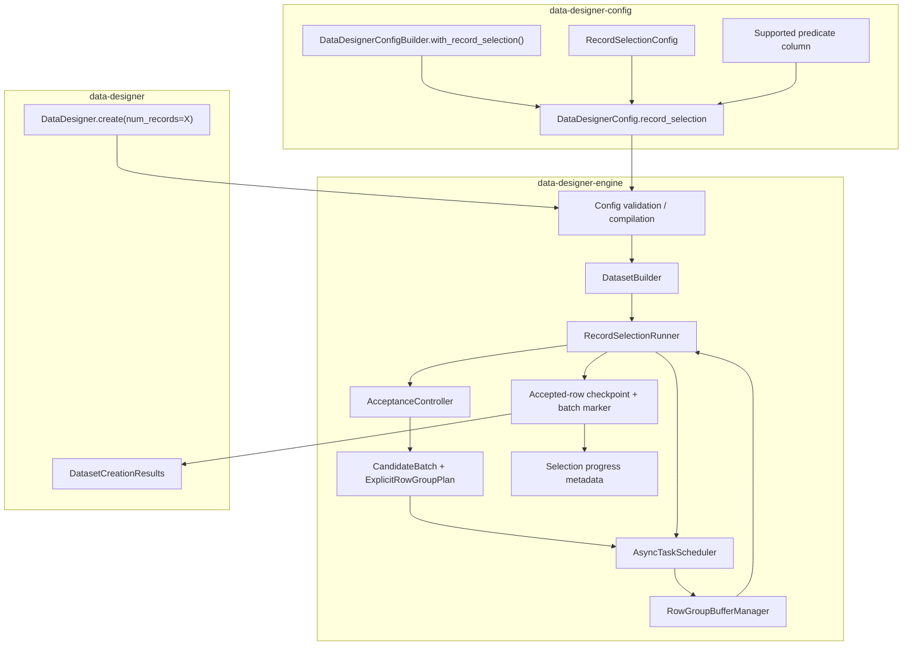
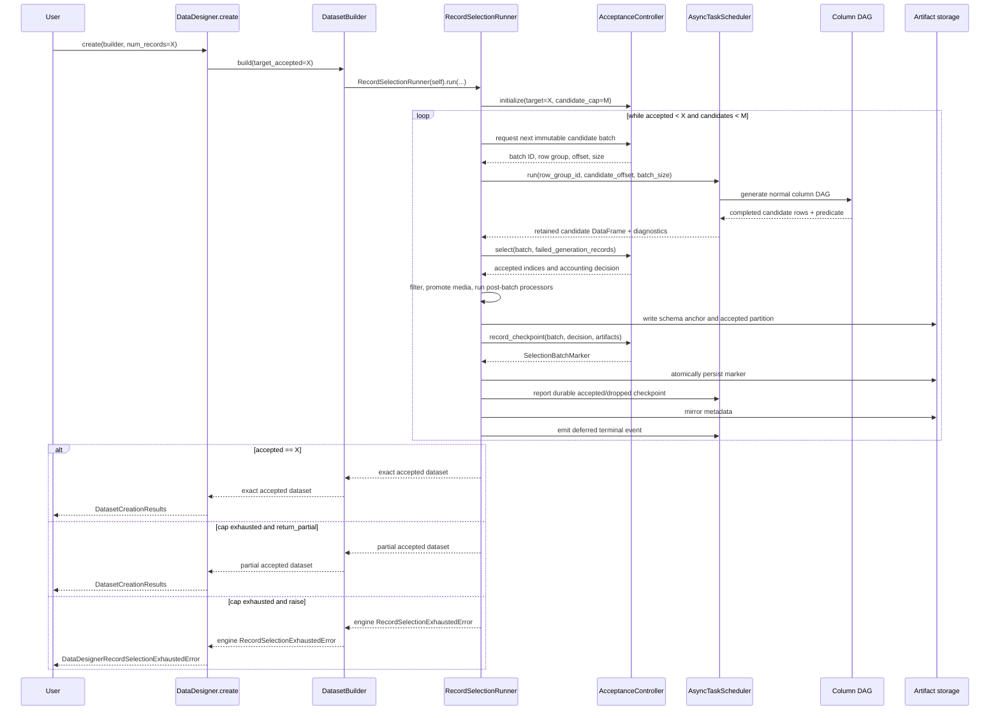
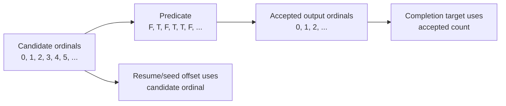
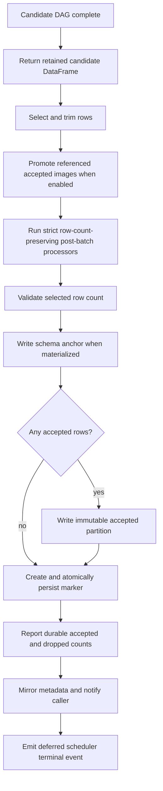
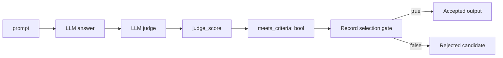
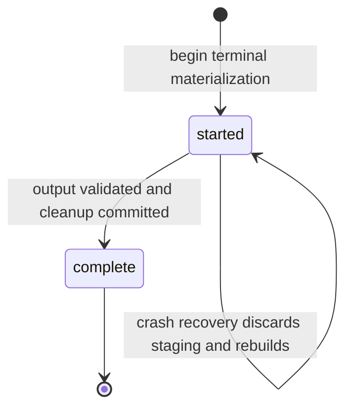
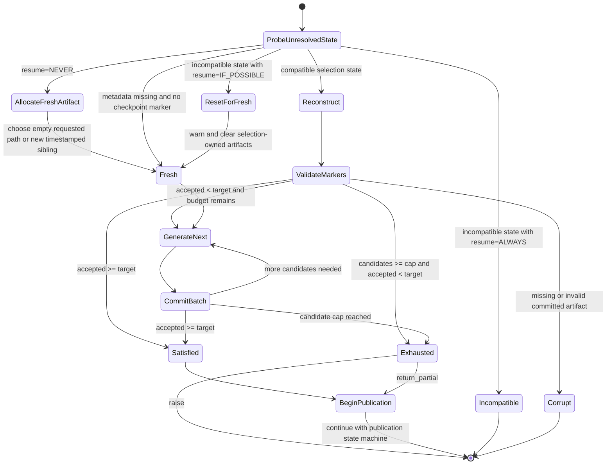

# Plan: Engine-native record selection for exact accepted-row targets

## Summary

This implementation adds a declarative record-selection policy to a normal `DataDesigner.create()` run. Users define
a supported predicate column that identifies acceptable records, then request the number of accepted records they
want:

```python
results = data_designer.create(builder, num_records=5_000)
```

When record selection is configured, `num_records` means **5,000 accepted output records**, not 5,000 candidate
attempts. The engine generates bounded candidate batches, evaluates the configured predicate column, checkpoints
only accepted rows, and continues until it has exactly the requested count or exhausts its candidate budget.

The core user contract is:

> Produce `X` records for which this declared predicate is true.

The user declares the desired data and acceptance criterion. The engine owns candidate generation, rejection,
refill, trimming, progress accounting, artifact layout, and resume.

## Motivation

Many synthetic-data pipelines need an exact number of rows that satisfy a quality condition:

- Generate 5,000 answers whose judge score is at least 0.8.
- Generate 10,000 conversations that pass a safety or policy validator.
- Generate examples where two judges disagree.
- Generate images whose VLM evaluation marks all required attributes present.
- Generate tool-use traces that terminate successfully and contain a required tool call.

Today users can generate candidates and filter afterward, but that produces fewer than the requested number of
rows. They can also orchestrate multiple `create()` calls or workflow stages, but then the user owns retry loops,
artifact extension, trimming, and resume. That conflicts with DataDesigner's "declare, don't orchestrate"
contract.

PR #773 explored workflow-level repetition. Real-run testing exposed two important constraints:

1. Repeatedly extending the same static row-group plan couples progress to `buffer_size`; small increments can
   stop generating after the second extension.
2. Restarting an append loop at its first requested size can ask resume to shrink below already-persisted rows.

The engine-native design therefore treats candidate batches as immutable first-class units and persists
candidate progress separately from accepted-output progress.

## Goals

1. Let users request exactly `X` accepted output rows in one `DataDesigner.create()` call.
2. Accept a boolean expression, custom column, or registered plugin column as the direct selection predicate.
   Normalize sampler, seed, validation, and built-in model-generated outputs through a boolean expression first.
3. Require a hard candidate budget so generation is always bounded.
4. Preserve normal DAG generation, model usage accounting, processors, profiling, plugins, and lazy imports.
5. Support durable resume without regenerating committed candidate batches.
6. Stream accepted candidate batches to parquet without loading the full candidate or output dataset into memory.
7. Keep dependency direction intact: interface -> engine -> config.
8. Produce deterministic output ordering and deterministic trimming from candidate order.

## Non-goals for v1

- Returning or exporting every rejected candidate.
- Running several candidate batches concurrently.
- Cancelling downstream column tasks immediately when an early predicate becomes false.
- Supporting row-count-changing after-generation processors.
- Inferring an unbounded stopping condition from an expected acceptance rate.
- Replacing workflow chaining for genuinely separate generate/judge/enrich stages.

## User-facing API

### Public API

`RecordSelectionConfig` in `data_designer.config` and the builder's `with_record_selection()` method provide the
public configuration surface:

```python
import data_designer.config as dd

answer_quality = dd.Score(
    name="answer_quality",
    description="Rate whether the answer is correct, complete, and well supported.",
    options={
        1: "Incorrect or unsupported",
        2: "Major problems",
        3: "Partially correct",
        4: "Correct and sufficiently supported",
        5: "Excellent",
    },
)

builder = dd.DataDesignerConfigBuilder(model_configs=[judge_model])
builder.add_column(
    dd.LLMJudgeColumnConfig(
        name="quality",
        model_alias="judge",
        prompt="Evaluate this answer: {{ answer }}",
        scores=[answer_quality],
    )
)
builder.add_column(
    dd.ExpressionColumnConfig(
        name="meets_criteria",
        expr="{{ quality.answer_quality.score >= 4 }}",
        dtype="bool",
        drop=True,
    )
)
builder.with_record_selection(
    dd.RecordSelectionConfig(
        predicate_column="meets_criteria",
        max_candidate_records=20_000,
        on_exhausted="raise",
    )
)

results = data_designer.create(builder, num_records=5_000)
```

The predicate expression can derive from any columns already represented in the execution graph:

```python
dd.ExpressionColumnConfig(
    name="meets_criteria",
    expr="{{ judge_score >= 0.8 and safety.valid and answer|length >= 100 }}",
    dtype="bool",
    drop=True,
)
```

The explicit boolean column is preferable to embedding a second expression directly in the selection policy:

- It participates in normal DAG dependency discovery.
- The predicate column itself can be previewed and debugged like any other column when record selection is disabled;
  V1 rejects selection-enabled preview runs.
- Direct predicates are boolean expressions, custom columns, or registered plugin columns. Other built-in output
  types remain upstream dependencies and are normalized through an expression.
- `drop=True` already controls whether it appears in the final schema.
- Selection does not need its own template renderer or duplicate expression semantics.

A V1 predicate must be **row-local**: the value for one candidate may depend on that candidate's generated columns,
but not on the composition of the current batch or on candidates accepted in earlier batches. Custom and plugin
columns are supported under the same contract. Run-global deduplication, quotas, ranking, and global top-N selection
are out of scope because they would require durable cross-batch state and could revoke rows that were already
checkpointed.

A future convenience overload may create a hidden expression column, but it should compile to the same explicit
column model rather than introduce another runtime path.

### Config model

```python
class RecordSelectionExhaustion(StrEnum):
    RAISE = "raise"
    RETURN_PARTIAL = "return_partial"


class RecordSelectionConfig(ConfigBase):
    """Select records until the requested accepted-row count is reached."""

    predicate_column: str = Field(min_length=1)
    max_candidate_records: int = Field(gt=0, strict=True)
    on_exhausted: RecordSelectionExhaustion = RecordSelectionExhaustion.RAISE
```

`DataDesignerConfig` includes the optional field:

```python
record_selection: RecordSelectionConfig | None = None
```

The builder exposes:

```python
def with_record_selection(
    self,
    config: RecordSelectionConfig,
) -> Self:
    ...
```

`RecordSelectionConfig` belongs in the config package because it changes the meaning and identity of the output
dataset. It is serialized and included in `DataDesignerConfig.fingerprint()`. Candidate concurrency and batch
sizing remain operational concerns owned by `RunConfig`.

`max_candidate_records` is a strict integer cost boundary. Boolean values (which are Python integer subclasses),
integral floats, and numeric strings are rejected instead of coerced. This keeps JSON/YAML configuration mistakes
from silently changing how much candidate generation the engine is authorized to perform.
`predicate_column` must be non-empty and contain at least one non-whitespace character.

### Public semantics

| Concern | v1 behavior |
|---|---|
| `num_records` | Desired number of accepted output records |
| Predicate | Boolean expression, custom column, or registered plugin column whose runtime values are boolean or null |
| Predicate scope | Row-local; batch-global and run-global selectors are not supported |
| `True` | Accept the record |
| `False` | Reject the record |
| `None` / null | Reject and increment `null_predicate_records` |
| Non-boolean value | Fail with a canonical configuration/generation error |
| Bound | `max_candidate_records` is required |
| Exhausted + `raise` | Raise a canonical selection-exhausted error |
| Exhausted + `return_partial` | Complete with all accepted rows generated so far |
| Empty `return_partial` | Return a schema-bearing zero-row dataset and skip profiling |
| Overshoot | Keep the earliest accepted rows in candidate order, trimming to exactly `num_records` |
| Predicate output column | Included or removed according to its normal `drop` setting |
| Profiling | Profile only the final accepted dataset |
| Model usage | Include accepted and rejected candidate work |
| Preview | Reject record selection clearly in v1; use `create()` for accepted-row targets |
| Resume target | Require the same `num_records`; smaller and larger targets are incompatible in v1 |
| Hugging Face Hub | Publish only terminal accepted output and aggregate selection metadata |

At the `create()` boundary, validate:

- `num_records > 0` when record selection is configured.
- `max_candidate_records >= num_records`.
- A resumed selection run uses the same `num_records` target recorded by the original run.
- `predicate_column` exists among compiled output or side-effect columns and has an owning column config.
- An expression predicate uses `dtype="bool"`; custom and plugin predicates receive strict runtime validation.
- Sampler, seed, validation, and built-in model-generated columns are rejected as direct predicates and must feed a
  boolean expression instead. This includes nested fields emitted by `LLMStructuredColumnConfig`, such as
  `judgment.accepted`.
- After-generation output preserves the accepted row count; a mismatch fails before publication is marked complete.

## Alternatives considered

| Approach | Advantages | Problems | Decision |
|---|---|---|---|
| Generate the full candidate cap, then filter once | Smallest implementation | Always pays maximum cost; cannot stop early; large temporary output | Do not use as primary design |
| Repeat `DataDesigner.create(..., resume=ALWAYS)` with larger targets | Reuses current public API | Couples selection to resume row-group math; difficult callback resume; repeated profiling | Rejected |
| Engine-managed immutable candidate batches | Bounded, resumable, streams output, stops early | Requires per-batch selection markers and immutable accepted partitions | **Implemented for v1** |
| Dynamically replace every rejected row inside one scheduler | Best theoretical efficiency | Invasive task-grid mutation, cancellation, refill, and ordering complexity | Future optimization |

### Is a v2 required?

No. V1 is the complete product feature, not a stepping stone that requires an immediate v2. It provides the full
user-visible contract: one declarative run produces exactly the requested number of matching rows, candidate work
is bounded, exhaustion is explicit, progress is resumable, and accepted rows and candidate attempts are accounted
for separately.

A possible v2 would preserve those semantics and improve performance only—for example, by running multiple candidate
batches concurrently, cancelling downstream work after early predicate rejection, or adapting batch size to the
observed acceptance rate. Work on v2 should begin only if production benchmarks show that v1's sequential candidate
batches materially limit throughput, provider utilization, latency, or cost. Until then, v1 is sufficient.

## Architecture

### Package ownership and control flow



Dependency direction remains legal:

```text
interface -> engine -> config
```

The config package contains only declarative models. It never imports the engine or executes generation.

### Runtime sequence



### Candidate and output coordinate spaces

Candidate position and accepted output position are different coordinates and must never be conflated:



Seed readers advance using the candidate offset. `actual_num_records` and `DatasetCreationResults.count_records()`
report accepted output rows.

## Detailed engine design

### 1. `AcceptanceController`

The engine-owned DTOs and controller live in `engine/dataset_builders/acceptance.py` and have no interface
dependency:

```python
@dataclass(frozen=True, slots=True)
class CandidateBatch:
    candidate_batch_id: int
    row_group_id: int
    start_offset: int
    size: int


@dataclass(frozen=True, slots=True)
class SelectionDecision:
    accepted_indices: tuple[int, ...]
    candidate_records: int
    accepted_records: int
    rejected_records: int
    null_predicate_records: int
    failed_generation_records: int
    trimmed_accepted_records: int


class SelectionBatchMarker(BaseModel):
    model_config = ConfigDict(frozen=True, strict=True)

    candidate_batch_id: int = Field(ge=0)
    row_group_id: int = Field(ge=0)
    candidate_start_offset: int = Field(ge=0)
    candidate_records: int = Field(ge=0)
    accepted_records: int = Field(ge=0)
    rejected_records: int = Field(ge=0)
    null_predicate_records: int = Field(ge=0)
    failed_generation_records: int = Field(ge=0)
    trimmed_accepted_records: int = Field(ge=0)
    accepted_partition: str | None
    schema_materialized: bool
    non_retryable_error: str | None
    stopped_early: bool

    @model_validator(mode="after")
    def validate_accounting(self) -> SelectionBatchMarker: ...


class AcceptanceController:
    def __init__(
        self,
        *,
        config: RecordSelectionConfig,
        target_records: int,
        buffer_size: int,
        markers: tuple[SelectionBatchMarker, ...] = (),
    ) -> None: ...

    @property
    def has_reached_target(self) -> bool: ...

    @property
    def has_candidate_budget(self) -> bool: ...

    @property
    def is_exhausted(self) -> bool: ...

    def next_candidate_batch(self) -> CandidateBatch: ...

    def select(
        self,
        dataframe: pd.DataFrame,
        *,
        batch: CandidateBatch,
        failed_generation_records: int,
    ) -> SelectionDecision: ...

    def record_checkpoint(
        self,
        *,
        batch: CandidateBatch,
        decision: SelectionDecision,
        accepted_partition: str | None,
        schema_materialized: bool = False,
        non_retryable_error: str | None = None,
        stopped_early: bool = False,
    ) -> SelectionBatchMarker: ...
```

Responsibilities:

- Track target accepted count.
- Track candidate attempts separately from accepted records.
- Allocate stable, monotonically increasing candidate batch IDs and offsets.
- Strictly evaluate the predicate column.
- Trim the last accepted candidate batch to the remaining output count.
- Hydrate and validate committed marker sequences.
- Expose progress and terminal properties for metadata and logs.
- Decide satisfied vs exhausted state.

The marker is a strict frozen Pydantic model. Pydantic owns field presence, type, and non-negative counter
validation; its model validator owns only the candidate-accounting and accepted-partition invariants. Persisted JSON
uses `model_dump(mode="json")`, so the on-disk object shape is unchanged while hand-written serialization and type
parsing are avoided.

The controller does not call column generators, write parquet, or own scheduler tasks. `RecordSelectionRunner`
persists the returned `SelectionBatchMarker` through `ArtifactStorage.write_selection_checkpoint()`.

### 2. Immutable candidate batch planning

`CandidateBatch` is the logical unit of record-selection work and progress. A row group is the scheduler's physical
task and buffering unit. They are distinct concepts even though v1 maps each candidate batch to exactly one fresh
row group. Keeping both identifiers explicit prevents selection progress from becoming coupled to row-group layout
and leaves room for later optimizations without changing the persisted selection model.

Do not extend a previously completed partial row group. Each candidate batch receives a new immutable row group:

```text
candidate batch 0 -> row group 0: candidate offset 0,    size 1000
candidate batch 1 -> row group 1: candidate offset 1000, size 1000
candidate batch 2 -> row group 2: candidate offset 2000, size 1000
...
```

`CandidateBatch` is the single selection work DTO. The implementation reuses the scheduler-facing
`ExplicitRowGroupPlan`, which survives `normalize_row_group_plan()` and exposes offsets through
`row_group_start_offset()`. Its backwards-compatible `base_offset` preserves the absolute offset of a one-row-group
candidate plan:

```python
@dataclass(frozen=True, slots=True)
class ExplicitRowGroupPlan:
    row_groups: tuple[tuple[int, int], ...]
    base_offset: int = 0

    def __post_init__(self) -> None:
        next_offset = self.base_offset
        # Build the existing size and start-offset indexes.
        ...


candidate_plan = ExplicitRowGroupPlan(
    row_groups=((candidate_batch.row_group_id, candidate_batch.size),),
    base_offset=candidate_batch.start_offset,
)
```

`scheduled_total_rows` is the sum of scheduled sizes, not `base_offset + size`. Because the normalizer preserves
an `ExplicitRowGroupPlan` instance, the scheduler's existing `current_row_group_start_offset` context receives the
absolute candidate offset. No parallel `CandidateBatchPlan` type is introduced. This avoids both seed replay and the
repeated-extension issue where a completed partial row group cannot grow while the next target remains inside the
same `buffer_size` boundary.

### 3. Candidate batch sizing

For v1, generate one candidate batch at a time. Its row group still gets normal per-column and per-cell parallelism.

Default candidate batch size:

```python
batch_size = min(
    run_config.buffer_size,
    target_accepted_records,
    remaining_candidate_budget,
)
```

This prevents a request for ten accepted rows from immediately generating the default 1,000 candidates. Users can
tune `RunConfig.buffer_size` when larger candidate batches produce better model throughput.

One candidate batch at a time provides:

- Predictable maximum overshoot of one candidate batch.
- No cancellation of already-running LLM requests.
- Straightforward candidate offsets and resume.
- Reuse of existing scheduler concurrency inside a row group.

Concurrent candidate batches can be introduced later after measuring throughput and overshoot.

V1 persists the run's `buffer_size` as selection resume-compatibility metadata and requires the same value when
resuming. A mismatch with `ResumeMode.ALWAYS` raises an incompatibility error; `ResumeMode.IF_POSSIBLE` logs a warning,
clears selection-owned artifacts, and starts fresh. `buffer_size` remains outside the data-config fingerprint because
it is operational state, but it is still part of the selection resume contract.

V1 also persists `target_num_records` as a runtime resume input and requires an exact match. It is not part of the
data-config fingerprint because it comes from `create(num_records=...)`, but it is compatibility-critical. A smaller
target can be below the already-persisted accepted count, while a larger target cannot recover predicate-true rows
trimmed from the previous final batch and would therefore violate the earliest-accepted-candidate ordering contract.
For either mismatch, `ResumeMode.ALWAYS` raises an incompatibility error and `ResumeMode.IF_POSSIBLE` visibly clears
all selection-owned and published artifacts before restarting from candidate offset zero.

### 4. Record-selection runner

`DatasetBuilder` remains the shared engine orchestrator. It owns generator initialization, graph construction,
processor and resource objects, generic scheduler construction, model-usage timing, and public run state. For a
selection build it creates one `RecordSelectionRunner` before resume preflight, uses that same per-build instance for
compatibility and cleanup decisions, calls each generator's `log_pre_generation()` once, and delegates the feature
lifecycle:

```python
record_selection_runner = (
    RecordSelectionRunner(self) if self._data_designer_config.record_selection is not None else None
)

# Resume preflight uses this same runner before ArtifactStorage resolves a dataset path.
...

if record_selection_runner is not None:
    for generator in generators:
        generator.log_pre_generation()
    record_selection_runner.run(
        generators,
        target_num_records=num_records,
        buffer_size=buffer_size,
        on_batch_complete=on_batch_complete,
        resume=resume,
    )
```

The runner holds a reference to its builder rather than copying a large set of scheduler, processor, storage,
resource, and run-state fields into a parallel context object. It owns selection-specific resume probing and cleanup,
controller hydration, the candidate lifecycle, marker and media commits, exhaustion, and terminal publication. It
does not retain a controller or candidate runtime after `run()` returns, so reusing a `DatasetBuilder` cannot leak
selection state across builds.

`RecordSelectionRunner.run()` restores or initializes the controller, reuses a valid completed publication when
possible, executes the bounded candidate loop, and then applies the terminal exhaustion/publication policy. The loop
remains deliberately serialized in v1:

```python
while not controller.has_reached_target and controller.has_candidate_budget:
    batch = controller.next_candidate_batch()
    self._run_candidate_batch(
        generators,
        controller=controller,
        batch=batch,
        on_batch_complete=on_batch_complete,
    )
    self._raise_if_selection_stopped_early(controller)
```

The runner:

- Calls `_prepare_async_run(..., log_pre_generation=False)` for every candidate batch while reusing the initialized
  generator instances and model registry.
- Creates new scheduler, tracker, and buffer state for each immutable candidate batch.
- Accumulates model usage over the full logical run.
- Handles exhaustion policy, schema creation, immutable-partition publication, and after-generation processing in
  `_finalize_selection_build()`.
- Profiles once in the interface after the engine returns a non-empty terminal result.

### 5. Result-oriented candidate execution

`AsyncTaskScheduler` has no selection-specific API. Its checkpoint boundary exposes generic lifecycle controls:

```python
on_before_checkpoint: Callable[[int, int], None] | None
on_finalize_row_group: Callable[[int], None] | None
retain_row_group_result: bool = False
```

Ordinary builds continue to use `on_before_checkpoint` for post-batch processing and `on_finalize_row_group` for
checkpointing. Selection instead treats each one-row-group scheduler as a result producer:

```python
scheduler, buffer_manager = self._builder._prepare_async_run(
    ...,
    retain_row_group_result=True,
    run_post_batch_in_scheduler=False,
)
run_async_scheduler(scheduler)
candidate_dataframe = buffer_manager.get_dataframe(batch.row_group_id)
```

`RecordSelectionRunner._generate_candidate_dataframe()` awaits that scheduler before applying selection.
`retain_row_group_result=True` retains the single completed buffer, including an all-failed zero-row batch, and gives
the caller ownership of completion reporting. The runner then performs selection, media promotion,
strict post-batch processing, and durable commit in a linear call stack. No selection callback, finalizer callback, or
shared callback runtime is required. The scheduler's automatic checkpoint event is deferred because candidate
completion is not yet a durable selection checkpoint; after the marker is written, the runner reports the checkpoint
with accepted rows as survivors and every rejected, null, failed, or trimmed candidate as dropped, then emits the
deferred terminal event. This preserves `scheduler_job_completed` as the final event and lets progress consumers
observe the durable checkpoint before closing the scheduler lifecycle. Deferred completion is restricted to the
single-row-group retained-result contract; a caller-side failure emits one error terminal event without inventing a
durable checkpoint.



The exact checkpoint order is:

1. The candidate DAG completes or salvages its surviving rows.
2. The scheduler returns while retaining the completed candidate buffer, including a zero-row buffer when the caller
   opts into `retain_row_group_result=True`. The runner materializes the candidate DataFrame and immediately releases
   the scheduler buffer.
3. `RecordSelectionRunner._select_candidate_dataframe()` calls `AcceptanceController.select()` with
   `failed_generation_records=batch.size - len(dataframe)` and filters and trims the accepted rows.
4. The runner promotes accepted image references when staging is active.
5. The runner applies normal post-batch processors with `strict_row_count=True`.
6. `RecordSelectionRunner._commit_selection_candidate_batch()` verifies the final count, writes a schema anchor
   when at least one candidate row fully generated and columns were materialized, writes an immutable accepted
   partition when non-empty, creates a
   `SelectionBatchMarker`, and atomically writes it through `ArtifactStorage`.
7. The runner reports `row_group_checkpointed` with the durable accepted/dropped counts, then
   `RecordSelectionRunner._mirror_committed_selection_batch()` refreshes metadata and in-memory counters and logs
   progress.
8. The runner invokes `on_batch_complete` for a non-empty accepted partition, cleans per-batch media staging in a
   `finally` path, and emits the deferred `scheduler_job_completed` event. Failures after the marker use the
   committed-phase error path so resume does not regenerate work. The runner derives that phase from the atomic
   marker file itself rather than a second mutable commit flag. The event sink is opened before media staging begins,
   so sink setup cannot leave media state to unwind; once generation starts, media cleanup still completes before the
   deferred terminal event.

### 6. Predicate placement in the DAG

For v1, selection occurs when the whole candidate row is complete. The predicate column still has normal
dependencies, so a boolean expression derived from judge results is evaluated in the correct order.



A later optimization may treat the predicate as an early row gate. When it becomes false, the scheduler can call
its existing row-drop machinery and remove downstream tasks for that row. This can avoid expensive enrichment
after a cheap criterion fails. That optimization is not required for exact-count v1 semantics.

## Artifact and resume model

### Why existing output metadata is insufficient

For ordinary generation, planned row-group size and output row count are usually the same. Under record selection,
a candidate batch of 1,000 may checkpoint 137 accepted rows—or zero. Therefore these values are distinct:

- Candidate rows attempted.
- Accepted rows checkpointed.
- Output parquet batches written.
- Candidate batches durably completed.

Resume must not infer candidate progress solely from accepted parquet row counts.

### Artifact layout

```text
artifacts/<dataset>/
  parquet-files/
    batch_00000.parquet            # published only when post_generation_state=complete
  dropped-columns-parquet-files/
    batch_00000.parquet            # accepted-only dropped columns; optional
  processors-files/                # accepted-only, batch-addressed post-batch processor outputs
  images/
    selection_batch_00000/         # images referenced by accepted rows; optional
      <column>/<uuid>.<extension>
  selection-accepted/
    schema.parquet                  # zero-row output schema anchor; never a candidate partition
    batch_00000.parquet            # immutable accepted partition for candidate batch 0; optional
    batch_00001.parquet            # immutable accepted partition for candidate batch 1; optional
  selection-checkpoints/
    batch_00000.json               # always present after candidate batch 0 commits
    batch_00001.json               # present even when candidate batch 1 accepted zero rows
  selection-media-staging/         # transient, candidate-batch-scoped image media
  selection-publication-staging/   # transient terminal materialization workspace
  tmp-partial-parquet-files/        # ordinary in-flight row-group output; transient
    ...
  metadata.json
  builder_config.json
```

`parquet-files/` is the accepted-only published dataset. It contains only post-trim rows whose predicate evaluated
`True`; rows with false or null predicates, rows that failed before predicate evaluation, and predicate-true rows
trimmed from the final overshooting batch never appear there. The predicate column itself follows its normal `drop`
setting. During an interrupted run, `selection-accepted/` plus committed markers remain the source of truth and
`parquet-files/` must not be treated as publishable until terminal materialization completes.

Example batch marker:

```json
{
  "candidate_batch_id": 1,
  "row_group_id": 1,
  "candidate_start_offset": 1000,
  "candidate_records": 1000,
  "accepted_records": 137,
  "rejected_records": 861,
  "null_predicate_records": 2,
  "failed_generation_records": 0,
  "trimmed_accepted_records": 0,
  "accepted_partition": "selection-accepted/batch_00001.parquet",
  "schema_materialized": true,
  "non_retryable_error": null,
  "stopped_early": false
}
```

`accepted_records` is the **post-trim persisted count** and must equal the row count of `accepted_partition`.
`trimmed_accepted_records` is diagnostic: it counts predicate-true rows discarded from the final overshooting batch
and is never added to accepted progress. Resume sums `accepted_records` to decide whether the target is satisfied.
`schema.parquet` is a rebuildable cache written from the first post-selection, post-batch DataFrame even if it has no
rows. It preserves the schema used as input to terminal publication when every candidate batch accepts zero rows; a
row-count-preserving after-generation processor may still change columns or dtypes in `parquet-files/`. The anchor is
not included in accepted counts. The marker's `schema_materialized` flag records whether its candidate produced a
typed output schema. Resume discards an anchor not owned by any committed marker, reconstructs one from an accepted
partition when possible, and rejects a missing committed typed schema rather than silently changing it.
If no committed candidate ever materializes columns, terminal empty publication instead uses the name-bearing,
generic-dtype fallback described under zero-row partial output.

For every marker, the following mutually exclusive accounting invariant must hold:

```text
candidate_records
  = accepted_records
  + rejected_records
  + null_predicate_records
  + failed_generation_records
  + trimmed_accepted_records
```

`rejected_records` counts explicit false predicates. `failed_generation_records` counts candidate slots dropped or
failed before predicate evaluation. For a zero-acceptance candidate batch, `accepted_partition` is null but the
marker still commits candidate progress.

`non_retryable_error` preserves the first scheduler diagnostic needed to explain an exhausted zero-row partial.
`stopped_early` records whether that candidate ended through scheduler early shutdown before satisfying the target.
Resume replays an exhausted early shutdown; when candidate budget remains, it continues from the next committed
offset instead.

### Global metadata

`metadata.json` contains this structured selection summary:

```json
{
  "target_num_records": 5000,
  "actual_num_records": 5000,
  "post_generation_state": "complete",
  "post_generation_processed": true,
  "record_selection": {
    "predicate_column": "meets_criteria",
    "max_candidate_records": 20000,
    "on_exhausted": "raise",
    "run_buffer_size": 1000,
    "candidate_records_generated": 12000,
    "candidate_batches_completed": 12,
    "accepted_records": 5000,
    "rejected_records": 6986,
    "null_predicate_records": 14,
    "failed_generation_records": 0,
    "trimmed_accepted_records": 0,
    "acceptance_rate": 0.4166667,
    "selection_satisfied": true,
    "selection_exhausted": false,
    "next_candidate_batch_id": 12,
    "next_candidate_offset": 12000
  }
}
```

The candidate-batch marker directory and immutable `selection-accepted/` partitions are the selection source of
truth. `parquet-files/` is the published dataset: terminal materialization and after-generation processors may
delete and re-chunk it without invalidating selection checkpoints. Global metadata is a convenient summary and may
lag by one checkpoint during a crash.

After selection reaches a terminal state, materialize `parquet-files/` from the immutable accepted partitions, then
run allowed after-generation processors only against the published dataset. Terminal metadata points results readers
to `parquet-files/`; selection markers continue to reference `selection-accepted/`. This separation lets resume
validate selection progress even after `ProcessorRunner.run_after_generation()` rewrites published files.
V1 retains immutable accepted partitions for the artifact's lifetime, accepting up to one additional copy of the
accepted dataset as the cost of durable resume and deterministic publication.

### Publication completion state

The implementation reuses the existing top-level `post_generation_state` metadata instead of treating
`selection_satisfied` or `selection_exhausted` as proof that the artifact is publishable:

| State | Meaning |
|---|---|
| `started` | Terminal materialization or after-generation processing is rebuilding mutable published artifacts |
| `complete` | Published parquet, allowed processor outputs, counts, and cleanup are complete and safe to expose |

Selection runs write `started` before replacing `parquet-files/` or running after-generation processors, and write
`complete` only after the final row-count check and transient-artifact cleanup succeed. A missing state with terminal
markers is also incomplete and is rebuilt on resume. `post_generation_processed` remains for compatibility and is
true exactly when the state is `complete`; even a selection run with no after-generation processors must reach
`complete` after materialization.

Unlike the ordinary in-place after-generation path, a selection run can recover safely from `started`: immutable
`selection-accepted/` partitions remain the source of truth. Resume discards incomplete publication staging, keeps
the state incomplete, and replaces the mutable published view from clean staging without regenerating candidates.



### Atomic commit and crash recovery

Treat the batch marker as the commit point:

1. Generate into the normal row-group buffer for the candidate batch.
2. Select and trim rows, promote referenced accepted images into the batch-scoped published prefix, rewrite their
   DataFrame values, and delete the candidate image-staging directory.
3. Run strict row-count-preserving post-batch processors, which may write accepted-only dropped-column and processor
   artifacts under the candidate batch ID. If the selected DataFrame is empty, remove those zero-row side files;
   otherwise an empty first parquet file can establish an empty Arrow directory schema and hide later accepted rows.
4. Validate that post-batch processing retained the selected row count.
5. Write the zero-row schema anchor when columns were materialized and no anchor exists.
6. Write the post-trim rows to the immutable accepted-partition path when non-empty.
7. Create and atomically persist the batch marker, including whether this candidate materialized a schema.
8. Mirror committed progress into global metadata and notify `on_batch_complete` for a non-empty partition.

Before `ArtifactStorage` resolves or caches a possibly timestamped dataset path,
`RecordSelectionRunner._selection_resume_probe()` reads the unresolved requested directory at
`Path(artifact_path) / dataset_name`. The immutable probe records metadata state (`missing`, `readable`, or
`unreadable`), whether readable metadata contains `record_selection`, stored target and buffer values, checkpoint
directory presence, and actual marker presence. Runtime compatibility and cleanup ownership derive their different
decisions from this one state model:

- Missing metadata is compatible only when no marker exists; an empty checkpoint directory is compatible.
- Unreadable metadata or readable non-selection metadata is incompatible for selection resume.
- Selection metadata or a checkpoint directory establishes selection ownership for cleanup.
- Unreadable metadata without selection metadata or a checkpoint directory is preserved rather than destructively
  claimed.

Raw unresolved-path JSON reading is intentional here. `ArtifactStorage.read_metadata()` uses `base_dataset_path`,
which would resolve and cache the dataset path before resume mode is finalized.

The earlier config-fingerprint preflight preserves the same mode distinction. Corrupt metadata raises a specific
`DatasetGenerationError` for `ResumeMode.ALWAYS`; for `ResumeMode.IF_POSSIBLE`, it is classified as incompatible so
the runner probe can apply safe selection-owned cleanup and normal fresh-path semantics. A readable non-object JSON
value is likewise incompatible rather than being allowed to fail later through dictionary access.

On resume:

- Reconstruct accepted and candidate progress from committed batch markers.
- Verify every marker that names an accepted partition points to a readable file whose row count equals
  `accepted_records`.
- Delete uncommitted accepted partitions and the promoted image prefix for the next candidate batch before rerunning
  that batch.
- Delete uncommitted dropped-column and post-batch processor files for that candidate batch before rerunning it;
  committed batch-addressed processor artifacts remain valid alongside their marker.
- Defensively remove all selection image staging. Normal promotion deletes a candidate's staging before post-batch
  processing and marker commit, so crash leftovers belong to an uncommitted attempt and are always disposable.
- Clear ordinary in-flight partial results.
- Set the next seed/candidate offset from committed candidate counts, not accepted row counts.
- Require the persisted `target_num_records` to equal the requested target before reusing any checkpoint.
- Rebuild missing or incomplete published output from immutable accepted partitions without regenerating candidates.
- When `post_generation_state` is `started` or missing for a terminal marker set, discard incomplete
  `selection-publication-staging/`, rebuild clean staging, and replace `parquet-files/` at promotion time. Never
  delete immutable accepted partitions, committed accepted images, or marker-committed post-batch processor artifacts
  during publication recovery.

### Resume state machine



Selection resume inputs include the data-config fingerprint, persisted `run_buffer_size`, and persisted
`target_num_records`. The target must remain unchanged in v1; both smaller and larger values are incompatible.
`ResumeMode.NEVER` follows the existing `ArtifactStorage` contract: it never overwrites a non-empty requested dataset
directory. It resolves a new timestamped sibling and scopes all checkpoint discovery to that new artifact directory;
an empty requested directory contains no stale markers to reconstruct. Therefore a fresh `NEVER` run cannot combine
its markers with markers from an earlier run.

`IF_POSSIBLE` fallback must be visible in logs and must clear checkpoints, immutable accepted partitions, published
output, processor outputs, and staged or promoted candidate images before fresh generation starts; it must never
silently combine incompatible runs.

## Processor interactions

### Pre-batch processors

Pre-batch processors run after seed columns complete and before non-seed DAG tasks are released. They must preserve
row count. `ProcessorRunner._raise_if_pre_batch_resized()` raises when `process_before_batch()` returns a different
number of rows, before selection or candidate-marker commit. Workflow chaining is the supported alternative for
pre-generation filtering.

### Post-batch processors

Apply record selection first, then run post-batch processors over accepted rows. Existing post-batch processing is
row-count preserving under `strict_row_count=True`, so accepted counts remain valid and processor side artifacts
align with the output. Processors still run for a zero-acceptance batch so a schema-capable processor can validate its
input contract, but any zero-row batch-addressed side files are discarded before commit. A later accepted batch then
becomes the first durable processor/dropped-column file and cannot be masked by an empty Arrow directory schema.

### After-generation processors

The implementation does not classify resizing after-generation processors during setup. Terminal publication:

1. Writes `post_generation_state="started"`.
2. Materializes `parquet-files/` from immutable accepted partitions.
3. Runs `ProcessorRunner.run_after_generation(...)` once over the published dataset, never over
   `selection-accepted/`; the normal writer reuses the already configured fixed batch-number width.
4. Counts the rewritten publication and compares it with `AcceptanceController.accepted_records`.
5. Raises `DatasetGenerationError` if the count changed. The state remains `started`, and immutable accepted
   partitions remain available for recovery.
6. Clears transient artifacts and writes `post_generation_state="complete"` only when the final count matches.

A future processor capability such as `preserves_row_count: bool` could enable earlier validation.

### Dropped predicate column

Evaluate selection before normal dropped-column handling. If the predicate has `drop=True`, preserve or omit it
using the existing `preserve_dropped_columns` behavior, aligned only to accepted rows.

## Media and side-effect artifacts

The engine-managed selection media contract currently covers image columns written in `StorageMode.DISK`. Staging is
candidate-batch-scoped rather than row-scoped:

1. `RecordSelectionRunner._run_candidate_batch()` calls
   `ArtifactStorage.begin_selection_media_batch(candidate_batch_id)`, which points
   `MediaStorage` at `selection-media-staging/batch_<padded-id>/`.
2. Image generation retains its normal `images/<column>/<uuid>.<extension>` relative values. The physical staged
   file is `selection-media-staging/batch_<padded-id>/images/<column>/<uuid>.<extension>`.
3. After predicate filtering, `ArtifactStorage.promote_selection_media()` recursively scans accepted DataFrame
   values. It moves referenced files to `images/selection_batch_<padded-id>/<column>/<uuid>.<extension>` and rewrites
   those accepted values.
4. The candidate staging directory is deleted, removing images generated for rejected and trimmed rows.
   `RecordSelectionRunner._finish_selection_candidate_batch()` restores the ordinary media path in a `finally` path.
5. Resume cleanup removes both staging and the promoted `images/selection_batch_<padded-id>/` prefix for the next
   uncommitted candidate, while committed candidate image prefixes remain valid.

Promotion happens before post-batch processors, so accepted-only processor artifacts contain committed image paths.
Text side effects stored in the DataFrame are filtered with their rows. Plugins and media types that write untracked
files outside the image-storage contract do not receive selection-specific cleanup guarantees.

## Hugging Face Hub publication

`DatasetCreationResults.push_to_hub()` keeps its current public API and publishes the accepted-only terminal view:

- Upload `parquet-files/` to the Hub `data/` config.
- Upload accepted images and processor outputs through their existing published directories.
- Upload `builder_config.json` and sanitized `metadata.json`, including aggregate record-selection diagnostics.
- Never upload `selection-accepted/`, `selection-checkpoints/`, `selection-media-staging/`, partial results, rejected
  media, or per-batch marker paths.

Both result-based and folder-based upload require two independent conditions: a terminal selection state (either
`selection_satisfied=true`, or `selection_exhausted=true` with `on_exhausted=return_partial`) and
`post_generation_state=complete`. Selection completion alone is insufficient because the final marker may commit
before published materialization and after-generation processing finish. A stale or incomplete `parquet-files/`
directory is not sufficient. `on_exhausted=raise` does not return a `DatasetCreationResults`, and an artifact in
`started` (or with no publication state) must be resumed or finalized before folder-based upload.

Hub metadata and the generated dataset card must use `metadata.json.actual_num_records` as the authoritative output
count, with `target_num_records` shown separately. This is required for partial output and especially for a valid
zero-row partial, where profiling is skipped and `column_statistics=[]`; falling back from missing statistics to the
target would incorrectly advertise the dataset as complete. The card also shows whether selection was
satisfied or exhausted, candidate attempts, and acceptance rate when record-selection metadata is present.

Accepted images are promoted into the existing published `images/` directory because the current Hub client uploads
that directory explicitly. Current V1 selection media support is image-only. Future file-backed audio or video
support would need explicit published directories in the Hub uploader; a generic media directory must not
be silently omitted.

When rebuilding terminal output locally, replace mutable `parquet-files/` from a clean publication staging area.
Post-batch processor outputs are accepted-only, batch-addressed artifacts committed with each candidate marker, so
publication recovery retains them and uncommitted-batch cleanup removes only the next incomplete batch. A plugin
that creates additional untracked side effects during `process_after_generation` is outside the V1 recovery contract;
after-generation processors may transform the published DataFrame but must not depend on untracked terminal files.

Record selection deliberately reuses the existing generic Hub uploader. This feature adds the terminal-state gate,
the metadata/card fields needed for accepted-only satisfied, partial, and empty results, and generic support for
single-file processor outputs alongside existing processor directories. Atomic multi-prefix publication, local
snapshot/TOCTOU protection, compare-and-swap commits, and deletion of stale remote shards are generic publishing
concerns and belong in a separate repository-wide publishing change. Record selection must not introduce a parallel
upload protocol or publication manifest solely for this feature.

## Failure and exhaustion behavior

### Exhaustion

When candidate budget is exhausted before the accepted target:

```python
if config.on_exhausted == RecordSelectionExhaustion.RAISE:
    # Engine-owned error; the interface catches and normalizes it.
    raise RecordSelectionExhaustedError(
        target_records=target,
        accepted_records=accepted,
        candidate_records=candidates,
        max_candidate_records=config.max_candidate_records,
    )
```

For `return_partial`, finalize the accepted output and record `selection_satisfied=false` and
`selection_exhausted=true`.

`RecordSelectionExhaustedError` in `data_designer.engine.dataset_builders.errors` is a
`DatasetGenerationError` carrying target, accepted, generated, and cap fields. `DataDesigner.create()` catches it
before the generic engine wrapper and raises a public `DataDesignerRecordSelectionExhaustedError`, preserving those
fields and the engine error as its cause. The engine never imports the interface package.

#### Zero-row partial output

If `return_partial` reaches the candidate cap with zero accepted rows and no authoritative early-shutdown or fatal
generation error, zero rows are a successful selection result:

- Prefer the durable zero-row `selection-accepted/schema.parquet` anchor written from the first post-selection,
  post-batch DataFrame that materializes columns, even when it has no accepted rows.
- If every candidate slot fails before columns materialize,
  `_derive_empty_selection_schema()` creates a name-bearing fallback from configured single-column names and side
  effects, then applies configured `DropColumnsProcessor` patterns. This fallback preserves column names but uses
  pandas' generic empty-column dtypes; it is not a compiled typed schema. A preserved non-retryable scheduler
  diagnostic is raised before this fallback can be published.
- Bypass the interface's ordinary zero-row generation-failure guard only when terminal selection metadata records
  `selection_exhausted=true` and `on_exhausted=return_partial`.
- Skip dataset profiling, persist `column_statistics=[]`, and return `analysis=None`. Formalize the existing runtime
  possibility by typing `DatasetCreationResults.load_analysis()` as `DatasetProfilerResults | None`.
- Keep typed early-shutdown and fatal generation errors authoritative; `return_partial` must not hide them.

### Early shutdown and generation failures

- Failed/dropped candidate slots count against `max_candidate_records`; they consumed an attempt and potentially
  model cost.
- Retryable model errors continue through the scheduler's normal retry/salvage path.
- If engine early shutdown fires, retain durably checkpointed accepted candidate batches.
- Existing typed early-shutdown errors remain authoritative unless the API explicitly chooses to map early
  shutdown to partial selection output.
- Do not parse error strings to decide selection behavior.

### Invalid predicate values

Runtime predicate validation reports:

- Predicate column name.
- Candidate batch ID.
- Invalid value and type, with bounded sample output.
- Expected boolean/null contract.

Avoid `bool(value)` coercion because non-empty strings such as `"false"` are truthy in Python. Expression columns
with `dtype="bool"` already provide the expected ergonomic conversion.

## Observability

After every committed candidate batch, `RecordSelectionRunner._mirror_committed_selection_batch()` writes the
selection summary and logs:

```text
Record selection: accepted 4,217 / 5,000; candidates generated 12,000 / 20,000; acceptance rate 35.1%.
```

Persisted `metadata.json.record_selection` fields are:

- `predicate_column`
- `max_candidate_records`
- `on_exhausted`
- `run_buffer_size`
- `candidate_records_generated`
- `candidate_batches_completed`
- `accepted_records`
- `rejected_records`
- `null_predicate_records`
- `failed_generation_records`
- `trimmed_accepted_records`
- `acceptance_rate`
- `selection_satisfied`
- `selection_exhausted`
- `next_candidate_batch_id`
- `next_candidate_offset`

Progress distinguishes accepted output completion from candidate work. Model usage remains the source of truth
for inference cost across accepted and rejected candidates. `acceptance_rate` is
`accepted_records / candidate_records_generated`, so failed attempts remain visible in end-to-end yield.

`DatasetCreationResults.count_records()` continues to return output records. A future structured
`load_selection_summary()` helper may expose the metadata section, but v1 can rely on `metadata.json`.

## Preview behavior

V1 rejects `preview()` when record selection is configured, before generation starts. The error explains that
preview has no accepted-row retry/checkpoint contract and directs the user to `create()` or to preview the same config
with record selection disabled. This prevents the default preview size from being silently reinterpreted as an
accepted target and expanding work up to `max_candidate_records`. In-memory selection preview can be a separate,
explicitly designed follow-up.

## Implemented components

### Component 1: Config and validation

**Package:** `data-designer-config`

Primary files:

- `config/record_selection.py` — public models and enums.
- `config/data_designer_config.py` — owns `record_selection`.
- `config/config_builder.py` — exposes `with_record_selection()`.
- `config/__init__.py` — lazy public exports.
- `config/fingerprint.py` — includes selection in identity-relevant fields.

Implemented behavior:

- Serializable public model.
- Builder API.
- Unit validation for strict integer bounds and enum coercion.
- Fingerprint changes when any selection field changes.

### Component 2: Interface contract and run-boundary validation

**Package:** `data-designer`

Primary files:

- `interface/data_designer.py` — interprets `num_records` as the accepted target, validates runtime bounds, rejects
  selection preview, normalizes exhaustion errors, and allows valid empty partial output.
- `interface/errors.py` — exposes the public selection-exhausted error.
- `interface/results.py` — formalizes optional analysis for schema-bearing empty partial output.

Implemented behavior:

- `create()` routes the accepted-row target into the engine without changing ordinary-run semantics.
- Run-boundary validation covers `max_candidate_records >= num_records`, predicate existence/type, and resume inputs;
  terminal publication verifies that after-generation processors preserve row count.
- Engine exhaustion errors are normalized at the interface boundary.
- V1 preview rejection and zero-row `return_partial` behavior are explicit and tested.

### Component 3: Engine controller, runner, and one-candidate-batch execution

**Package:** `data-designer-engine`

Primary files:

- `engine/dataset_builders/acceptance.py` — `AcceptanceController` and DTOs.
- `engine/dataset_builders/record_selection_runner.py` — per-build selection orchestration, resume, candidate commit,
  media cleanup, and terminal publication.
- `engine/dataset_builders/row_group_plan.py` — provides `base_offset` on the existing `ExplicitRowGroupPlan`.
- `engine/dataset_builders/dataset_builder.py` — runner delegation plus shared generic scheduler construction.
- `engine/dataset_builders/async_scheduler.py` — generic before-checkpoint callback, empty-row retention policy, and
  caller-managed durable-checkpoint event reporting.
- `engine/dataset_builders/utils/row_group_buffer.py` — retained candidate DataFrame support.

Implemented behavior:

- Exact accepted output for a fresh run.
- Required candidate cap.
- `raise` and `return_partial` exhaustion.
- Deterministic trimming and ordering.
- One candidate batch in flight at a time.
- Selection-specific orchestration is isolated from the central builder in a per-build collaborator.
- The generic scheduler contains no record-selection callback or feature branch.
- `log_pre_generation()` runs once per logical build across all candidate batches.
- Ordered seeds receive the absolute candidate offset through the existing scheduler context.

### Component 4: Durable selection checkpoints, media, publication, and resume

Primary files:

- `engine/storage/artifact_storage.py` — selection checkpoint paths and atomic marker I/O.
- `engine/dataset_builders/record_selection_runner.py` — unresolved-path resume probe, compatibility and cleanup,
  marker hydration, validation, and publication reconstruction.
- `engine/dataset_builders/acceptance.py` — controller hydration from markers.
- Engine media-storage integration — candidate-batch-scoped image staging, accepted-reference promotion, and crash
  cleanup.

Implemented behavior:

- Candidate progress reconstructed independently from accepted parquet row count.
- Zero-acceptance candidate batches remain durably complete.
- A durable zero-row schema anchor makes all-false partial output reconstructible after restart.
- Immutable accepted partitions remain valid when published output is re-chunked by after-generation processors.
- Marker counters satisfy the complete candidate-accounting invariant.
- Crash-window cleanup for uncommitted candidate-batch artifacts.
- Defensive cleanup of transient staging, deterministic rebuild of incomplete published parquet, retention (without
  reconstruction or revalidation) of marker-committed post-batch processor output, and cleanup of the next
  uncommitted batch's side artifacts.
- Compatible `ResumeMode.ALWAYS` and `ResumeMode.IF_POSSIBLE` behavior for config, `buffer_size`, and target changes.
- A single unresolved-path probe preserves the intentional difference between resume compatibility and safe cleanup
  ownership without resolving `ArtifactStorage.base_dataset_path` early.
- Explicit `post_generation_state` transitions from terminal selection through publication completion.

### Component 5: Results, Hub publication, docs, and examples

**Packages:** interface, Hugging Face integration, and Fern docs

Primary files:

- `interface/results.py` — preserves the existing `push_to_hub()` surface.
- `integrations/huggingface/client.py` — enforces terminal selection state and reuses the existing published-artifact
  upload paths.
- `integrations/huggingface/dataset_card.py` — uses authoritative actual counts and selection diagnostics.

Implemented behavior:

- User-facing example with judge score -> boolean expression -> exact target.
- Metadata documentation.
- Exhaustion and resume examples.
- Explicit after-generation processor and media-artifact limitations.
- Accepted-only Hub publication for satisfied, partial, and schema-bearing empty outputs.
- No upload of selection checkpoints, immutable internal partitions, staging, or rejected media.
- Folder-based upload requires `post_generation_state=complete` in addition to terminal selection metadata.
- Generic atomic publication and stale remote cleanup remain a separate repository-wide follow-up.

### Optional post-v1 optimization (not required for feature completeness)

Compile the predicate as a scheduler row gate. Once its value is false:

- Drop the row through `CompletionTracker.drop_row()`.
- Remove downstream tasks from the ready frontier.
- Cancel no task that is already in flight in v1 of the optimization.
- Preserve the same candidate/accepted checkpoint contract.

This optimization changes cost, not output semantics. It is not part of the v1 definition of done and creates no
commitment to implement a v2; benchmark evidence should justify it first.

## Implemented test coverage

This section records the tests present in PR #817. It distinguishes direct coverage from behavior that is currently
covered only by smaller unit tests or remains to be exercised directly.

The combined Python 3.11 CI-equivalent run against the current PR working tree completed with 4,107 passed and one
skipped test. Aggregate line coverage was 91.67%, passing the 90% project gate; diff coverage against `origin/main`
was 91.3% (912 of 999 executable changed lines).

### Config and interface coverage

- Strict positive-integer validation rejects zero, negative, boolean, float, and string candidate bounds.
- Blank predicate names and unknown exhaustion values are rejected; string exhaustion values normalize to the enum.
- Config serialization, YAML reconstruction, public exports, builder round trips, and fingerprint changes are tested.
- The run boundary rejects `max_candidate_records < num_records`.
- `create(num_records=X)` returns an exact accepted target across multiple explicitly small candidate batches and
  deterministically trims the final overshoot.
- Sampler, seed, validation, and built-in model-generated columns are rejected as direct predicates; a boolean
  expression derived from a nested LLM structured object is accepted.
- Custom predicate output types defer to strict runtime validation, and predicate `drop=True`/`drop=False` behavior is
  exercised.
- Engine exhaustion maps to `DataDesignerRecordSelectionExhaustedError` with target, accepted, generated, and cap
  fields.
- `preview()` fails before generation with actionable guidance.
- Empty `return_partial` produces a schema-bearing zero-row result with `analysis=None`; non-empty partial output is
  profiled against the accepted count and requested target.
- Non-retryable predicate failures and early-shutdown precedence are covered at the interface boundary.
- Empty-selection composite workflows cover `allow_empty`, skipped downstream/output processors, default failure,
  and processor-output fallback.

### Controller, ordering, and artifact coverage

- Controller tests cover Python and NumPy booleans, null rejection, invalid values, failed-generation accounting,
  deterministic trimming, strict Pydantic marker validation, marker hydration, marker sequence validation, and
  zero-acceptance markers.
- `log_pre_generation()` is called once across multiple candidate batches.
- Ordered seeds advance in candidate-coordinate space, and `ExplicitRowGroupPlan(base_offset=...)` retains its offset
  through normalization without changing scheduled row totals.
- Schema tests cover orphan-anchor deletion, first-materialized-batch ownership, and failure when a committed schema
  anchor is missing. An all-failed candidate cannot claim a partial cached buffer schema as the output anchor.
- Storage tests cover marker and partition round trips, numeric ordering beyond five digits, empty publication,
  candidate-width naming, and cleanup of uncommitted side artifacts.
- Image tests cover accepted-reference promotion, rejected-image cleanup, duplicate references, path traversal, and
  committed paths in post-batch and dropped-column outputs.
- Boundary tests cover a candidate cap equal to the target, a smaller final candidate batch, and rejection of
  non-empty zero-column post-batch or after-generation processor output.
- The linear runner path preserves selection-specific and post-batch-specific error normalization after scheduler
  completion.
- A rejected first candidate followed by an accepted candidate proves zero-row processor files are discarded and do
  not mask later accepted processor output.
- Scheduler coverage includes default freeing of all-dropped groups, explicit empty-group retention, generic
  before-checkpoint error normalization, caller-managed durable-checkpoint events, and the independent-root in-flight
  race.
- End-to-end OpenTelemetry coverage verifies accepted/dropped record counters, progress, and one terminal scheduler
  event for a mixed record-selection batch.

### Resume and publication coverage

- Work interrupted before a durable marker reruns; a callback failure after marker commit resumes from the next
  candidate offset without rewriting the committed marker.
- Metadata write failure after marker commit is reconstructed from markers.
- Completed output with the same target is reused without rewriting markers.
- A larger target fails with `ResumeMode.ALWAYS`; `ResumeMode.IF_POSSIBLE` clears selection-owned artifacts and
  restarts from offset zero.
- Direct probe tests distinguish missing/readable/unreadable metadata, selection ownership, empty checkpoint
  directories, marker-without-metadata incompatibility, matching/mismatched target and buffer values, corrupt JSON,
  non-object JSON, invalid UTF-8, preservation of unowned unreadable state, and the requirement to avoid resolved
  `ArtifactStorage` APIs.
- The missing/incomplete published-parquet reconstruction path is exercised with immutable accepted partitions.
- Unreadable accepted partitions are normalized; malformed marker/schema states are rejected; persisted
  non-retryable diagnostics and exhausted early shutdown are replayed.
- Publication width and `metadata.json.file_paths` refresh are covered for terminal selection output.

### Hugging Face coverage

- Folder upload rejects `post_generation_state="started"`, non-terminal selection, and `on_exhausted="raise"`
  exhaustion before making network calls.
- Satisfied output and exhausted `return_partial` output are accepted only with
  `post_generation_state="complete"`.
- Empty and non-empty partial cards use authoritative actual counts and include selection diagnostics.
- The generic uploader's parquet, image, processor-directory, and single-file processor paths are covered separately.

### Additional direct coverage still needed

The following intended behaviors are implemented or composed from tested primitives but do not yet have a direct
selection-specific regression test:

- A successful target first reached after three or more candidate batches while `num_records` is smaller than the
  default `buffer_size`, matching the exact PR #773 regression shape.
- Rejected-candidate model-usage accounting, shuffle determinism, and stateful generator reuse across candidate
  batches.
- A configured predicate name that does not exist among compiled columns.
- The end-to-end `ALWAYS`/`IF_POSSIBLE` matrix for changed selection config, smaller target, and changed `buffer_size`;
  target/buffer comparison and unresolved cleanup ownership are covered directly at the runner boundary.
- A zero-acceptance committed batch proven not to regenerate by marker timestamp or predicate call count.
- A missing committed accepted partition, plus reconstruction of a missing committed schema from a valid accepted
  partition.
- Complete marker accounting in one assertion and propagation of null, failed, and trimmed counters into terminal
  `metadata.json`.
- After-generation re-chunking followed by resume and row-count-changing after-generation detection.
- Publication reconstruction with candidate generation explicitly patched or counted to prove that it is not rerun.
- Early shutdown after one or more accepted candidate batches and end-to-end media cleanup across a crash/resume.
- Explicit missing-publication-state Hub rejection and an integrated assertion that selection-internal directories
  are excluded from upload.
- An integrated schema-bearing zero-row Hub upload; schema, card-count, and generic uploader behavior are currently
  tested separately.
- File-backed audio/video publication, which is outside the current engine-managed image-storage contract.

## Risks and mitigations

| Risk | Mitigation |
|---|---|
| Low acceptance causes runaway cost | Required hard candidate cap |
| Candidate/output counts are conflated | Mutually exclusive marker counters with a required sum invariant |
| Resume repeats seeds | `ExplicitRowGroupPlan(base_offset=...)` carries candidate offsets; ordered seeds are tested across batches |
| Zero-acceptance candidate batch is invisible | Always write a candidate-batch completion marker |
| Last candidate batch overproduces | Deterministically trim before checkpoint |
| Processor changes selected count | Strict post-batch row counts, immutable accepted partitions, and a terminal published-row-count check |
| Rejected media leaks disk space | Candidate-batch-scoped image staging, accepted-reference promotion, and deterministic crash cleanup |
| Throughput drops with sequential candidate batches | Preserve full within-row-group concurrency; add concurrent candidate batches only if benchmarks justify it |
| Plugin predicate returns surprising types or uses global state | Strict runtime boolean/null validation and a row-local V1 predicate contract |
| Metadata write lags parquet write | Marker-based filesystem reconstruction and orphan cleanup |
| Runtime settings change during resume | Persist `buffer_size`; fail `ALWAYS` or reset `IF_POSSIBLE` on mismatch |
| Accepted target changes during resume | Persist `target_num_records`; reject both smaller and larger targets for `ALWAYS`, visibly reset for `IF_POSSIBLE` |
| Published output is interrupted or re-chunked | Gate publication on `post_generation_state=complete`; rebuild mutable output from immutable accepted partitions |
| Immutable and published datasets increase disk use | Document up to one extra accepted-data copy and remove both through normal artifact cleanup |
| Hub publication leaks internal/rejected artifacts | The generic uploader enumerates published parquet, images, processor outputs, metadata, and config; terminal validation rejects incomplete selection artifacts |
| Partial or empty Hub card reports the target as actual | Use `metadata.json.actual_num_records` as the authoritative card count |
| Re-publishing leaves stale local shards | Replace engine-managed local publication artifacts before rebuilding |
| Generic Hub re-publication leaves stale remote shards | Address atomic replacement and stale cleanup in a separate repository-wide publishing change |

## V1 decisions

- Use `RecordSelectionConfig` publicly and `AcceptanceController` internally.
- Keep selection lifecycle and resume state in one per-build `RecordSelectionRunner`; keep shared generator, scheduler,
  processor, resource, and run state in `DatasetBuilder`.
- Keep `AsyncTaskScheduler` feature-agnostic by processing selection after each result-producing scheduler completes;
  use one `retain_row_group_result` contract so zero-output candidate DataFrames remain available to the runner and
  completion events remain caller-owned until the selection marker is durable.
- Require an explicit, row-local boolean expression, custom, or plugin predicate column; normalize all other built-in
  outputs through a boolean expression. Global ranking, quotas, and deduplication are out of scope.
- Require `max_candidate_records`.
- Treat null as rejected and non-boolean as an error.
- Use `num_records` as the accepted-row target; do not duplicate it in selection config.
- Run one immutable candidate batch at a time.
- Derive candidate batch size from `min(buffer_size, target, remaining_budget)`.
- Reuse `ExplicitRowGroupPlan` with its explicit base offset; do not add `CandidateBatchPlan`.
- Require the same `buffer_size` for resume, with `ALWAYS` failure and visible `IF_POSSIBLE` reset semantics.
- Require the same `target_num_records` for resume; v1 does not shrink or extend an existing selection run.
- Commit a marker for every candidate batch, including zero-acceptance candidate batches.
- Make `accepted_records` the post-trim persisted count and account explicitly for failed-generation and trimmed rows.
- Keep immutable accepted partitions separate from mutable published output.
- Run selection before post-batch processors.
- Detect and reject row-count-changing after-generation output before marking publication complete.
- Stage engine-managed image media per candidate batch and promote only files referenced by accepted rows.
- Keep rejected records out of the final dataset and expose only aggregate diagnostics.
- Return a schema-bearing empty dataset with no profile for valid zero-row `return_partial` exhaustion.
- Reject record selection in `preview()` for v1.
- Normalize an engine selection-exhausted error into a public interface error.
- Keep `push_to_hub()` API-compatible while publishing only terminal accepted output and sanitized aggregate metadata.
- Reuse `post_generation_state` so selection completion and publication completion are distinct; only `complete` is
  publishable, and interrupted mutable output is rebuilt from immutable accepted partitions.
- Replace stale local published data during recovery and clear all engine-managed local prefixes on incompatible
  `IF_POSSIBLE` restart.
- Reuse the existing generic Hub upload flow; defer atomic replacement, source snapshotting, and stale remote cleanup
  to a separate publishing change that applies to all datasets.
- Defer early predicate task cancellation and concurrent candidate batches.

## Implemented acceptance criteria

The implementation lets a user declare a supported boolean criterion and reliably obtain exactly `X` matching rows
from one `DataDesigner.create()` call. These are implemented runtime semantics; the direct regression-test gaps
listed above remain.

The implementation provides:

- Bounded candidate generation.
- Exact deterministic trimming.
- Correct default-buffer behavior across three or more candidate batches.
- Durable resume after any committed candidate batch.
- Resume compatibility rejects both smaller and larger accepted targets unless `IF_POSSIBLE` visibly restarts fresh.
- Correct zero-acceptance checkpoint handling.
- Absolute candidate offsets preserved through `ExplicitRowGroupPlan` without ordered-seed replay.
- Marker counts that reconcile accepted, rejected, null, failed-generation, and trimmed candidate outcomes.
- Immutable accepted partitions that survive published-output processing and re-chunking.
- Accepted-only output, processing, and non-empty profiling; valid empty partial output skips profiling explicitly.
- Engine-managed rejected media cleanup with crash-safe candidate staging.
- Explicit publication completion metadata with recovery from crashes before or during materialization and processor
  output generation.
- Hugging Face publication that exposes only terminal accepted output, reports partial/empty counts correctly, and
  does not upload selection-internal artifacts.
- Clear V1 rejection of preview and run-global predicate semantics.
- Complete candidate/acceptance metadata, public exhaustion errors, and model usage accounting.
- No dependency-layer violations.
- Documentation that explains cost, bounds, partial exhaustion, and resume semantics.

These criteria describe the implemented V1 scope. No v2 work is required unless measured performance warrants a
separate optimization effort.
