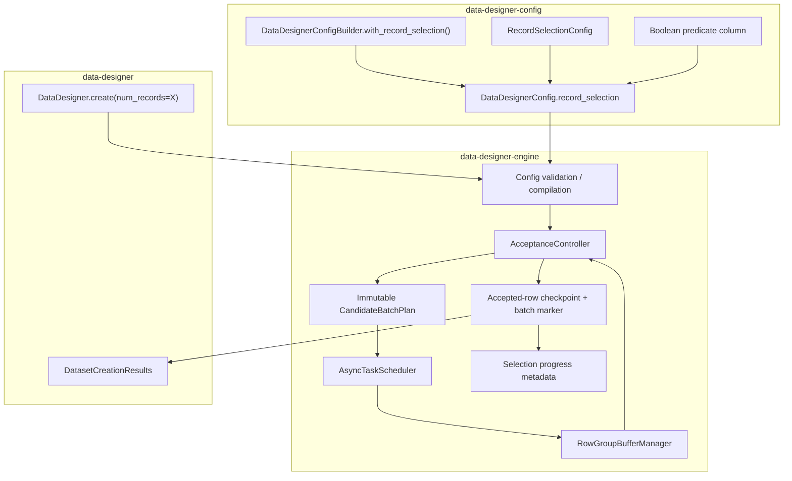
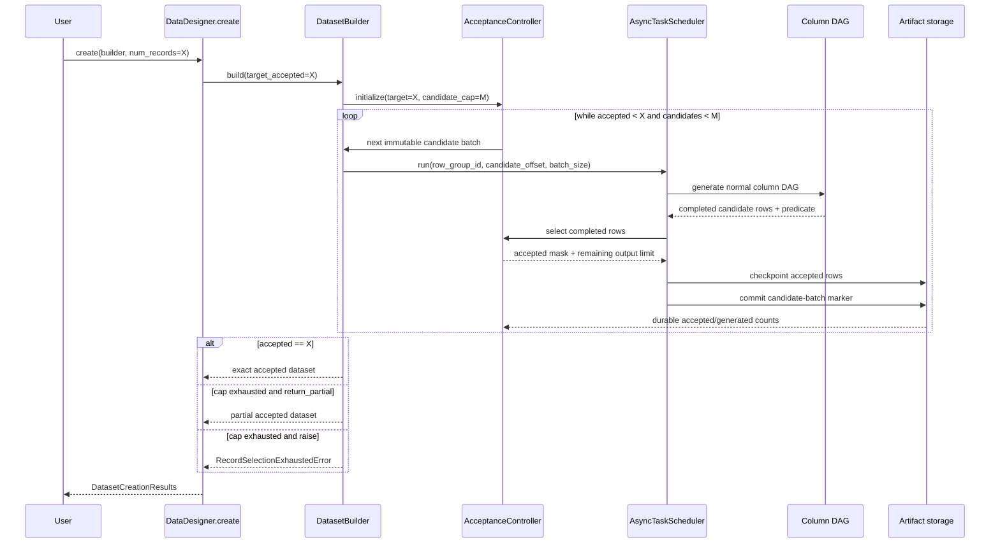
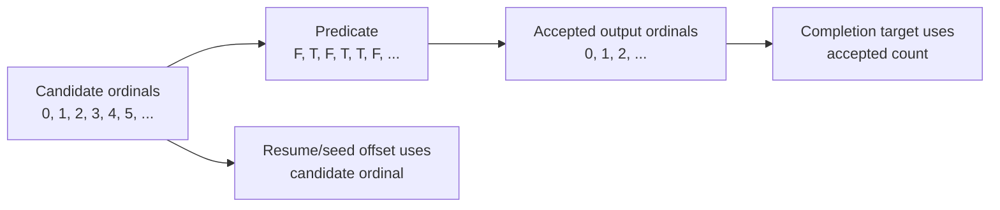
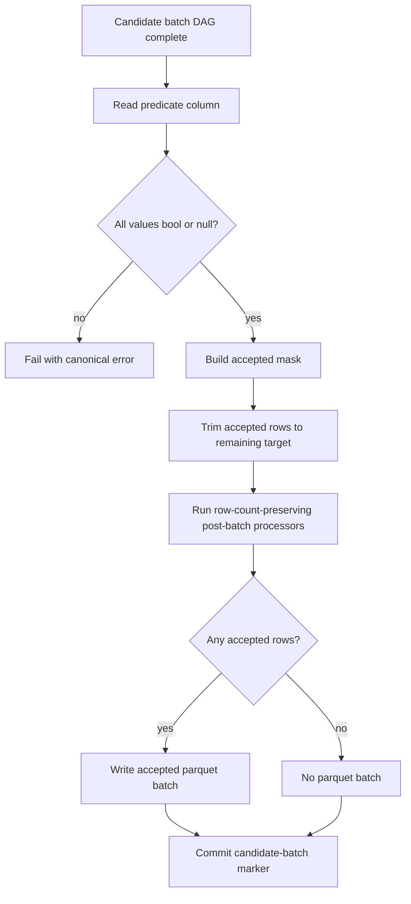
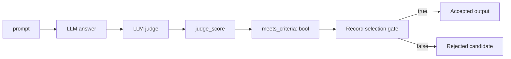
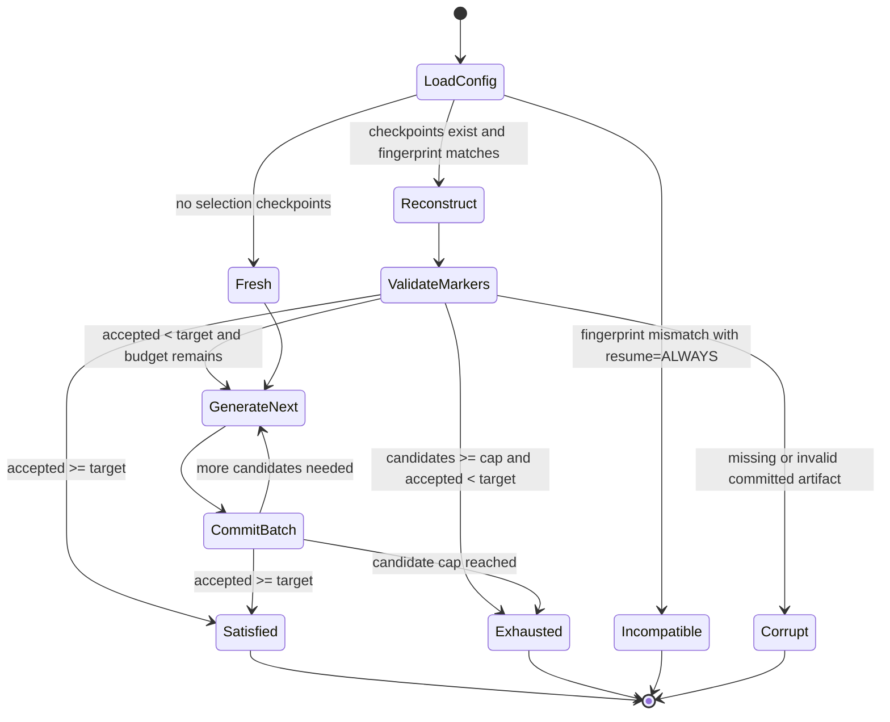

# Plan: Engine-native record selection for exact accepted-row targets

## Summary

Add a declarative record-selection policy to a normal `DataDesigner.create()` run. Users define a boolean
column that identifies acceptable records, then request the number of accepted records they want:

```python
results = data_designer.create(builder, num_records=5_000)
```

When record selection is configured, `num_records` means **5,000 accepted output records**, not 5,000 candidate
attempts. The engine generates bounded candidate batches, evaluates the configured predicate column, checkpoints
only accepted rows, and continues until it has exactly the requested count or exhausts its candidate budget.

The core user contract is:

> Produce `X` records for which this declared boolean column is true.

The user declares the desired data and acceptance criterion. The engine owns candidate generation, rejection,
refill, trimming, progress accounting, artifact layout, and resume.

## Motivation

Many synthetic-data pipelines need an exact number of rows that satisfy a quality condition:

- Generate 5,000 answers whose judge score is at least 0.8.
- Generate 10,000 conversations that pass a safety or policy validator.
- Generate examples where two judges disagree.
- Generate images whose VLM evaluation marks all required attributes present.
- Generate tool-use traces that terminate successfully and contain a required tool call.

Today users can generate candidates and filter afterward, but that produces fewer than the requested number of
rows. They can also orchestrate multiple `create()` calls or workflow stages, but then the user owns retry loops,
artifact extension, trimming, and resume. That conflicts with DataDesigner's "declare, don't orchestrate"
contract.

PR #773 explored workflow-level repetition. Real-run testing exposed two important constraints:

1. Repeatedly extending the same static row-group plan couples progress to `buffer_size`; small increments can
   stop generating after the second extension.
2. Restarting an append loop at its first requested size can ask resume to shrink below already-persisted rows.

An engine-native design should therefore treat candidate batches as immutable first-class units and persist
candidate progress separately from accepted-output progress.

## Goals

1. Let users request exactly `X` accepted output rows in one `DataDesigner.create()` call.
2. Accept any declared boolean column as the selection predicate, including an expression derived from judge or
   validation output.
3. Require a hard candidate budget so generation is always bounded.
4. Preserve normal DAG generation, model usage accounting, processors, profiling, plugins, and lazy imports.
5. Support durable resume without regenerating committed candidate batches.
6. Stream accepted candidate batches to parquet without loading the full candidate or output dataset into memory.
7. Keep dependency direction intact: interface -> engine -> config.
8. Produce deterministic output ordering and deterministic trimming from candidate order.

## Non-goals for v1

- Returning or exporting every rejected candidate.
- Running several candidate batches concurrently.
- Cancelling downstream column tasks immediately when an early predicate becomes false.
- Supporting row-count-changing after-generation processors.
- Inferring an unbounded stopping condition from an expected acceptance rate.
- Replacing workflow chaining for genuinely separate generate/judge/enrich stages.

## User-facing API

### Recommended API

Add `RecordSelectionConfig` to `data_designer.config` and a builder convenience method:

```python
import data_designer.config as dd

builder = dd.DataDesignerConfigBuilder(model_configs=[judge_model])
builder.add_column(
    dd.LLMJudgeColumnConfig(
        name="quality",
        model_alias="judge",
        prompt="Evaluate this answer: {{ answer }}",
        scores=[...],
    )
)
builder.add_column(
    dd.ExpressionColumnConfig(
        name="meets_criteria",
        expr="{{ quality.score >= 0.8 }}",
        dtype="bool",
        drop=True,
    )
)
builder.with_record_selection(
    dd.RecordSelectionConfig(
        predicate_column="meets_criteria",
        max_candidate_records=20_000,
        on_exhausted="raise",
    )
)

results = data_designer.create(builder, num_records=5_000)
```

The predicate can derive from any columns already represented in the execution graph:

```python
dd.ExpressionColumnConfig(
    name="meets_criteria",
    expr="{{ judge_score >= 0.8 and safety.valid and answer|length >= 100 }}",
    dtype="bool",
    drop=True,
)
```

The explicit boolean column is preferable to embedding a second expression directly in the selection policy:

- It participates in normal DAG dependency discovery.
- It can be previewed and debugged like any other column.
- It can be generated by expressions, plugins, validators, or future generator types.
- `drop=True` already controls whether it appears in the final schema.
- Selection does not need its own template renderer or duplicate expression semantics.

A future convenience overload may create a hidden expression column, but it should compile to the same explicit
column model rather than introduce another runtime path.

### Config model

```python
class RecordSelectionExhaustion(StrEnum):
    RAISE = "raise"
    RETURN_PARTIAL = "return_partial"


class RecordSelectionConfig(ConfigBase):
    """Select records until the requested accepted-row count is reached."""

    predicate_column: str
    max_candidate_records: int = Field(gt=0)
    on_exhausted: RecordSelectionExhaustion = RecordSelectionExhaustion.RAISE
```

Add an optional field to `DataDesignerConfig`:

```python
record_selection: RecordSelectionConfig | None = None
```

Add a builder method:

```python
def with_record_selection(
    self,
    config: RecordSelectionConfig,
) -> DataDesignerConfigBuilder:
    ...
```

`RecordSelectionConfig` belongs in the config package because it changes the meaning and identity of the output
dataset. It must be serialized and included in `DataDesignerConfig.fingerprint()`. Candidate concurrency and batch
sizing remain operational concerns owned by `RunConfig`.

### Public semantics

| Concern | v1 behavior |
|---|---|
| `num_records` | Desired number of accepted output records |
| Predicate | Existing column whose runtime values must be boolean or null |
| `True` | Accept the record |
| `False` | Reject the record |
| `None` / null | Reject and increment `null_predicate_records` |
| Non-boolean value | Fail with a canonical configuration/generation error |
| Bound | `max_candidate_records` is required |
| Exhausted + `raise` | Raise a canonical selection-exhausted error |
| Exhausted + `return_partial` | Complete with all accepted rows generated so far |
| Overshoot | Keep the earliest accepted rows in candidate order, trimming to exactly `num_records` |
| Predicate output column | Included or removed according to its normal `drop` setting |
| Profiling | Profile only the final accepted dataset |
| Model usage | Include accepted and rejected candidate work |

At the `create()` boundary, validate:

- `max_candidate_records >= num_records`.
- `predicate_column` exists.
- The predicate is not a seed-only side artifact with no materialized output.
- Known output types are boolean. Unknown plugin output types receive strict runtime validation.
- v1 has no row-count-changing after-generation processor.

## Alternatives considered

| Approach | Advantages | Problems | Decision |
|---|---|---|---|
| Generate the full candidate cap, then filter once | Smallest implementation | Always pays maximum cost; cannot stop early; large temporary output | Do not use as primary design |
| Repeat `DataDesigner.create(..., resume=ALWAYS)` with larger targets | Reuses current public API | Couples selection to resume row-group math; difficult callback resume; repeated profiling | Rejected |
| Engine-managed immutable candidate batches | Bounded, resumable, streams output, stops early | Requires new selection progress and candidate-batch manifest | **Recommended for v1** |
| Dynamically replace every rejected row inside one scheduler | Best theoretical efficiency | Invasive task-grid mutation, cancellation, refill, and ordering complexity | Future optimization |

### Is a v2 required?

No. V1 is the complete product feature, not a stepping stone that requires an immediate v2. It provides the full
user-visible contract: one declarative run produces exactly the requested number of matching rows, candidate work
is bounded, exhaustion is explicit, progress is resumable, and accepted rows and candidate attempts are accounted
for separately.

A possible v2 would preserve those semantics and improve performance only—for example, by running multiple candidate
batches concurrently, cancelling downstream work after early predicate rejection, or adapting batch size to the
observed acceptance rate. Work on v2 should begin only if production benchmarks show that v1's sequential candidate
batches materially limit throughput, provider utilization, latency, or cost. Until then, v1 is sufficient.

## Architecture

### Package ownership and control flow



Dependency direction remains legal:

```text
interface -> engine -> config
```

The config package contains only declarative models. It never imports the engine or executes generation.

### Runtime sequence



### Candidate and output coordinate spaces

Candidate position and accepted output position are different coordinates and must never be conflated:



Seed readers advance using the candidate offset. `actual_num_records` and `DatasetCreationResults.count_records()`
report accepted output rows.

## Detailed engine design

### 1. `AcceptanceController`

Introduce an engine-owned controller with no interface dependency:

```python
@dataclass(frozen=True, slots=True)
class CandidateBatch:
    candidate_batch_id: int
    row_group_id: int
    start_offset: int
    size: int


@dataclass(frozen=True, slots=True)
class SelectionDecision:
    accepted_indices: tuple[int, ...]
    rejected_count: int
    null_predicate_count: int
    trimmed_accepted_count: int


class AcceptanceController:
    def has_reached_target(self) -> bool: ...
    def has_candidate_budget(self) -> bool: ...
    def next_candidate_batch(self) -> CandidateBatch: ...
    def select(self, dataframe: pd.DataFrame) -> SelectionDecision: ...
    def record_checkpoint(self, batch: CandidateBatch, decision: SelectionDecision) -> None: ...
```

Responsibilities:

- Track target accepted count.
- Track candidate attempts separately from accepted records.
- Allocate stable, monotonically increasing candidate batch IDs and offsets.
- Strictly evaluate the predicate column.
- Trim the last accepted candidate batch to the remaining output count.
- Expose progress for metadata and logs.
- Decide satisfied vs exhausted state.

The controller does not call column generators, write parquet, or own scheduler tasks.

### 2. Immutable candidate batch planning

`CandidateBatch` is the logical unit of record-selection work and progress. A row group is the scheduler's physical
task and buffering unit. They are distinct concepts even though v1 maps each candidate batch to exactly one fresh
row group. Keeping both identifiers explicit prevents selection progress from becoming coupled to row-group layout
and leaves room for later optimizations without changing the persisted selection model.

Do not extend a previously completed partial row group. Each candidate batch receives a new immutable row group:

```text
candidate batch 0 -> row group 0: candidate offset 0,    size 1000
candidate batch 1 -> row group 1: candidate offset 1000, size 1000
candidate batch 2 -> row group 2: candidate offset 2000, size 1000
...
```

Add a plan type capable of preserving explicit start offsets:

```python
@dataclass(frozen=True, slots=True)
class CandidateBatchPlan:
    candidate_batch_id: int
    row_group_id: int
    start_offset: int
    size: int

    def __iter__(self) -> Iterator[tuple[int, int]]:
        yield self.row_group_id, self.size

    def row_group_start_offset(self, row_group: int) -> int:
        return self.start_offset
```

This avoids deriving candidate offsets from accepted parquet row counts. It also avoids the repeated-extension issue
where a completed partial extension row group cannot grow when the next requested target still falls inside the same
`buffer_size` boundary.

### 3. Candidate batch sizing

For v1, generate one candidate batch at a time. Its row group still gets normal per-column and per-cell parallelism.

Default candidate batch size:

```python
batch_size = min(
    run_config.buffer_size,
    target_accepted_records,
    remaining_candidate_budget,
)
```

This prevents a request for ten accepted rows from immediately generating the default 1,000 candidates. Users can
tune `RunConfig.buffer_size` when larger candidate batches produce better model throughput.

One candidate batch at a time provides:

- Predictable maximum overshoot of one candidate batch.
- No cancellation of already-running LLM requests.
- Straightforward candidate offsets and resume.
- Reuse of existing scheduler concurrency inside a row group.

Concurrent candidate batches can be introduced later after measuring throughput and overshoot.

### 4. Builder loop

Add a dedicated path inside `DatasetBuilder.build()` after config compilation and before profiling:

```python
def _build_with_record_selection(
    self,
    generators: list[ColumnGenerator],
    *,
    target_num_records: int,
    buffer_size: int,
    resume: ResumeMode,
) -> None:
    controller = self._load_or_create_acceptance_controller(...)

    while not controller.has_reached_target() and controller.has_candidate_budget():
        candidate_batch = controller.next_candidate_batch()
        self._run_candidate_batch(
            generators=generators,
            candidate_batch=candidate_batch,
            controller=controller,
        )

    self._handle_selection_completion(controller)
```

Initialize generator instances once and reuse them across candidate batches. In particular:

- Call `log_pre_generation()` once per logical build, not once per candidate batch.
- Preserve stateful generator instances across candidate batches.
- Create new scheduler/tracker/buffer state for each immutable candidate batch.
- Accumulate model usage over the full logical run.
- Run after-generation processors and profiling once after selection completes.

### 5. Selection checkpoint hook

Selection belongs after all DAG columns for the candidate batch have completed and before post-batch processors and
final checkpointing:



Add a scheduler callback before the existing `on_before_checkpoint` processor callback, for example:

```python
on_select_before_checkpoint: Callable[[int, int], SelectionDecision] | None
```

The callback should:

1. Read the completed candidate batch from `RowGroupBufferManager`.
2. Validate and apply the predicate.
3. Mark rejected and trimmed rows as dropped in the tracker and buffer.
4. Recompute dropped/surviving diagnostics.
5. Run post-batch processors only over accepted survivors.
6. Checkpoint accepted rows.
7. Commit the batch marker even when no rows survive.

The current checkpoint path computes `dropped_rows` before processor callbacks. Refactor it so selection occurs
before that count is finalized; otherwise diagnostics and all-rows-dropped behavior will be incorrect.

### 6. Predicate placement in the DAG

For v1, selection occurs when the whole candidate row is complete. The predicate column still has normal
dependencies, so a boolean expression derived from judge results is evaluated in the correct order.



A later optimization may treat the predicate as an early row gate. When it becomes false, the scheduler can call
its existing row-drop machinery and remove downstream tasks for that row. This can avoid expensive enrichment
after a cheap criterion fails. That optimization is not required for exact-count v1 semantics.

## Artifact and resume model

### Why existing output metadata is insufficient

For ordinary generation, planned row-group size and output row count are usually the same. Under record selection,
a candidate batch of 1,000 may checkpoint 137 accepted rows—or zero. Therefore these values are distinct:

- Candidate rows attempted.
- Accepted rows checkpointed.
- Output parquet batches written.
- Candidate batches durably completed.

Resume must not infer candidate progress solely from accepted parquet row counts.

### Proposed artifact layout

```text
artifacts/<dataset>/
  parquet-files/
    batch_00000.parquet            # accepted rows from candidate batch 0; optional
    batch_00001.parquet            # accepted rows from candidate batch 1; optional
  selection-checkpoints/
    batch_00000.json               # always present after candidate batch 0 commits
    batch_00001.json               # present even when candidate batch 1 accepted zero rows
  partial-results/
    ...
  metadata.json
  builder_config.json
```

Example batch marker:

```json
{
  "candidate_batch_id": 1,
  "row_group_id": 1,
  "candidate_start_offset": 1000,
  "candidate_records": 1000,
  "accepted_records": 137,
  "rejected_records": 861,
  "null_predicate_records": 2,
  "trimmed_accepted_records": 0,
  "parquet_file": "parquet-files/batch_00001.parquet"
}
```

For a zero-acceptance candidate batch, `parquet_file` is null but the marker still commits candidate progress.

### Global metadata

Extend `metadata.json` with a structured section:

```json
{
  "target_num_records": 5000,
  "actual_num_records": 4217,
  "record_selection": {
    "predicate_column": "meets_criteria",
    "max_candidate_records": 20000,
    "on_exhausted": "raise",
    "candidate_records_generated": 12000,
    "candidate_batches_completed": 12,
    "accepted_records": 4217,
    "rejected_records": 7769,
    "null_predicate_records": 14,
    "trimmed_accepted_records": 0,
    "acceptance_rate": 0.3514167,
    "selection_satisfied": false,
    "selection_exhausted": false,
    "next_candidate_batch_id": 12,
    "next_candidate_offset": 12000
  }
}
```

The candidate-batch marker directory is the filesystem source of truth. Global metadata is a convenient summary and may lag
by one checkpoint during a crash, just as current metadata may lag parquet writes.

### Atomic commit and crash recovery

Treat the batch marker as the commit point:

1. Generate into the normal row-group buffer for the candidate batch.
2. Apply selection and processors.
3. Write accepted parquet to a temporary/final deterministic candidate-batch path when non-empty.
4. Atomically write the batch marker.
5. Update global metadata.

On resume:

- Reconstruct accepted and candidate progress from committed batch markers.
- Verify every marker that names a parquet file points to a readable file with the expected accepted count.
- Delete an uncommitted parquet file for the next candidate batch before rerunning that batch.
- Clear ordinary in-flight partial results.
- Set the next seed/candidate offset from committed candidate counts, not accepted row counts.
- Never call generic resume with a requested target smaller than persisted output.

### Resume state machine



## Processor interactions

### Pre-batch processors

Run normally on candidate rows before generation. Rows they drop consume candidate slots because work was admitted
for those candidate positions.

### Post-batch processors

Apply record selection first, then run post-batch processors over accepted rows. Existing post-batch processing is
row-count preserving under `strict_row_count=True`, so accepted counts remain valid and processor side artifacts
align with the output.

### After-generation processors

Row-count-changing after-generation processors can violate the exact-count guarantee after selection has finished.
For v1:

1. Reject known row-count-changing after-generation processors at compile/runtime setup.
2. Run allowed after-generation processors once over accepted output.
3. Verify the final output count still equals the selected count; raise a canonical error if a plugin violates the
   declared contract.

A future processor capability such as `preserves_row_count: bool` can make this validation explicit and reusable.

### Dropped predicate column

Evaluate selection before normal dropped-column handling. If the predicate has `drop=True`, preserve or omit it
using the existing `preserve_dropped_columns` behavior, aligned only to accepted rows.

## Media and side-effect artifacts

Rejected rows may already have written image, audio, video, trace, or plugin side artifacts. Filtering the parquet
row alone can leave orphan files.

V1 must choose and document one of these approaches:

1. **Preferred:** write candidate media under a candidate-batch-scoped temporary directory and commit only accepted paths.
2. Track media paths produced per row and delete those associated exclusively with rejected rows.
3. Explicitly allow orphan media until run cleanup, then garbage-collect paths not referenced by accepted output.

Do not silently accumulate unbounded rejected media. Text side-effect columns that live inside the row are filtered
automatically with the DataFrame.

## Failure and exhaustion behavior

### Exhaustion

When candidate budget is exhausted before the accepted target:

```python
if config.on_exhausted == RecordSelectionExhaustion.RAISE:
    raise RecordSelectionExhaustedError(
        target_records=target,
        accepted_records=accepted,
        candidate_records=candidates,
    )
```

For `return_partial`, finalize the accepted output and record `selection_satisfied=false` and
`selection_exhausted=true`.

### Early shutdown and generation failures

- Failed/dropped candidate slots count against `max_candidate_records`; they consumed an attempt and potentially
  model cost.
- Retryable model errors continue through the scheduler's normal retry/salvage path.
- If engine early shutdown fires, retain durably checkpointed accepted candidate batches.
- Existing typed early-shutdown errors remain authoritative unless the API explicitly chooses to map early
  shutdown to partial selection output.
- Do not parse error strings to decide selection behavior.

### Invalid predicate values

Runtime predicate validation should report:

- Predicate column name.
- Candidate batch ID.
- Invalid value and type, with bounded sample output.
- Expected boolean/null contract.

Avoid `bool(value)` coercion because non-empty strings such as `"false"` are truthy in Python. Expression columns
with `dtype="bool"` already provide the expected ergonomic conversion.

## Observability

Log and persist selection progress after every committed candidate batch:

```text
Record selection: accepted 4,217 / 5,000
Candidates generated: 12,000 / 20,000
Acceptance rate: 35.1%
```

Recommended counters:

- `record_selection_candidate_records`
- `record_selection_accepted_records`
- `record_selection_rejected_records`
- `record_selection_null_predicate_records`
- `record_selection_trimmed_records`
- `record_selection_candidate_batches_completed`
- `record_selection_acceptance_rate`
- `record_selection_satisfied`
- `record_selection_exhausted`

Progress should distinguish accepted output completion from candidate work. Model usage remains the source of truth
for inference cost across accepted and rejected candidates.

`DatasetCreationResults.count_records()` continues to return output records. A future structured
`load_selection_summary()` helper may expose the metadata section, but v1 can rely on `metadata.json`.

## Preview behavior

For consistency, `preview(num_records=N)` should return accepted rows when record selection is configured. It must
still honor `max_candidate_records`; otherwise preview can become unexpectedly unbounded.

Implementation options:

- Reuse the same candidate-batch controller with in-memory checkpoints for small previews.
- Initially reject record selection in preview with a clear error and add support in a follow-up.

The first option provides the least surprising public contract, but it should not block the on-disk `create()`
implementation if preview integration materially expands v1 scope.

## Implementation phases

### Phase 1: Config and validation

**Package:** `data-designer-config`

Likely files:

- `config/record_selection.py` — new models and enums.
- `config/data_designer_config.py` — add `record_selection`.
- `config/config_builder.py` — add `with_record_selection()`.
- `config/__init__.py` — lazy public exports.
- `config/fingerprint.py` — confirm selection is identity-relevant.

Deliverables:

- Serializable public model.
- Builder API.
- Unit validation for bounds and enum coercion.
- Fingerprint changes when any selection field changes.

### Phase 2: Engine controller and one-candidate-batch execution

**Package:** `data-designer-engine`

Likely files:

- `engine/dataset_builders/acceptance.py` — `AcceptanceController` and DTOs.
- `engine/dataset_builders/row_group_plan.py` — explicit candidate batch plan with start offset.
- `engine/dataset_builders/dataset_builder.py` — bounded candidate-batch loop.
- `engine/dataset_builders/async_scheduler.py` — selection callback before post-batch checkpoint.
- `engine/dataset_builders/utils/row_group_buffer.py` — selected checkpoint support.

Deliverables:

- Exact accepted output for a fresh run.
- Required candidate cap.
- `raise` and `return_partial` exhaustion.
- Deterministic trimming and ordering.
- One candidate batch in flight at a time.

### Phase 3: Durable selection checkpoints and resume

Likely files:

- `engine/storage/artifact_storage.py` — selection checkpoint paths and atomic marker I/O.
- `engine/dataset_builders/dataset_builder.py` — resume reconstruction.
- `engine/dataset_builders/acceptance.py` — controller hydration from markers.

Deliverables:

- Candidate progress reconstructed independently from accepted parquet row count.
- Zero-acceptance candidate batches remain durably complete.
- Crash-window cleanup for uncommitted candidate-batch artifacts.
- Compatible `ResumeMode.ALWAYS` and `ResumeMode.IF_POSSIBLE` behavior.

### Phase 4: Results, docs, and examples

**Packages:** interface and Fern docs

Deliverables:

- User-facing example with judge score -> boolean expression -> exact target.
- Metadata documentation.
- Exhaustion and resume examples.
- Explicit after-generation processor and media-artifact limitations.

### Optional post-v1 optimization (not required for feature completeness)

Compile the predicate as a scheduler row gate. Once its value is false:

- Drop the row through `CompletionTracker.drop_row()`.
- Remove downstream tasks from the ready frontier.
- Cancel no task that is already in flight in v1 of the optimization.
- Preserve the same candidate/accepted checkpoint contract.

This optimization changes cost, not output semantics. It is not part of the v1 definition of done and creates no
commitment to implement a v2; benchmark evidence should justify it first.

## Test plan

### Config tests

- Predicate column is required and must exist.
- `max_candidate_records` must be positive.
- Run boundary rejects `max_candidate_records < num_records`.
- Selection participates in config serialization and fingerprinting.
- String exhaustion values normalize to enums.

### Fresh-run integration tests

- Target reached in the first candidate batch.
- Target reached after three or more candidate batches with default `buffer_size`.
- Final candidate batch overshoots and trims to exact target.
- Predicate column is removed when `drop=True`.
- Predicate column remains when `drop=False`.
- Null predicate values reject and increment metadata.
- Non-boolean predicate values raise.
- `return_partial` returns non-empty partial output.
- `return_partial` returns a valid empty dataset when no candidates pass.
- `raise` reports target, accepted, generated, and cap.
- Post-batch processor output aligns with accepted rows.
- Profiling counts accepted rows only.
- Usage accounting includes rejected candidate calls.

### Seed and ordering tests

- Candidate batch offsets are contiguous and do not repeat seed rows unexpectedly.
- Ordered seed sampling preserves candidate order.
- Shuffle sampling remains deterministic under the existing seed contract.
- Trimming retains earliest accepted candidate ordinals.
- Stateful generators preserve state across candidate batches.

### Resume tests

- Interrupt during candidate batch 0 before checkpoint; candidate batch 0 reruns.
- Interrupt after candidate batch 2 commits; resume starts at candidate batch 3's candidate offset.
- Candidate batch accepting zero rows is not regenerated after resume.
- Global metadata lag is reconstructed from batch markers.
- Orphan uncommitted parquet is removed and regenerated.
- Missing parquet referenced by a committed marker raises corruption error.
- Changed selection config invalidates resume.
- Completed exact output is reused without re-evaluating the predicate.
- Exhausted partial output is reused according to its recorded terminal state.

### Failure and boundary tests

- Candidate cap exactly equals target.
- Candidate cap ends with a smaller final candidate batch.
- Early shutdown after some accepted candidate batches preserves durable output.
- All rows fail generation before predicate evaluation.
- Predicate generator itself fails.
- Row-count-changing after-generation processor is rejected or detected.
- Rejected media does not leak unbounded artifacts.

### Regression tests motivated by PR #773

- `num_records` smaller than default `buffer_size`, target first reached on candidate batch 3.
- Interrupted run after candidate batch 2 resumes without requesting a smaller target.
- Candidate progress never derives from accepted output row count.
- A later low-acceptance candidate batch cannot replace or erase earlier accepted output.

## Risks and mitigations

| Risk | Mitigation |
|---|---|
| Low acceptance causes runaway cost | Required hard candidate cap |
| Candidate/output counts are conflated | Separate controller fields, markers, and metadata |
| Resume repeats seeds | Persist candidate offsets per committed candidate batch |
| Zero-acceptance candidate batch is invisible | Always write a candidate-batch completion marker |
| Last candidate batch overproduces | Deterministically trim before checkpoint |
| Processor changes selected count | Selection before post-batch; block/verify after-generation resize |
| Rejected media leaks disk space | Candidate-scoped staging or reference-based cleanup |
| Throughput drops with sequential candidate batches | Preserve full within-row-group concurrency; add concurrent candidate batches only if benchmarks justify it |
| Plugin predicate returns surprising types | Strict runtime boolean/null validation |
| Metadata write lags parquet write | Marker-based filesystem reconstruction and orphan cleanup |

## Open questions

1. **Naming:** `RecordSelectionConfig`, `AcceptanceConfig`, or `RecordFilterConfig`? `RecordSelectionConfig` avoids
   exposing the rejection-sampling algorithm but may overlap conceptually with seed selection strategies.
2. **Null policy:** Always reject null in v1, or expose `null_policy="reject" | "error"`?
3. **Rejected records:** Drop entirely in v1, or optionally keep a bounded diagnostic sample?
4. **Preview:** Support selection immediately or fail clearly until the on-disk path ships?
5. **Media:** Which candidate-scoped storage strategy best fits current `MediaStorage` ownership?
6. **Processor capability:** Introduce `preserves_row_count` now or enforce count at runtime first?
7. **Candidate batch size:** Derive solely from `buffer_size`, or expose an explicit selection batch-size override?
8. **Terminal error type:** Add `RecordSelectionExhaustedError` under interface errors or normalize an engine error at
   the interface boundary?

## Recommended decisions for v1

- Use `RecordSelectionConfig` publicly and `AcceptanceController` internally.
- Require an explicit boolean predicate column.
- Require `max_candidate_records`.
- Treat null as rejected and non-boolean as an error.
- Use `num_records` as the accepted-row target; do not duplicate it in selection config.
- Run one immutable candidate batch at a time.
- Derive candidate batch size from `min(buffer_size, target, remaining_budget)`.
- Commit a marker for every candidate batch, including zero-acceptance candidate batches.
- Run selection before post-batch processors.
- Block row-count-changing after-generation processors for v1.
- Keep rejected records out of the final dataset and expose only aggregate diagnostics.
- Defer early predicate task cancellation and concurrent candidate batches.

## Definition of done

The feature is complete when a user can declare a boolean criterion and reliably obtain exactly `X` matching rows
from one `DataDesigner.create()` call, with:

- Bounded candidate generation.
- Exact deterministic trimming.
- Correct default-buffer behavior across three or more candidate batches.
- Durable resume after any committed candidate batch.
- Correct zero-acceptance checkpoint handling.
- Accepted-only output, processing, and profiling.
- Complete candidate/acceptance metadata and model usage accounting.
- No dependency-layer violations.
- Documentation that explains cost, bounds, partial exhaustion, and resume semantics.

Meeting this definition completes the feature. No v2 work is required unless measured performance warrants a
separate optimization effort.
