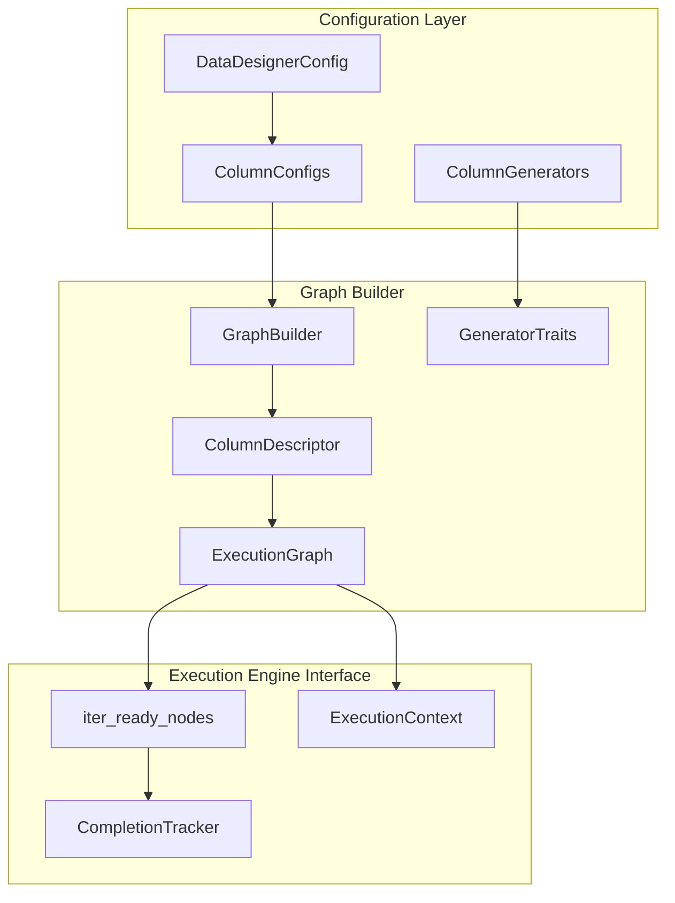
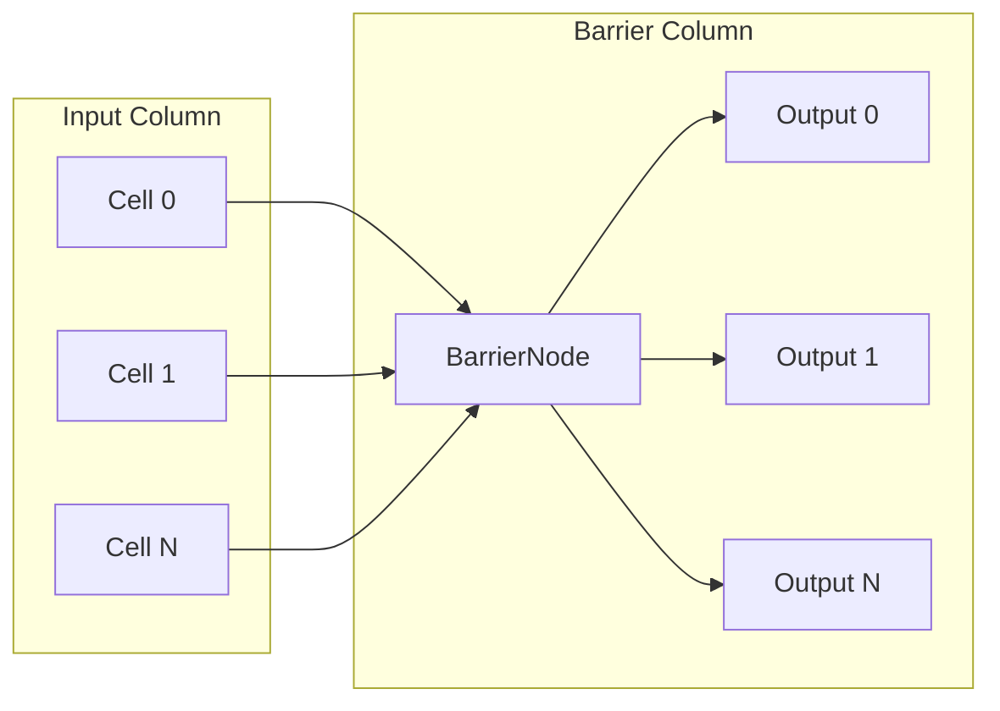

# Execution Graph Builder

## Overview

Build a new graph-based execution framework that models cell-level dependencies for async dataset generation. The graph uses a **hybrid representation** where column structure is stored explicitly while cell-level nodes are computed on-demand to handle millions of records efficiently.

## Architecture




## Generator Execution Traits

Traits are inferred from generator properties (no hardcoded class-name matching):


| Trait            | Source Property                             | Description                                 |
| ---------------- | ------------------------------------------- | ------------------------------------------- |
| `START`          | `can_generate_from_scratch = True`          | Can initiate workflows without input        |
| `CELL_BY_CELL`   | `get_generation_strategy() == CELL_BY_CELL` | Processes individual cells independently    |
| `ROW_STREAMABLE` | `is_row_streamable = True`                  | Full column generator that can emit per-row |
| `BARRIER`        | `is_row_streamable = False` on full-column  | Requires all inputs before any output       |


### New Generator Property

Add `is_row_streamable` property to `ColumnGenerator` base class in [packages/data-designer-engine/src/data_designer/engine/column_generators/generators/base.py](packages/data-designer-engine/src/data_designer/engine/column_generators/generators/base.py):

```python
@property
def is_row_streamable(self) -> bool:
    """Whether this generator can emit results as rows complete."""
    return self.get_generation_strategy() == GenerationStrategy.CELL_BY_CELL
```

Override in specific generators:

- `ExpressionColumnGenerator`: `True` (processes rows independently)
- `ValidationColumnGenerator`: `False` (needs all rows for batch processing)
- `SamplerColumnGenerator`: `True` (generates per-row data)

## Dependency Resolution

### Cell-by-Cell / Row-Streamable Columns

Row-local dependencies:

- Cell `(row=5, col="question")` depends on `(row=5, col="context")`

### Barrier Columns

All-or-nothing dependencies:

- `BarrierNodeId("validation")` depends on ALL cells of dependency columns
- Output cells `(row=*, col="validation")` depend on `BarrierNodeId("validation")`




## File Structure

```
packages/data-designer-engine/src/data_designer/engine/execution_graph/
  __init__.py           # Public exports
  node_id.py            # CellNodeId, BarrierNodeId, NodeId type alias
  traits.py             # ExecutionTraits Flag enum
  column_descriptor.py  # ColumnDescriptor dataclass
  graph.py              # ExecutionGraph class (hybrid representation)
  builder.py            # GraphBuilder factory (infers traits from generators)
  completion.py         # CompletionTracker (memory-efficient tracking)
```

## Key Components

### 1. Node Identification (`node_id.py`)

```python
@dataclass(frozen=True, slots=True)
class CellNodeId:
    row: int
    column: str

@dataclass(frozen=True, slots=True)
class BarrierNodeId:
    column: str

NodeId = CellNodeId | BarrierNodeId
```

### 2. Execution Traits (`traits.py`)

```python
class ExecutionTraits(Flag):
    NONE = 0
    START = auto()           # Can generate from scratch
    CELL_BY_CELL = auto()    # Processes individual cells
    ROW_STREAMABLE = auto()  # Can emit as rows complete
    BARRIER = auto()         # Requires all inputs first
```

### 3. Column Descriptor (`column_descriptor.py`)

```python
@dataclass(slots=True)
class ColumnDescriptor:
    name: str
    config: ConfigBase
    generator_cls: type[ColumnGenerator]
    traits: ExecutionTraits
    dependencies: list[str]     # from required_columns
    side_effects: list[str]     # additional columns produced
```

### 4. Execution Graph (`graph.py`)

Key methods for execution engines:

- `iter_start_nodes()` - Nodes that can begin immediately
- `iter_ready_nodes(completed)` - Nodes with satisfied dependencies
- `get_dependencies(node)` - Dependencies for a node
- `get_generator_and_config(node)` - Generator class and config for execution

### 5. Graph Builder (`builder.py`)

```python
class GraphBuilder:
    def build(self, config: DataDesignerConfig, num_records: int) -> ExecutionGraph:
        # 1. Build descriptors from column configs
        # 2. Infer traits from generator properties (not class names!)
        # 3. Handle multi-column configs (mark additional columns as side effects)
        # 4. Validate dependencies exist
        # 5. Return ExecutionGraph with descriptors in topo order
```

Trait inference (plugin-compatible):

```python
def _infer_traits(self, gen_cls: type[ColumnGenerator]) -> ExecutionTraits:
    traits = ExecutionTraits.NONE

    # Check can_generate_from_scratch property (works for any generator)
    if getattr(gen_cls, 'can_generate_from_scratch', False):
        traits |= ExecutionTraits.START

    # Check generation strategy
    strategy = gen_cls.get_generation_strategy()
    if strategy == GenerationStrategy.CELL_BY_CELL:
        traits |= ExecutionTraits.CELL_BY_CELL | ExecutionTraits.ROW_STREAMABLE
    else:  # FULL_COLUMN
        # Check is_row_streamable property
        if getattr(gen_cls, 'is_row_streamable', False):
            traits |= ExecutionTraits.ROW_STREAMABLE
        else:
            traits |= ExecutionTraits.BARRIER

    return traits
```

### 6. Completion Tracker (`completion.py`)

Memory-efficient tracking for large datasets with two variants:

**Base Protocol:**

```python
class CompletionTrackerProtocol(Protocol):
    """Protocol for completion tracking - enables duck typing."""

    def mark_complete(self, node: NodeId) -> None: ...
    def is_complete(self, node: NodeId) -> bool: ...
    def is_column_complete(self, column: str) -> bool: ...
    def __contains__(self, node: NodeId) -> bool: ...
```

**Simple Tracker (asyncio / single-threaded):**

```python
class CompletionTracker:
    """O(C) memory instead of O(C x R). No locks - for single-threaded use."""

    def mark_complete(self, node: NodeId) -> None: ...
    def is_complete(self, node: NodeId) -> bool: ...
    def is_column_complete(self, column: str) -> bool: ...
```

**Thread-Safe Tracker (thread pool / multi-threaded):**

```python
class ThreadSafeCompletionTracker:
    """Thread-safe variant with internal locking for concurrent access."""

    def mark_complete(self, node: NodeId) -> None:
        with self._lock:
            # ... same logic as CompletionTracker

    def is_complete(self, node: NodeId) -> bool:
        with self._lock:
            # ... same logic as CompletionTracker
```

Both trackers use the same memory-efficient strategy:

- Track fully completed columns as a set of names: O(C)
- Only store partial completion progress for in-progress columns
- Automatically compact when columns fully complete

**Thread-Safety Notes:**

- `ExecutionGraph` is **immutable after construction** - no locks needed
- Only the `CompletionTracker` holds mutable state
- Choose tracker variant based on your execution model:
  - `CompletionTracker`: asyncio, single-threaded executors
  - `ThreadSafeCompletionTracker`: thread pools, concurrent.futures

## Memory Efficiency


| Aspect            | Storage                                        |
| ----------------- | ---------------------------------------------- |
| Column metadata   | O(C) where C = number of columns               |
| Cell nodes        | Virtual - O(1) per node, computed on iteration |
| Topological order | O(C), cached once                              |
| NodeId objects    | Frozen dataclasses with `slots=True`           |
| Dependency edges  | Computed mathematically, not stored            |


A graph with 1M records and 10 columns uses ~same memory as 10 records.

## Example Usage

```python
from data_designer.engine.execution_graph import GraphBuilder, ExecutionGraph
from data_designer.engine.execution_graph.completion import (
    CompletionTracker,
    ThreadSafeCompletionTracker,
)

# Build graph from config (immutable after construction)
builder = GraphBuilder(column_generator_registry)
graph: ExecutionGraph = builder.build(config, num_records=1_000_000)

# Option 1: Single-threaded / asyncio execution
tracker = CompletionTracker(graph.num_records)
for node in graph.iter_ready_nodes(tracker):
    gen_cls, config = graph.get_generator_and_config(node)
    # Execute node...
    tracker.mark_complete(node)

# Option 2: Multi-threaded execution (e.g., with ThreadPoolExecutor)
tracker = ThreadSafeCompletionTracker(graph.num_records)
# Safe to call mark_complete() from multiple threads concurrently
```

## Multi-Column Config Handling

Multi-column configs (samplers, seed datasets) produce multiple output columns. The graph handles this by:

1. Using the first column as the primary descriptor name
2. Marking additional columns as `side_effects`
3. Building a reverse mapping `_side_effect_to_parent` for dependency resolution
4. Allowing downstream columns to depend on any produced column

## Validation

The graph builder validates:

1. All dependency columns exist (or are side effects of existing columns)
2. No circular dependencies (enforced by topological order)
3. At least one column has `START` trait (can generate from scratch)

## Checkpoint/Restart Support

The execution graph supports **row-complete batch checkpointing** for resuming interrupted generation runs.

### Key Design Decisions

1. **Row-complete batches**: Checkpoint when all cells for a batch of rows are complete
2. **Compact checkpoint format**: Store `{"completed_rows": 5000}` not individual cell indices
3. **Usable partial datasets**: Each checkpoint can be loaded and used independently
4. **Restore via graph**: Restoration uses the graph structure to expand row ranges into cell-level tracking

### Mental Model

A row is "complete" when **all columns for that row** have their cells done:
- For regular columns: `CellNodeId(row, column)` is complete
- For barrier columns: the `BarrierNodeId(column)` is complete AND `CellNodeId(row, column)` is complete

### Checkpoint Format

```json
{
    "version": 1,
    "completed_rows": 5000
}
```

This is **O(1) regardless of dataset size** - no row indices stored.

### Row Completion API

`ExecutionGraph` provides methods for row-level completion checking:

```python
# Check if a specific row is complete (all columns done)
graph.is_row_complete(row=5, completed=tracker)

# Get count of contiguous complete rows from row 0
completed_count = graph.get_completed_row_count(tracker)
```

### Checkpoint API

Both `CompletionTracker` and `ThreadSafeCompletionTracker` support checkpointing:

```python
# Create checkpoint
checkpoint = tracker.to_checkpoint(graph)
# Returns: {"version": 1, "completed_rows": 5000}

# Restore from checkpoint
tracker = CompletionTracker.from_checkpoint(checkpoint, graph)
# or
tracker = ThreadSafeCompletionTracker.from_checkpoint(checkpoint, graph)
```

### Usage Pattern

**Checkpoint during execution:**
```python
BATCH_SIZE = 1000
last_checkpoint = 0

# Periodically check and checkpoint
completed = graph.get_completed_row_count(tracker)
if completed >= last_checkpoint + BATCH_SIZE:
    storage.update_metadata({"checkpoint": tracker.to_checkpoint(graph)})
    last_checkpoint = completed
```

**Resume from checkpoint:**
```python
try:
    metadata = storage.read_metadata()
    if "checkpoint" in metadata:
        tracker = CompletionTracker.from_checkpoint(metadata["checkpoint"], graph)
        print(f"Resumed: {metadata['checkpoint']['completed_rows']} rows complete")
    else:
        tracker = CompletionTracker(graph.num_records)
except FileNotFoundError:
    tracker = CompletionTracker(graph.num_records)

# iter_ready_nodes automatically skips completed rows
for node in graph.iter_ready_nodes(tracker):
    ...
```

### Why Row-Complete Batches?

| Approach | Checkpoint Size (1M records, 50% done) | Usable? |
|----------|----------------------------------------|---------|
| Per-cell indices | ~4MB per partial column | Partial |
| Row-complete batch | ~50 bytes | ✓ Yes |

Row-complete batches give you:
- **Constant-size checkpoints**: O(1) storage
- **Usable partial data**: Each checkpoint is a valid dataset subset
- **Simple mental model**: "5000 rows are done"

### Out-of-Order Completion Note

If rows don't complete in order (due to concurrent workers), the current implementation uses **Option A: Wait for contiguous completion**:
- Only checkpoint contiguous rows from 0
- Some work may be re-done on restart
- Simpler implementation that matches the batch-oriented nature of dataset generation

---

## Open Decision: Checkpointing with Barrier Columns

### The Problem

With the current design, **barrier columns prevent any intermediate checkpoints**.

A row is only "complete" when ALL columns (including barriers) are done for that row. Since barrier columns require ALL input rows before producing ANY output, no rows can be checkpointed until the barrier finishes processing the entire dataset.

**Example Pipeline**: `A (start) → B (row-streamable) → C (barrier/validation)`

| Stage | `get_completed_row_count()` |
|-------|----------------------------|
| A: 5000/10000 rows done | 0 |
| B: 5000/10000 rows done | 0 |
| C barrier waiting | 0 |
| C barrier executing | 0 |
| C barrier complete | 10000 |

**Impact**: If generation fails during or before barrier execution, all pre-barrier work is lost.

### Options

#### Option A: Accept Current Behavior (Dataset-Scoped Barriers)

Keep barriers dataset-scoped. Accept that checkpoints only occur after all barriers complete.

| Pros | Cons |
|------|------|
| Simple mental model | No intermediate checkpoints with barriers |
| No changes needed | Work lost on failure before barrier completes |
| Correct for cross-row operations (global dedup, normalization) | |

#### Option B: Batch-Scoped Barriers

Execute barriers per-batch instead of per-dataset. Each batch completes independently.

```
Batch 0: A[0:999] → B[0:999] → Barrier(C, batch=0) → C[0:999] → checkpoint(1000)
Batch 1: A[1000:1999] → B[1000:1999] → Barrier(C, batch=1) → C[1000:1999] → checkpoint(2000)
```

**Implementation changes:**
```python
@dataclass(frozen=True, slots=True)
class BarrierNodeId:
    column: str
    batch: int | None = None  # None = dataset-scoped, int = batch-scoped
```

| Pros | Cons |
|------|------|
| Enables incremental checkpoints | More complex graph structure |
| Limits work lost on failure | Not valid for cross-row operations |
| Natural fit for batch-oriented execution | Requires generator to declare batch-safety |

**Semantic validity depends on barrier type:**
- ✅ Row-independent validation (format checks, schema validation)
- ✅ Per-batch statistics
- ❌ Global uniqueness checks
- ❌ Min-max normalization across dataset

#### Option C: Column-Level Checkpointing

Extend checkpoint format to track completed columns, not just completed rows.

```json
{
    "version": 2,
    "completed_rows": 0,
    "completed_columns": ["A", "B"]
}
```

On restart, skip re-generating completed columns and feed their data into the barrier.

| Pros | Cons |
|------|------|
| Preserves pre-barrier work | More complex checkpoint format |
| Works with dataset-scoped barriers | Requires loading partial data on restart |
| No changes to barrier semantics | Larger checkpoint size O(C) vs O(1) |

#### Option D: Hybrid Approach

Add a `BATCH_BARRIER` trait for barriers that are batch-safe, keeping `BARRIER` for dataset-scoped operations.

```python
class ExecutionTraits(Flag):
    ...
    BARRIER = auto()           # Dataset-scoped (e.g., global dedup)
    BATCH_BARRIER = auto()     # Batch-scoped (e.g., validation)
```

Generators declare which type they support. Graph builder creates appropriate node structure.

| Pros | Cons |
|------|------|
| Flexibility - use right tool for job | Most complex implementation |
| Preserves correctness for cross-row ops | Generators must declare batch-safety |
| Enables checkpoints where semantically valid | Two barrier code paths to maintain |

### Decision Needed

Which approach should we implement? Considerations:

1. **How common are barriers in typical pipelines?** (validation is common)
2. **How long do generation runs typically take?** (longer = more checkpoint value)
3. **Are there cross-row barriers we need to support?** (global dedup, normalization)
4. **Implementation complexity vs. user value tradeoff?**
